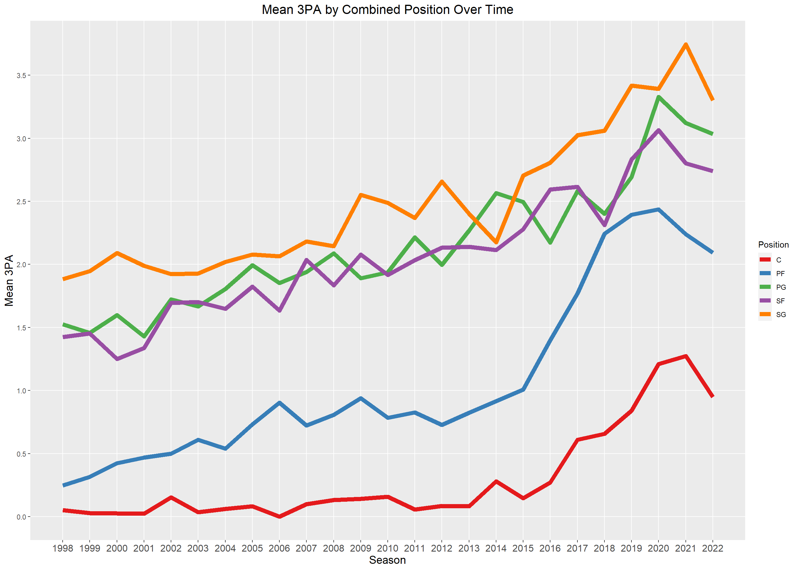
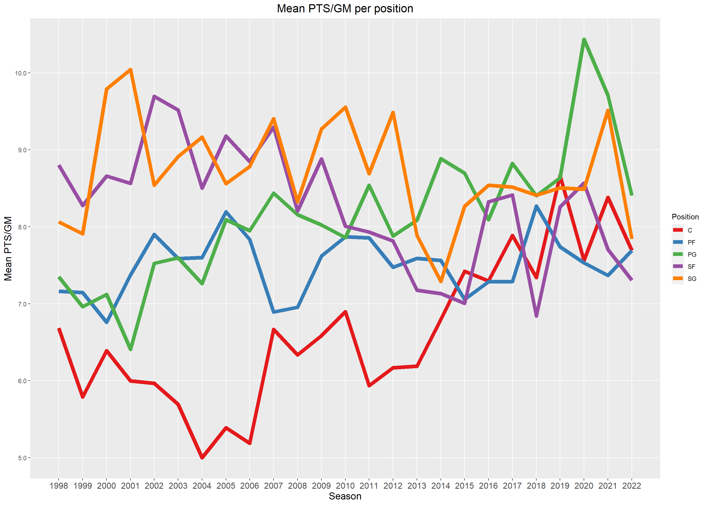
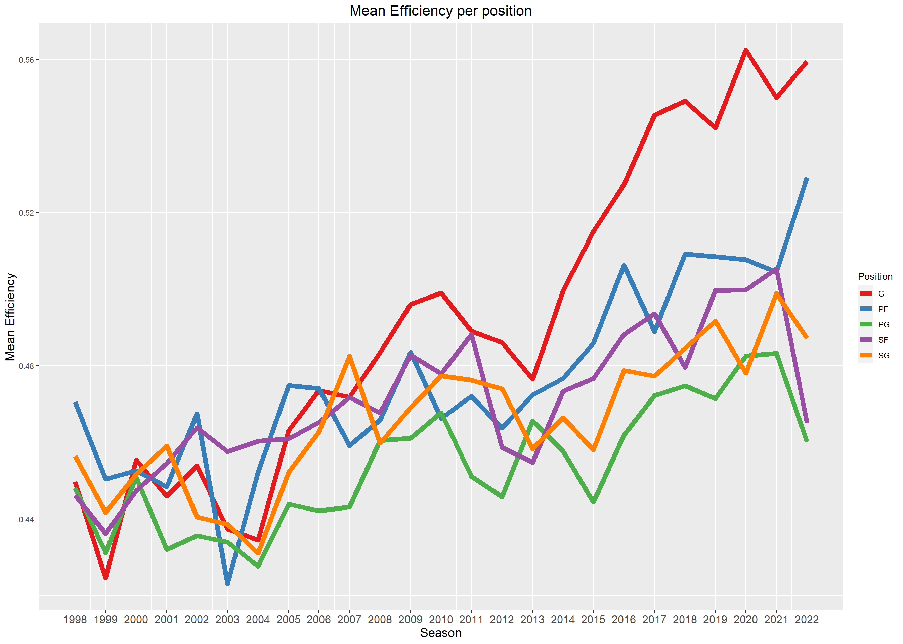
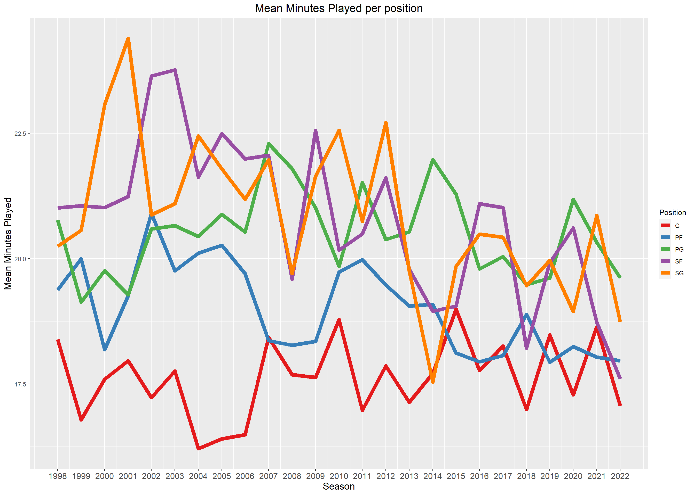
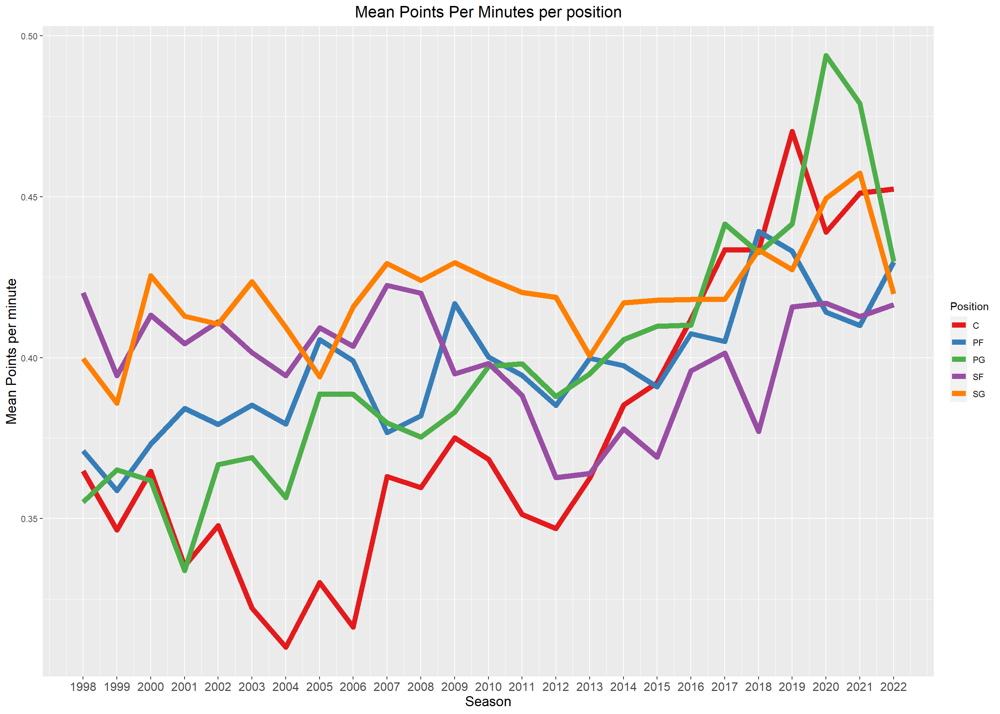
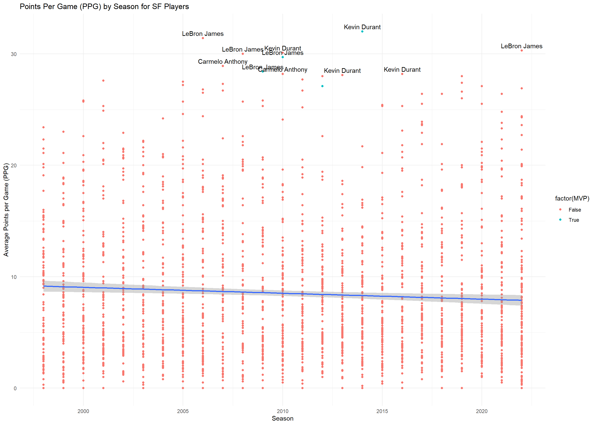

In this module, I wanted to look at the future of the position of the SF in the NBA. The season has just started and I'm really excited this year. 

My intention for this Module originally was just to prove how the league has gone to a more 3-point-centric game than the classic pound it inside. However, when I was looking at the data, I coulnd't help but to notice the decline of the SF position in the NBA.

Here's my attempt wrangle and visualize just that.

::: {.cell}

```{.r .cell-code}
df <- read.csv('data.csv')

position_map <- c(
  "PG" = "PG",
  "SG" = "SG",
  "SF" = "SF",
  "PF" = "PF",
  "C"  = "C",
  "C-PF" = "C",
  "PF-C" = "PF",
  "PF-SF" = "PF",
  "PG-SF" = "PG",
  "PG-SG" = "PG",
  "SF-C"  = "SF",
  "SF-PF" = "SF",
  "SF-SG" = "SF",
  "SG-PF" = "SG",
  "SG-PG" = "SG",
  "SG-SF" = "SG"
)

df <- df %>%
  mutate(Combined_Pos = position_map[Pos], Season = substr(Season, start = 1, stop = 4), Season = as.numeric(Season)+1)
         
threes <- df %>%
  group_by(Season, Combined_Pos) %>%
  summarise(Avg_3PA = mean(X3PA, na.rm = TRUE))

scoring <- df %>%
  group_by(Season, Combined_Pos) %>%
  summarise(ptsper = mean(PTS, na.rm = TRUE))

efficiency <- df %>%
  group_by(Season, Combined_Pos) %>%
  summarise(eff = mean(eFG., na.rm = TRUE))

minutesplayed <- df %>%
  group_by(Season, Combined_Pos) %>%
  summarise(mp = mean(MP, na.rm = TRUE))

ptspermin <- df %>%
  group_by(Season, Combined_Pos) %>%
  summarise(ptsper = mean(PTS, na.rm = TRUE), mp = mean(MP, na.rm = TRUE), ppm = mean(ptsper/mp))
```
:::

As I mentioned earlier, my original intention was just to show how the league has focused more on three pointers. In this chart, we definitely see an uptick in three points attemps by all positions in the NBA.

::: {.cell}

```{.r .cell-code}
ggplot(threes, aes(x = Season, y = Avg_3PA, color = Combined_Pos)) +
  geom_line(size = 2.5) +
  labs(
    title = "Mean 3PA by Combined Position Over Time",
    x = "Season",
    y = "Mean 3PA",
    color = "Position"
  ) +
  theme_grey() +
  theme(
    axis.text.x = element_text(angle = 0, hjust = 0.5, size = 12),  # Increase font size
    axis.title.x = element_text(size = 14),  # Increase x-axis title font size
    axis.title.y = element_text(size = 14),  # Increase y-axis title font size
    plot.title = element_text(hjust = 0.5, size = 16),  # Increase title font size
  ) +
  scale_color_brewer(palette = "Set1") +
  scale_x_continuous(breaks = seq(min(threes$Season), max(threes$Season), by = 1), minor_breaks = NULL) +
  scale_y_continuous(
    breaks = seq(min(threes$Avg_3PA), max(threes$Avg_3PA), by = 0.5),
    minor_breaks = NULL,
    labels = scales::number_format(scale = 1, accuracy = 0.1)
  )
```

::: {.cell-output-display}
{width=1344}
:::
:::

Next, I looked into the mean Points per game per position in the NBA. What I saw shocked me. The SF position where most of the scoring used to come from now at the bottom of the list. Centers, Power forwards and Centers have overtaken the Small forward position in bulk scoring. 

::: {.cell}

```{.r .cell-code}
ggplot(scoring, aes(x = Season, y = ptsper, color = Combined_Pos)) +
  geom_line(size = 2.5) +
  labs(
    title = "Mean PTS/GM per position",
    x = "Season",
    y = "Mean PTS/GM",
    color = "Position"
  ) +
  theme_grey() +
  theme(
    axis.text.x = element_text(angle = 0, hjust = 0.5, size = 12),  # Increase font size
    axis.title.x = element_text(size = 14),  # Increase x-axis title font size
    axis.title.y = element_text(size = 14),  # Increase y-axis title font size
    plot.title = element_text(hjust = 0.5, size = 16),  # Increase title font size
  ) +
  scale_color_brewer(palette = "Set1") +
  scale_x_continuous(breaks = seq(min(scoring$Season), max(scoring$Season), by = 1), minor_breaks = NULL) +
  scale_y_continuous(
    breaks = seq(min(scoring$ptsper), max(scoring$ptsper)),
    minor_breaks = NULL,
    labels = scales::number_format(scale = 1, accuracy = 0.1)
  )
```

::: {.cell-output-display}
{width=1344}
:::
:::

Their efficiency have also taken a hit compared to the other positions. I should look into eFG next.

::: {.cell}

```{.r .cell-code}
ggplot(efficiency, aes(x = Season, y = eff, color = Combined_Pos)) +
  geom_line(size = 2.5) +
  labs(
    title = "Mean Efficiency per position",
    x = "Season",
    y = "Mean Efficiency",
    color = "Position"
  ) +
  theme_grey() +
  theme(
    axis.text.x = element_text(angle = 0, hjust = 0.5, size = 12),  # Increase font size
    axis.title.x = element_text(size = 14),  # Increase x-axis title font size
    axis.title.y = element_text(size = 14),  # Increase y-axis title font size
    plot.title = element_text(hjust = 0.5, size = 16),  # Increase title font size
  ) +
  scale_color_brewer(palette = "Set1") +
  scale_x_continuous(breaks = seq(min(efficiency$Season), max(efficiency$Season), by = 1), 
  )
```

::: {.cell-output-display}
{width=1344}
:::
:::


Another strong evidence with the decline of the position is minutes played. They used to be the most played position 30 years ago and now they're at the second last. 

::: {.cell}

```{.r .cell-code}
ggplot(minutesplayed, aes(x = Season, y = mp, color = Combined_Pos)) +
  geom_line(size = 2.5) +
  labs(
    title = "Mean Minutes Played per position",
    x = "Season",
    y = "Mean Minutes Played",
    color = "Position"
  ) +
  theme_grey() +
  theme(
    axis.text.x = element_text(angle = 0, hjust = 0.5, size = 12),  # Increase font size
    axis.title.x = element_text(size = 14),  # Increase x-axis title font size
    axis.title.y = element_text(size = 14),  # Increase y-axis title font size
    plot.title = element_text(hjust = 0.5, size = 16),  # Increase title font size
  ) +
  scale_color_brewer(palette = "Set1") +
  scale_x_continuous(breaks = seq(min(minutesplayed$Season), max(minutesplayed$Season), by = 1), 
  )
```

::: {.cell-output-display}
{width=1344}
:::
:::

Lastly I looked into Points per minute while on the floor and there's just tons of evidence that other positions have overtaken the SF when it comes to scoring and efficiency.

::: {.cell}

```{.r .cell-code}
ggplot(ptspermin, aes(x = Season, y = ppm , color = Combined_Pos)) +
  geom_line(size = 2.5) +
  labs(
    title = "Mean Points Per Minutes per position",
    x = "Season",
    y = "Mean Points per minute",
    color = "Position"
  ) +
  theme_grey() +
  theme(
    axis.text.x = element_text(angle = 0, hjust = 0.5, size = 12),  # Increase font size
    axis.title.x = element_text(size = 14),  # Increase x-axis title font size
    axis.title.y = element_text(size = 14),  # Increase y-axis title font size
    plot.title = element_text(hjust = 0.5, size = 16),  # Increase title font size
  ) +
  scale_color_brewer(palette = "Set1") +
  scale_x_continuous(breaks = seq(min(ptspermin$Season), max(ptspermin$Season), by = 1), 
  )
```

::: {.cell-output-display}
{width=1344}
:::
:::

Lastly, I wanted to look how the MVPs of each position stack up to each other. On average, for you to be an MVP in the SF position you have to be like three players. You need to play like Lebron James, Kevin Durant, or Carmelo Anthony. You have to be at the the 98th percentile of the SF to become an MVP. Talk about high standards.

::: {.cell}

```{.r .cell-code}
sfstats <- df %>%
  filter(Pos == 'SF') %>%
  group_by(Player, Season, MVP) %>%
  summarise(ptsper = mean(PTS, na.rm = TRUE))

ggplot(sfstats, aes(x = Season, y = ptsper)) +
  geom_point(aes(colour = factor(MVP))) +
  geom_smooth(method = lm, aes(group = 1)) +  # Add aes(group = 1) for the smoothing
  labs(title = "Points Per Game (PPG) by Season for SF Players",
       x = "Season",
       y = "Average Points per Game (PPG)") +
  geom_text(aes(label = ifelse(ptsper > 28, as.character(Player), '')), hjust = 0.5, vjust = -0.5) +
  theme_minimal()
```

::: {.cell-output-display}
{width=1344}
:::
:::