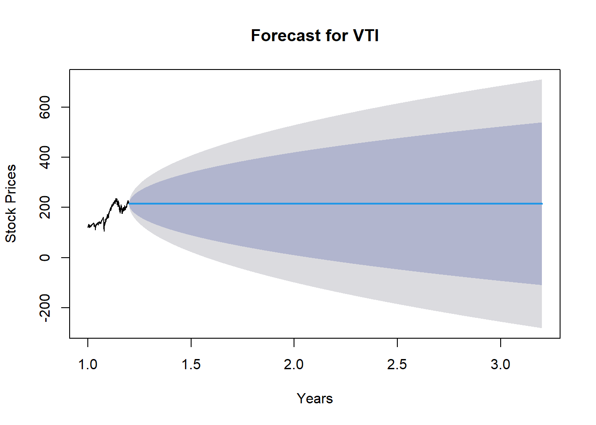

I wanted to predict what our retirement would look like with the stocks we've picked when my wife and I got married. These are the top 5 stocks that I've handpicked when we started investing. 

However, like most stock analysis predictions, using statistics and math to produce models is not 100% reliable. Complexity of Financial Markets and Randomness and Uncertainty will always play a role in the voilatility to the market. Thus, this is not a financial advice! 

::: {.cell}

```{.r .cell-code}
# Pull 5 stock picks my wife and I have.

df <- tq_get(c("NVDA", "VTI", "AAPL", "SCHD", "IBM"),
             get = "stock.prices",
             from = "2017-12-01",
             to = "2023-09-26") # Date can be modified to pick the current date end_date for this demo I want to select the date I finished this project

# Data Wrangling 
df2 <- df %>% pivot_wider(names_from = symbol, values_from = adjusted, id_cols = date)

xts <- df2 %>%
  tk_xts(date = date)

stocks <- dygraph(xts, main = "Tech Stocks", xlab = "Years", ylab = "Stock Prices") %>%
  dyRangeSelector(dateWindow = c("2017-12-01", "2023-09-26"))

# Display the dygraph
stocks
```

::: {.cell-output-display}

```{=html}
<div class="dygraphs html-widget html-fill-item-overflow-hidden html-fill-item" id="htmlwidget-d2eb50f9fc5d00afef51" style="width:100%;height:464px;"></div>
<script type="application/json" data-for="htmlwidget-d2eb50f9fc5d00afef51">{"x":{"attrs":{"title":"Tech Stocks","xlabel":"Years","ylabel":"Stock Prices","labels":["day","NVDA","VTI","AAPL","SCHD","IBM"],"legend":"auto","retainDateWindow":false,"axes":{"x":{"pixelsPerLabel":60}},"showRangeSelector":true,"dateWindow":["2017-12-01T00:00:00.000Z","2023-09-26T00:00:00.000Z"],"rangeSelectorHeight":40,"rangeSelectorPlotFillColor":" #A7B1C4","rangeSelectorPlotStrokeColor":"#808FAB","interactionModel":"Dygraph.Interaction.defaultModel"},"scale":"daily","annotations":[],"shadings":[],"events":[],"format":"date","data":[["2017-12-01T00:00:00.000Z","2017-12-04T00:00:00.000Z","2017-12-05T00:00:00.000Z","2017-12-06T00:00:00.000Z","2017-12-07T00:00:00.000Z","2017-12-08T00:00:00.000Z","2017-12-11T00:00:00.000Z","2017-12-12T00:00:00.000Z","2017-12-13T00:00:00.000Z","2017-12-14T00:00:00.000Z","2017-12-15T00:00:00.000Z","2017-12-18T00:00:00.000Z","2017-12-19T00:00:00.000Z","2017-12-20T00:00:00.000Z","2017-12-21T00:00:00.000Z","2017-12-22T00:00:00.000Z","2017-12-26T00:00:00.000Z","2017-12-27T00:00:00.000Z","2017-12-28T00:00:00.000Z","2017-12-29T00:00:00.000Z","2018-01-02T00:00:00.000Z","2018-01-03T00:00:00.000Z","2018-01-04T00:00:00.000Z","2018-01-05T00:00:00.000Z","2018-01-08T00:00:00.000Z","2018-01-09T00:00:00.000Z","2018-01-10T00:00:00.000Z","2018-01-11T00:00:00.000Z","2018-01-12T00:00:00.000Z","2018-01-16T00:00:00.000Z","2018-01-17T00:00:00.000Z","2018-01-18T00:00:00.000Z","2018-01-19T00:00:00.000Z","2018-01-22T00:00:00.000Z","2018-01-23T00:00:00.000Z","2018-01-24T00:00:00.000Z","2018-01-25T00:00:00.000Z","2018-01-26T00:00:00.000Z","2018-01-29T00:00:00.000Z","2018-01-30T00:00:00.000Z","2018-01-31T00:00:00.000Z","2018-02-01T00:00:00.000Z","2018-02-02T00:00:00.000Z","2018-02-05T00:00:00.000Z","2018-02-06T00:00:00.000Z","2018-02-07T00:00:00.000Z","2018-02-08T00:00:00.000Z","2018-02-09T00:00:00.000Z","2018-02-12T00:00:00.000Z","2018-02-13T00:00:00.000Z","2018-02-14T00:00:00.000Z","2018-02-15T00:00:00.000Z","2018-02-16T00:00:00.000Z","2018-02-20T00:00:00.000Z","2018-02-21T00:00:00.000Z","2018-02-22T00:00:00.000Z","2018-02-23T00:00:00.000Z","2018-02-26T00:00:00.000Z","2018-02-27T00:00:00.000Z","2018-02-28T00:00:00.000Z","2018-03-01T00:00:00.000Z","2018-03-02T00:00:00.000Z","2018-03-05T00:00:00.000Z","2018-03-06T00:00:00.000Z","2018-03-07T00:00:00.000Z","2018-03-08T00:00:00.000Z","2018-03-09T00:00:00.000Z","2018-03-12T00:00:00.000Z","2018-03-13T00:00:00.000Z","2018-03-14T00:00:00.000Z","2018-03-15T00:00:00.000Z","2018-03-16T00:00:00.000Z","2018-03-19T00:00:00.000Z","2018-03-20T00:00:00.000Z","2018-03-21T00:00:00.000Z","2018-03-22T00:00:00.000Z","2018-03-23T00:00:00.000Z","2018-03-26T00:00:00.000Z","2018-03-27T00:00:00.000Z","2018-03-28T00:00:00.000Z","2018-03-29T00:00:00.000Z","2018-04-02T00:00:00.000Z","2018-04-03T00:00:00.000Z","2018-04-04T00:00:00.000Z","2018-04-05T00:00:00.000Z","2018-04-06T00:00:00.000Z","2018-04-09T00:00:00.000Z","2018-04-10T00:00:00.000Z","2018-04-11T00:00:00.000Z","2018-04-12T00:00:00.000Z","2018-04-13T00:00:00.000Z","2018-04-16T00:00:00.000Z","2018-04-17T00:00:00.000Z","2018-04-18T00:00:00.000Z","2018-04-19T00:00:00.000Z","2018-04-20T00:00:00.000Z","2018-04-23T00:00:00.000Z","2018-04-24T00:00:00.000Z","2018-04-25T00:00:00.000Z","2018-04-26T00:00:00.000Z","2018-04-27T00:00:00.000Z","2018-04-30T00:00:00.000Z","2018-05-01T00:00:00.000Z","2018-05-02T00:00:00.000Z","2018-05-03T00:00:00.000Z","2018-05-04T00:00:00.000Z","2018-05-07T00:00:00.000Z","2018-05-08T00:00:00.000Z","2018-05-09T00:00:00.000Z","2018-05-10T00:00:00.000Z","2018-05-11T00:00:00.000Z","2018-05-14T00:00:00.000Z","2018-05-15T00:00:00.000Z","2018-05-16T00:00:00.000Z","2018-05-17T00:00:00.000Z","2018-05-18T00:00:00.000Z","2018-05-21T00:00:00.000Z","2018-05-22T00:00:00.000Z","2018-05-23T00:00:00.000Z","2018-05-24T00:00:00.000Z","2018-05-25T00:00:00.000Z","2018-05-29T00:00:00.000Z","2018-05-30T00:00:00.000Z","2018-05-31T00:00:00.000Z","2018-06-01T00:00:00.000Z","2018-06-04T00:00:00.000Z","2018-06-05T00:00:00.000Z","2018-06-06T00:00:00.000Z","2018-06-07T00:00:00.000Z","2018-06-08T00:00:00.000Z","2018-06-11T00:00:00.000Z","2018-06-12T00:00:00.000Z","2018-06-13T00:00:00.000Z","2018-06-14T00:00:00.000Z","2018-06-15T00:00:00.000Z","2018-06-18T00:00:00.000Z","2018-06-19T00:00:00.000Z","2018-06-20T00:00:00.000Z","2018-06-21T00:00:00.000Z","2018-06-22T00:00:00.000Z","2018-06-25T00:00:00.000Z","2018-06-26T00:00:00.000Z","2018-06-27T00:00:00.000Z","2018-06-28T00:00:00.000Z","2018-06-29T00:00:00.000Z","2018-07-02T00:00:00.000Z","2018-07-03T00:00:00.000Z","2018-07-05T00:00:00.000Z","2018-07-06T00:00:00.000Z","2018-07-09T00:00:00.000Z","2018-07-10T00:00:00.000Z","2018-07-11T00:00:00.000Z","2018-07-12T00:00:00.000Z","2018-07-13T00:00:00.000Z","2018-07-16T00:00:00.000Z","2018-07-17T00:00:00.000Z","2018-07-18T00:00:00.000Z","2018-07-19T00:00:00.000Z","2018-07-20T00:00:00.000Z","2018-07-23T00:00:00.000Z","2018-07-24T00:00:00.000Z","2018-07-25T00:00:00.000Z","2018-07-26T00:00:00.000Z","2018-07-27T00:00:00.000Z","2018-07-30T00:00:00.000Z","2018-07-31T00:00:00.000Z","2018-08-01T00:00:00.000Z","2018-08-02T00:00:00.000Z","2018-08-03T00:00:00.000Z","2018-08-06T00:00:00.000Z","2018-08-07T00:00:00.000Z","2018-08-08T00:00:00.000Z","2018-08-09T00:00:00.000Z","2018-08-10T00:00:00.000Z","2018-08-13T00:00:00.000Z","2018-08-14T00:00:00.000Z","2018-08-15T00:00:00.000Z","2018-08-16T00:00:00.000Z","2018-08-17T00:00:00.000Z","2018-08-20T00:00:00.000Z","2018-08-21T00:00:00.000Z","2018-08-22T00:00:00.000Z","2018-08-23T00:00:00.000Z","2018-08-24T00:00:00.000Z","2018-08-27T00:00:00.000Z","2018-08-28T00:00:00.000Z","2018-08-29T00:00:00.000Z","2018-08-30T00:00:00.000Z","2018-08-31T00:00:00.000Z","2018-09-04T00:00:00.000Z","2018-09-05T00:00:00.000Z","2018-09-06T00:00:00.000Z","2018-09-07T00:00:00.000Z","2018-09-10T00:00:00.000Z","2018-09-11T00:00:00.000Z","2018-09-12T00:00:00.000Z","2018-09-13T00:00:00.000Z","2018-09-14T00:00:00.000Z","2018-09-17T00:00:00.000Z","2018-09-18T00:00:00.000Z","2018-09-19T00:00:00.000Z","2018-09-20T00:00:00.000Z","2018-09-21T00:00:00.000Z","2018-09-24T00:00:00.000Z","2018-09-25T00:00:00.000Z","2018-09-26T00:00:00.000Z","2018-09-27T00:00:00.000Z","2018-09-28T00:00:00.000Z","2018-10-01T00:00:00.000Z","2018-10-02T00:00:00.000Z","2018-10-03T00:00:00.000Z","2018-10-04T00:00:00.000Z","2018-10-05T00:00:00.000Z","2018-10-08T00:00:00.000Z","2018-10-09T00:00:00.000Z","2018-10-10T00:00:00.000Z","2018-10-11T00:00:00.000Z","2018-10-12T00:00:00.000Z","2018-10-15T00:00:00.000Z","2018-10-16T00:00:00.000Z","2018-10-17T00:00:00.000Z","2018-10-18T00:00:00.000Z","2018-10-19T00:00:00.000Z","2018-10-22T00:00:00.000Z","2018-10-23T00:00:00.000Z","2018-10-24T00:00:00.000Z","2018-10-25T00:00:00.000Z","2018-10-26T00:00:00.000Z","2018-10-29T00:00:00.000Z","2018-10-30T00:00:00.000Z","2018-10-31T00:00:00.000Z","2018-11-01T00:00:00.000Z","2018-11-02T00:00:00.000Z","2018-11-05T00:00:00.000Z","2018-11-06T00:00:00.000Z","2018-11-07T00:00:00.000Z","2018-11-08T00:00:00.000Z","2018-11-09T00:00:00.000Z","2018-11-12T00:00:00.000Z","2018-11-13T00:00:00.000Z","2018-11-14T00:00:00.000Z","2018-11-15T00:00:00.000Z","2018-11-16T00:00:00.000Z","2018-11-19T00:00:00.000Z","2018-11-20T00:00:00.000Z","2018-11-21T00:00:00.000Z","2018-11-23T00:00:00.000Z","2018-11-26T00:00:00.000Z","2018-11-27T00:00:00.000Z","2018-11-28T00:00:00.000Z","2018-11-29T00:00:00.000Z","2018-11-30T00:00:00.000Z","2018-12-03T00:00:00.000Z","2018-12-04T00:00:00.000Z","2018-12-06T00:00:00.000Z","2018-12-07T00:00:00.000Z","2018-12-10T00:00:00.000Z","2018-12-11T00:00:00.000Z","2018-12-12T00:00:00.000Z","2018-12-13T00:00:00.000Z","2018-12-14T00:00:00.000Z","2018-12-17T00:00:00.000Z","2018-12-18T00:00:00.000Z","2018-12-19T00:00:00.000Z","2018-12-20T00:00:00.000Z","2018-12-21T00:00:00.000Z","2018-12-24T00:00:00.000Z","2018-12-26T00:00:00.000Z","2018-12-27T00:00:00.000Z","2018-12-28T00:00:00.000Z","2018-12-31T00:00:00.000Z","2019-01-02T00:00:00.000Z","2019-01-03T00:00:00.000Z","2019-01-04T00:00:00.000Z","2019-01-07T00:00:00.000Z","2019-01-08T00:00:00.000Z","2019-01-09T00:00:00.000Z","2019-01-10T00:00:00.000Z","2019-01-11T00:00:00.000Z","2019-01-14T00:00:00.000Z","2019-01-15T00:00:00.000Z","2019-01-16T00:00:00.000Z","2019-01-17T00:00:00.000Z","2019-01-18T00:00:00.000Z","2019-01-22T00:00:00.000Z","2019-01-23T00:00:00.000Z","2019-01-24T00:00:00.000Z","2019-01-25T00:00:00.000Z","2019-01-28T00:00:00.000Z","2019-01-29T00:00:00.000Z","2019-01-30T00:00:00.000Z","2019-01-31T00:00:00.000Z","2019-02-01T00:00:00.000Z","2019-02-04T00:00:00.000Z","2019-02-05T00:00:00.000Z","2019-02-06T00:00:00.000Z","2019-02-07T00:00:00.000Z","2019-02-08T00:00:00.000Z","2019-02-11T00:00:00.000Z","2019-02-12T00:00:00.000Z","2019-02-13T00:00:00.000Z","2019-02-14T00:00:00.000Z","2019-02-15T00:00:00.000Z","2019-02-19T00:00:00.000Z","2019-02-20T00:00:00.000Z","2019-02-21T00:00:00.000Z","2019-02-22T00:00:00.000Z","2019-02-25T00:00:00.000Z","2019-02-26T00:00:00.000Z","2019-02-27T00:00:00.000Z","2019-02-28T00:00:00.000Z","2019-03-01T00:00:00.000Z","2019-03-04T00:00:00.000Z","2019-03-05T00:00:00.000Z","2019-03-06T00:00:00.000Z","2019-03-07T00:00:00.000Z","2019-03-08T00:00:00.000Z","2019-03-11T00:00:00.000Z","2019-03-12T00:00:00.000Z","2019-03-13T00:00:00.000Z","2019-03-14T00:00:00.000Z","2019-03-15T00:00:00.000Z","2019-03-18T00:00:00.000Z","2019-03-19T00:00:00.000Z","2019-03-20T00:00:00.000Z","2019-03-21T00:00:00.000Z","2019-03-22T00:00:00.000Z","2019-03-25T00:00:00.000Z","2019-03-26T00:00:00.000Z","2019-03-27T00:00:00.000Z","2019-03-28T00:00:00.000Z","2019-03-29T00:00:00.000Z","2019-04-01T00:00:00.000Z","2019-04-02T00:00:00.000Z","2019-04-03T00:00:00.000Z","2019-04-04T00:00:00.000Z","2019-04-05T00:00:00.000Z","2019-04-08T00:00:00.000Z","2019-04-09T00:00:00.000Z","2019-04-10T00:00:00.000Z","2019-04-11T00:00:00.000Z","2019-04-12T00:00:00.000Z","2019-04-15T00:00:00.000Z","2019-04-16T00:00:00.000Z","2019-04-17T00:00:00.000Z","2019-04-18T00:00:00.000Z","2019-04-22T00:00:00.000Z","2019-04-23T00:00:00.000Z","2019-04-24T00:00:00.000Z","2019-04-25T00:00:00.000Z","2019-04-26T00:00:00.000Z","2019-04-29T00:00:00.000Z","2019-04-30T00:00:00.000Z","2019-05-01T00:00:00.000Z","2019-05-02T00:00:00.000Z","2019-05-03T00:00:00.000Z","2019-05-06T00:00:00.000Z","2019-05-07T00:00:00.000Z","2019-05-08T00:00:00.000Z","2019-05-09T00:00:00.000Z","2019-05-10T00:00:00.000Z","2019-05-13T00:00:00.000Z","2019-05-14T00:00:00.000Z","2019-05-15T00:00:00.000Z","2019-05-16T00:00:00.000Z","2019-05-17T00:00:00.000Z","2019-05-20T00:00:00.000Z","2019-05-21T00:00:00.000Z","2019-05-22T00:00:00.000Z","2019-05-23T00:00:00.000Z","2019-05-24T00:00:00.000Z","2019-05-28T00:00:00.000Z","2019-05-29T00:00:00.000Z","2019-05-30T00:00:00.000Z","2019-05-31T00:00:00.000Z","2019-06-03T00:00:00.000Z","2019-06-04T00:00:00.000Z","2019-06-05T00:00:00.000Z","2019-06-06T00:00:00.000Z","2019-06-07T00:00:00.000Z","2019-06-10T00:00:00.000Z","2019-06-11T00:00:00.000Z","2019-06-12T00:00:00.000Z","2019-06-13T00:00:00.000Z","2019-06-14T00:00:00.000Z","2019-06-17T00:00:00.000Z","2019-06-18T00:00:00.000Z","2019-06-19T00:00:00.000Z","2019-06-20T00:00:00.000Z","2019-06-21T00:00:00.000Z","2019-06-24T00:00:00.000Z","2019-06-25T00:00:00.000Z","2019-06-26T00:00:00.000Z","2019-06-27T00:00:00.000Z","2019-06-28T00:00:00.000Z","2019-07-01T00:00:00.000Z","2019-07-02T00:00:00.000Z","2019-07-03T00:00:00.000Z","2019-07-05T00:00:00.000Z","2019-07-08T00:00:00.000Z","2019-07-09T00:00:00.000Z","2019-07-10T00:00:00.000Z","2019-07-11T00:00:00.000Z","2019-07-12T00:00:00.000Z","2019-07-15T00:00:00.000Z","2019-07-16T00:00:00.000Z","2019-07-17T00:00:00.000Z","2019-07-18T00:00:00.000Z","2019-07-19T00:00:00.000Z","2019-07-22T00:00:00.000Z","2019-07-23T00:00:00.000Z","2019-07-24T00:00:00.000Z","2019-07-25T00:00:00.000Z","2019-07-26T00:00:00.000Z","2019-07-29T00:00:00.000Z","2019-07-30T00:00:00.000Z","2019-07-31T00:00:00.000Z","2019-08-01T00:00:00.000Z","2019-08-02T00:00:00.000Z","2019-08-05T00:00:00.000Z","2019-08-06T00:00:00.000Z","2019-08-07T00:00:00.000Z","2019-08-08T00:00:00.000Z","2019-08-09T00:00:00.000Z","2019-08-12T00:00:00.000Z","2019-08-13T00:00:00.000Z","2019-08-14T00:00:00.000Z","2019-08-15T00:00:00.000Z","2019-08-16T00:00:00.000Z","2019-08-19T00:00:00.000Z","2019-08-20T00:00:00.000Z","2019-08-21T00:00:00.000Z","2019-08-22T00:00:00.000Z","2019-08-23T00:00:00.000Z","2019-08-26T00:00:00.000Z","2019-08-27T00:00:00.000Z","2019-08-28T00:00:00.000Z","2019-08-29T00:00:00.000Z","2019-08-30T00:00:00.000Z","2019-09-03T00:00:00.000Z","2019-09-04T00:00:00.000Z","2019-09-05T00:00:00.000Z","2019-09-06T00:00:00.000Z","2019-09-09T00:00:00.000Z","2019-09-10T00:00:00.000Z","2019-09-11T00:00:00.000Z","2019-09-12T00:00:00.000Z","2019-09-13T00:00:00.000Z","2019-09-16T00:00:00.000Z","2019-09-17T00:00:00.000Z","2019-09-18T00:00:00.000Z","2019-09-19T00:00:00.000Z","2019-09-20T00:00:00.000Z","2019-09-23T00:00:00.000Z","2019-09-24T00:00:00.000Z","2019-09-25T00:00:00.000Z","2019-09-26T00:00:00.000Z","2019-09-27T00:00:00.000Z","2019-09-30T00:00:00.000Z","2019-10-01T00:00:00.000Z","2019-10-02T00:00:00.000Z","2019-10-03T00:00:00.000Z","2019-10-04T00:00:00.000Z","2019-10-07T00:00:00.000Z","2019-10-08T00:00:00.000Z","2019-10-09T00:00:00.000Z","2019-10-10T00:00:00.000Z","2019-10-11T00:00:00.000Z","2019-10-14T00:00:00.000Z","2019-10-15T00:00:00.000Z","2019-10-16T00:00:00.000Z","2019-10-17T00:00:00.000Z","2019-10-18T00:00:00.000Z","2019-10-21T00:00:00.000Z","2019-10-22T00:00:00.000Z","2019-10-23T00:00:00.000Z","2019-10-24T00:00:00.000Z","2019-10-25T00:00:00.000Z","2019-10-28T00:00:00.000Z","2019-10-29T00:00:00.000Z","2019-10-30T00:00:00.000Z","2019-10-31T00:00:00.000Z","2019-11-01T00:00:00.000Z","2019-11-04T00:00:00.000Z","2019-11-05T00:00:00.000Z","2019-11-06T00:00:00.000Z","2019-11-07T00:00:00.000Z","2019-11-08T00:00:00.000Z","2019-11-11T00:00:00.000Z","2019-11-12T00:00:00.000Z","2019-11-13T00:00:00.000Z","2019-11-14T00:00:00.000Z","2019-11-15T00:00:00.000Z","2019-11-18T00:00:00.000Z","2019-11-19T00:00:00.000Z","2019-11-20T00:00:00.000Z","2019-11-21T00:00:00.000Z","2019-11-22T00:00:00.000Z","2019-11-25T00:00:00.000Z","2019-11-26T00:00:00.000Z","2019-11-27T00:00:00.000Z","2019-11-29T00:00:00.000Z","2019-12-02T00:00:00.000Z","2019-12-03T00:00:00.000Z","2019-12-04T00:00:00.000Z","2019-12-05T00:00:00.000Z","2019-12-06T00:00:00.000Z","2019-12-09T00:00:00.000Z","2019-12-10T00:00:00.000Z","2019-12-11T00:00:00.000Z","2019-12-12T00:00:00.000Z","2019-12-13T00:00:00.000Z","2019-12-16T00:00:00.000Z","2019-12-17T00:00:00.000Z","2019-12-18T00:00:00.000Z","2019-12-19T00:00:00.000Z","2019-12-20T00:00:00.000Z","2019-12-23T00:00:00.000Z","2019-12-24T00:00:00.000Z","2019-12-26T00:00:00.000Z","2019-12-27T00:00:00.000Z","2019-12-30T00:00:00.000Z","2019-12-31T00:00:00.000Z","2020-01-02T00:00:00.000Z","2020-01-03T00:00:00.000Z","2020-01-06T00:00:00.000Z","2020-01-07T00:00:00.000Z","2020-01-08T00:00:00.000Z","2020-01-09T00:00:00.000Z","2020-01-10T00:00:00.000Z","2020-01-13T00:00:00.000Z","2020-01-14T00:00:00.000Z","2020-01-15T00:00:00.000Z","2020-01-16T00:00:00.000Z","2020-01-17T00:00:00.000Z","2020-01-21T00:00:00.000Z","2020-01-22T00:00:00.000Z","2020-01-23T00:00:00.000Z","2020-01-24T00:00:00.000Z","2020-01-27T00:00:00.000Z","2020-01-28T00:00:00.000Z","2020-01-29T00:00:00.000Z","2020-01-30T00:00:00.000Z","2020-01-31T00:00:00.000Z","2020-02-03T00:00:00.000Z","2020-02-04T00:00:00.000Z","2020-02-05T00:00:00.000Z","2020-02-06T00:00:00.000Z","2020-02-07T00:00:00.000Z","2020-02-10T00:00:00.000Z","2020-02-11T00:00:00.000Z","2020-02-12T00:00:00.000Z","2020-02-13T00:00:00.000Z","2020-02-14T00:00:00.000Z","2020-02-18T00:00:00.000Z","2020-02-19T00:00:00.000Z","2020-02-20T00:00:00.000Z","2020-02-21T00:00:00.000Z","2020-02-24T00:00:00.000Z","2020-02-25T00:00:00.000Z","2020-02-26T00:00:00.000Z","2020-02-27T00:00:00.000Z","2020-02-28T00:00:00.000Z","2020-03-02T00:00:00.000Z","2020-03-03T00:00:00.000Z","2020-03-04T00:00:00.000Z","2020-03-05T00:00:00.000Z","2020-03-06T00:00:00.000Z","2020-03-09T00:00:00.000Z","2020-03-10T00:00:00.000Z","2020-03-11T00:00:00.000Z","2020-03-12T00:00:00.000Z","2020-03-13T00:00:00.000Z","2020-03-16T00:00:00.000Z","2020-03-17T00:00:00.000Z","2020-03-18T00:00:00.000Z","2020-03-19T00:00:00.000Z","2020-03-20T00:00:00.000Z","2020-03-23T00:00:00.000Z","2020-03-24T00:00:00.000Z","2020-03-25T00:00:00.000Z","2020-03-26T00:00:00.000Z","2020-03-27T00:00:00.000Z","2020-03-30T00:00:00.000Z","2020-03-31T00:00:00.000Z","2020-04-01T00:00:00.000Z","2020-04-02T00:00:00.000Z","2020-04-03T00:00:00.000Z","2020-04-06T00:00:00.000Z","2020-04-07T00:00:00.000Z","2020-04-08T00:00:00.000Z","2020-04-09T00:00:00.000Z","2020-04-13T00:00:00.000Z","2020-04-14T00:00:00.000Z","2020-04-15T00:00:00.000Z","2020-04-16T00:00:00.000Z","2020-04-17T00:00:00.000Z","2020-04-20T00:00:00.000Z","2020-04-21T00:00:00.000Z","2020-04-22T00:00:00.000Z","2020-04-23T00:00:00.000Z","2020-04-24T00:00:00.000Z","2020-04-27T00:00:00.000Z","2020-04-28T00:00:00.000Z","2020-04-29T00:00:00.000Z","2020-04-30T00:00:00.000Z","2020-05-01T00:00:00.000Z","2020-05-04T00:00:00.000Z","2020-05-05T00:00:00.000Z","2020-05-06T00:00:00.000Z","2020-05-07T00:00:00.000Z","2020-05-08T00:00:00.000Z","2020-05-11T00:00:00.000Z","2020-05-12T00:00:00.000Z","2020-05-13T00:00:00.000Z","2020-05-14T00:00:00.000Z","2020-05-15T00:00:00.000Z","2020-05-18T00:00:00.000Z","2020-05-19T00:00:00.000Z","2020-05-20T00:00:00.000Z","2020-05-21T00:00:00.000Z","2020-05-22T00:00:00.000Z","2020-05-26T00:00:00.000Z","2020-05-27T00:00:00.000Z","2020-05-28T00:00:00.000Z","2020-05-29T00:00:00.000Z","2020-06-01T00:00:00.000Z","2020-06-02T00:00:00.000Z","2020-06-03T00:00:00.000Z","2020-06-04T00:00:00.000Z","2020-06-05T00:00:00.000Z","2020-06-08T00:00:00.000Z","2020-06-09T00:00:00.000Z","2020-06-10T00:00:00.000Z","2020-06-11T00:00:00.000Z","2020-06-12T00:00:00.000Z","2020-06-15T00:00:00.000Z","2020-06-16T00:00:00.000Z","2020-06-17T00:00:00.000Z","2020-06-18T00:00:00.000Z","2020-06-19T00:00:00.000Z","2020-06-22T00:00:00.000Z","2020-06-23T00:00:00.000Z","2020-06-24T00:00:00.000Z","2020-06-25T00:00:00.000Z","2020-06-26T00:00:00.000Z","2020-06-29T00:00:00.000Z","2020-06-30T00:00:00.000Z","2020-07-01T00:00:00.000Z","2020-07-02T00:00:00.000Z","2020-07-06T00:00:00.000Z","2020-07-07T00:00:00.000Z","2020-07-08T00:00:00.000Z","2020-07-09T00:00:00.000Z","2020-07-10T00:00:00.000Z","2020-07-13T00:00:00.000Z","2020-07-14T00:00:00.000Z","2020-07-15T00:00:00.000Z","2020-07-16T00:00:00.000Z","2020-07-17T00:00:00.000Z","2020-07-20T00:00:00.000Z","2020-07-21T00:00:00.000Z","2020-07-22T00:00:00.000Z","2020-07-23T00:00:00.000Z","2020-07-24T00:00:00.000Z","2020-07-27T00:00:00.000Z","2020-07-28T00:00:00.000Z","2020-07-29T00:00:00.000Z","2020-07-30T00:00:00.000Z","2020-07-31T00:00:00.000Z","2020-08-03T00:00:00.000Z","2020-08-04T00:00:00.000Z","2020-08-05T00:00:00.000Z","2020-08-06T00:00:00.000Z","2020-08-07T00:00:00.000Z","2020-08-10T00:00:00.000Z","2020-08-11T00:00:00.000Z","2020-08-12T00:00:00.000Z","2020-08-13T00:00:00.000Z","2020-08-14T00:00:00.000Z","2020-08-17T00:00:00.000Z","2020-08-18T00:00:00.000Z","2020-08-19T00:00:00.000Z","2020-08-20T00:00:00.000Z","2020-08-21T00:00:00.000Z","2020-08-24T00:00:00.000Z","2020-08-25T00:00:00.000Z","2020-08-26T00:00:00.000Z","2020-08-27T00:00:00.000Z","2020-08-28T00:00:00.000Z","2020-08-31T00:00:00.000Z","2020-09-01T00:00:00.000Z","2020-09-02T00:00:00.000Z","2020-09-03T00:00:00.000Z","2020-09-04T00:00:00.000Z","2020-09-08T00:00:00.000Z","2020-09-09T00:00:00.000Z","2020-09-10T00:00:00.000Z","2020-09-11T00:00:00.000Z","2020-09-14T00:00:00.000Z","2020-09-15T00:00:00.000Z","2020-09-16T00:00:00.000Z","2020-09-17T00:00:00.000Z","2020-09-18T00:00:00.000Z","2020-09-21T00:00:00.000Z","2020-09-22T00:00:00.000Z","2020-09-23T00:00:00.000Z","2020-09-24T00:00:00.000Z","2020-09-25T00:00:00.000Z","2020-09-28T00:00:00.000Z","2020-09-29T00:00:00.000Z","2020-09-30T00:00:00.000Z","2020-10-01T00:00:00.000Z","2020-10-02T00:00:00.000Z","2020-10-05T00:00:00.000Z","2020-10-06T00:00:00.000Z","2020-10-07T00:00:00.000Z","2020-10-08T00:00:00.000Z","2020-10-09T00:00:00.000Z","2020-10-12T00:00:00.000Z","2020-10-13T00:00:00.000Z","2020-10-14T00:00:00.000Z","2020-10-15T00:00:00.000Z","2020-10-16T00:00:00.000Z","2020-10-19T00:00:00.000Z","2020-10-20T00:00:00.000Z","2020-10-21T00:00:00.000Z","2020-10-22T00:00:00.000Z","2020-10-23T00:00:00.000Z","2020-10-26T00:00:00.000Z","2020-10-27T00:00:00.000Z","2020-10-28T00:00:00.000Z","2020-10-29T00:00:00.000Z","2020-10-30T00:00:00.000Z","2020-11-02T00:00:00.000Z","2020-11-03T00:00:00.000Z","2020-11-04T00:00:00.000Z","2020-11-05T00:00:00.000Z","2020-11-06T00:00:00.000Z","2020-11-09T00:00:00.000Z","2020-11-10T00:00:00.000Z","2020-11-11T00:00:00.000Z","2020-11-12T00:00:00.000Z","2020-11-13T00:00:00.000Z","2020-11-16T00:00:00.000Z","2020-11-17T00:00:00.000Z","2020-11-18T00:00:00.000Z","2020-11-19T00:00:00.000Z","2020-11-20T00:00:00.000Z","2020-11-23T00:00:00.000Z","2020-11-24T00:00:00.000Z","2020-11-25T00:00:00.000Z","2020-11-27T00:00:00.000Z","2020-11-30T00:00:00.000Z","2020-12-01T00:00:00.000Z","2020-12-02T00:00:00.000Z","2020-12-03T00:00:00.000Z","2020-12-04T00:00:00.000Z","2020-12-07T00:00:00.000Z","2020-12-08T00:00:00.000Z","2020-12-09T00:00:00.000Z","2020-12-10T00:00:00.000Z","2020-12-11T00:00:00.000Z","2020-12-14T00:00:00.000Z","2020-12-15T00:00:00.000Z","2020-12-16T00:00:00.000Z","2020-12-17T00:00:00.000Z","2020-12-18T00:00:00.000Z","2020-12-21T00:00:00.000Z","2020-12-22T00:00:00.000Z","2020-12-23T00:00:00.000Z","2020-12-24T00:00:00.000Z","2020-12-28T00:00:00.000Z","2020-12-29T00:00:00.000Z","2020-12-30T00:00:00.000Z","2020-12-31T00:00:00.000Z","2021-01-04T00:00:00.000Z","2021-01-05T00:00:00.000Z","2021-01-06T00:00:00.000Z","2021-01-07T00:00:00.000Z","2021-01-08T00:00:00.000Z","2021-01-11T00:00:00.000Z","2021-01-12T00:00:00.000Z","2021-01-13T00:00:00.000Z","2021-01-14T00:00:00.000Z","2021-01-15T00:00:00.000Z","2021-01-19T00:00:00.000Z","2021-01-20T00:00:00.000Z","2021-01-21T00:00:00.000Z","2021-01-22T00:00:00.000Z","2021-01-25T00:00:00.000Z","2021-01-26T00:00:00.000Z","2021-01-27T00:00:00.000Z","2021-01-28T00:00:00.000Z","2021-01-29T00:00:00.000Z","2021-02-01T00:00:00.000Z","2021-02-02T00:00:00.000Z","2021-02-03T00:00:00.000Z","2021-02-04T00:00:00.000Z","2021-02-05T00:00:00.000Z","2021-02-08T00:00:00.000Z","2021-02-09T00:00:00.000Z","2021-02-10T00:00:00.000Z","2021-02-11T00:00:00.000Z","2021-02-12T00:00:00.000Z","2021-02-16T00:00:00.000Z","2021-02-17T00:00:00.000Z","2021-02-18T00:00:00.000Z","2021-02-19T00:00:00.000Z","2021-02-22T00:00:00.000Z","2021-02-23T00:00:00.000Z","2021-02-24T00:00:00.000Z","2021-02-25T00:00:00.000Z","2021-02-26T00:00:00.000Z","2021-03-01T00:00:00.000Z","2021-03-02T00:00:00.000Z","2021-03-03T00:00:00.000Z","2021-03-04T00:00:00.000Z","2021-03-05T00:00:00.000Z","2021-03-08T00:00:00.000Z","2021-03-09T00:00:00.000Z","2021-03-10T00:00:00.000Z","2021-03-11T00:00:00.000Z","2021-03-12T00:00:00.000Z","2021-03-15T00:00:00.000Z","2021-03-16T00:00:00.000Z","2021-03-17T00:00:00.000Z","2021-03-18T00:00:00.000Z","2021-03-19T00:00:00.000Z","2021-03-22T00:00:00.000Z","2021-03-23T00:00:00.000Z","2021-03-24T00:00:00.000Z","2021-03-25T00:00:00.000Z","2021-03-26T00:00:00.000Z","2021-03-29T00:00:00.000Z","2021-03-30T00:00:00.000Z","2021-03-31T00:00:00.000Z","2021-04-01T00:00:00.000Z","2021-04-05T00:00:00.000Z","2021-04-06T00:00:00.000Z","2021-04-07T00:00:00.000Z","2021-04-08T00:00:00.000Z","2021-04-09T00:00:00.000Z","2021-04-12T00:00:00.000Z","2021-04-13T00:00:00.000Z","2021-04-14T00:00:00.000Z","2021-04-15T00:00:00.000Z","2021-04-16T00:00:00.000Z","2021-04-19T00:00:00.000Z","2021-04-20T00:00:00.000Z","2021-04-21T00:00:00.000Z","2021-04-22T00:00:00.000Z","2021-04-23T00:00:00.000Z","2021-04-26T00:00:00.000Z","2021-04-27T00:00:00.000Z","2021-04-28T00:00:00.000Z","2021-04-29T00:00:00.000Z","2021-04-30T00:00:00.000Z","2021-05-03T00:00:00.000Z","2021-05-04T00:00:00.000Z","2021-05-05T00:00:00.000Z","2021-05-06T00:00:00.000Z","2021-05-07T00:00:00.000Z","2021-05-10T00:00:00.000Z","2021-05-11T00:00:00.000Z","2021-05-12T00:00:00.000Z","2021-05-13T00:00:00.000Z","2021-05-14T00:00:00.000Z","2021-05-17T00:00:00.000Z","2021-05-18T00:00:00.000Z","2021-05-19T00:00:00.000Z","2021-05-20T00:00:00.000Z","2021-05-21T00:00:00.000Z","2021-05-24T00:00:00.000Z","2021-05-25T00:00:00.000Z","2021-05-26T00:00:00.000Z","2021-05-27T00:00:00.000Z","2021-05-28T00:00:00.000Z","2021-06-01T00:00:00.000Z","2021-06-02T00:00:00.000Z","2021-06-03T00:00:00.000Z","2021-06-04T00:00:00.000Z","2021-06-07T00:00:00.000Z","2021-06-08T00:00:00.000Z","2021-06-09T00:00:00.000Z","2021-06-10T00:00:00.000Z","2021-06-11T00:00:00.000Z","2021-06-14T00:00:00.000Z","2021-06-15T00:00:00.000Z","2021-06-16T00:00:00.000Z","2021-06-17T00:00:00.000Z","2021-06-18T00:00:00.000Z","2021-06-21T00:00:00.000Z","2021-06-22T00:00:00.000Z","2021-06-23T00:00:00.000Z","2021-06-24T00:00:00.000Z","2021-06-25T00:00:00.000Z","2021-06-28T00:00:00.000Z","2021-06-29T00:00:00.000Z","2021-06-30T00:00:00.000Z","2021-07-01T00:00:00.000Z","2021-07-02T00:00:00.000Z","2021-07-06T00:00:00.000Z","2021-07-07T00:00:00.000Z","2021-07-08T00:00:00.000Z","2021-07-09T00:00:00.000Z","2021-07-12T00:00:00.000Z","2021-07-13T00:00:00.000Z","2021-07-14T00:00:00.000Z","2021-07-15T00:00:00.000Z","2021-07-16T00:00:00.000Z","2021-07-19T00:00:00.000Z","2021-07-20T00:00:00.000Z","2021-07-21T00:00:00.000Z","2021-07-22T00:00:00.000Z","2021-07-23T00:00:00.000Z","2021-07-26T00:00:00.000Z","2021-07-27T00:00:00.000Z","2021-07-28T00:00:00.000Z","2021-07-29T00:00:00.000Z","2021-07-30T00:00:00.000Z","2021-08-02T00:00:00.000Z","2021-08-03T00:00:00.000Z","2021-08-04T00:00:00.000Z","2021-08-05T00:00:00.000Z","2021-08-06T00:00:00.000Z","2021-08-09T00:00:00.000Z","2021-08-10T00:00:00.000Z","2021-08-11T00:00:00.000Z","2021-08-12T00:00:00.000Z","2021-08-13T00:00:00.000Z","2021-08-16T00:00:00.000Z","2021-08-17T00:00:00.000Z","2021-08-18T00:00:00.000Z","2021-08-19T00:00:00.000Z","2021-08-20T00:00:00.000Z","2021-08-23T00:00:00.000Z","2021-08-24T00:00:00.000Z","2021-08-25T00:00:00.000Z","2021-08-26T00:00:00.000Z","2021-08-27T00:00:00.000Z","2021-08-30T00:00:00.000Z","2021-08-31T00:00:00.000Z","2021-09-01T00:00:00.000Z","2021-09-02T00:00:00.000Z","2021-09-03T00:00:00.000Z","2021-09-07T00:00:00.000Z","2021-09-08T00:00:00.000Z","2021-09-09T00:00:00.000Z","2021-09-10T00:00:00.000Z","2021-09-13T00:00:00.000Z","2021-09-14T00:00:00.000Z","2021-09-15T00:00:00.000Z","2021-09-16T00:00:00.000Z","2021-09-17T00:00:00.000Z","2021-09-20T00:00:00.000Z","2021-09-21T00:00:00.000Z","2021-09-22T00:00:00.000Z","2021-09-23T00:00:00.000Z","2021-09-24T00:00:00.000Z","2021-09-27T00:00:00.000Z","2021-09-28T00:00:00.000Z","2021-09-29T00:00:00.000Z","2021-09-30T00:00:00.000Z","2021-10-01T00:00:00.000Z","2021-10-04T00:00:00.000Z","2021-10-05T00:00:00.000Z","2021-10-06T00:00:00.000Z","2021-10-07T00:00:00.000Z","2021-10-08T00:00:00.000Z","2021-10-11T00:00:00.000Z","2021-10-12T00:00:00.000Z","2021-10-13T00:00:00.000Z","2021-10-14T00:00:00.000Z","2021-10-15T00:00:00.000Z","2021-10-18T00:00:00.000Z","2021-10-19T00:00:00.000Z","2021-10-20T00:00:00.000Z","2021-10-21T00:00:00.000Z","2021-10-22T00:00:00.000Z","2021-10-25T00:00:00.000Z","2021-10-26T00:00:00.000Z","2021-10-27T00:00:00.000Z","2021-10-28T00:00:00.000Z","2021-10-29T00:00:00.000Z","2021-11-01T00:00:00.000Z","2021-11-02T00:00:00.000Z","2021-11-03T00:00:00.000Z","2021-11-04T00:00:00.000Z","2021-11-05T00:00:00.000Z","2021-11-08T00:00:00.000Z","2021-11-09T00:00:00.000Z","2021-11-10T00:00:00.000Z","2021-11-11T00:00:00.000Z","2021-11-12T00:00:00.000Z","2021-11-15T00:00:00.000Z","2021-11-16T00:00:00.000Z","2021-11-17T00:00:00.000Z","2021-11-18T00:00:00.000Z","2021-11-19T00:00:00.000Z","2021-11-22T00:00:00.000Z","2021-11-23T00:00:00.000Z","2021-11-24T00:00:00.000Z","2021-11-26T00:00:00.000Z","2021-11-29T00:00:00.000Z","2021-11-30T00:00:00.000Z","2021-12-01T00:00:00.000Z","2021-12-02T00:00:00.000Z","2021-12-03T00:00:00.000Z","2021-12-06T00:00:00.000Z","2021-12-07T00:00:00.000Z","2021-12-08T00:00:00.000Z","2021-12-09T00:00:00.000Z","2021-12-10T00:00:00.000Z","2021-12-13T00:00:00.000Z","2021-12-14T00:00:00.000Z","2021-12-15T00:00:00.000Z","2021-12-16T00:00:00.000Z","2021-12-17T00:00:00.000Z","2021-12-20T00:00:00.000Z","2021-12-21T00:00:00.000Z","2021-12-22T00:00:00.000Z","2021-12-23T00:00:00.000Z","2021-12-27T00:00:00.000Z","2021-12-28T00:00:00.000Z","2021-12-29T00:00:00.000Z","2021-12-30T00:00:00.000Z","2021-12-31T00:00:00.000Z","2022-01-03T00:00:00.000Z","2022-01-04T00:00:00.000Z","2022-01-05T00:00:00.000Z","2022-01-06T00:00:00.000Z","2022-01-07T00:00:00.000Z","2022-01-10T00:00:00.000Z","2022-01-11T00:00:00.000Z","2022-01-12T00:00:00.000Z","2022-01-13T00:00:00.000Z","2022-01-14T00:00:00.000Z","2022-01-18T00:00:00.000Z","2022-01-19T00:00:00.000Z","2022-01-20T00:00:00.000Z","2022-01-21T00:00:00.000Z","2022-01-24T00:00:00.000Z","2022-01-25T00:00:00.000Z","2022-01-26T00:00:00.000Z","2022-01-27T00:00:00.000Z","2022-01-28T00:00:00.000Z","2022-01-31T00:00:00.000Z","2022-02-01T00:00:00.000Z","2022-02-02T00:00:00.000Z","2022-02-03T00:00:00.000Z","2022-02-04T00:00:00.000Z","2022-02-07T00:00:00.000Z","2022-02-08T00:00:00.000Z","2022-02-09T00:00:00.000Z","2022-02-10T00:00:00.000Z","2022-02-11T00:00:00.000Z","2022-02-14T00:00:00.000Z","2022-02-15T00:00:00.000Z","2022-02-16T00:00:00.000Z","2022-02-17T00:00:00.000Z","2022-02-18T00:00:00.000Z","2022-02-22T00:00:00.000Z","2022-02-23T00:00:00.000Z","2022-02-24T00:00:00.000Z","2022-02-25T00:00:00.000Z","2022-02-28T00:00:00.000Z","2022-03-01T00:00:00.000Z","2022-03-02T00:00:00.000Z","2022-03-03T00:00:00.000Z","2022-03-04T00:00:00.000Z","2022-03-07T00:00:00.000Z","2022-03-08T00:00:00.000Z","2022-03-09T00:00:00.000Z","2022-03-10T00:00:00.000Z","2022-03-11T00:00:00.000Z","2022-03-14T00:00:00.000Z","2022-03-15T00:00:00.000Z","2022-03-16T00:00:00.000Z","2022-03-17T00:00:00.000Z","2022-03-18T00:00:00.000Z","2022-03-21T00:00:00.000Z","2022-03-22T00:00:00.000Z","2022-03-23T00:00:00.000Z","2022-03-24T00:00:00.000Z","2022-03-25T00:00:00.000Z","2022-03-28T00:00:00.000Z","2022-03-29T00:00:00.000Z","2022-03-30T00:00:00.000Z","2022-03-31T00:00:00.000Z","2022-04-01T00:00:00.000Z","2022-04-04T00:00:00.000Z","2022-04-05T00:00:00.000Z","2022-04-06T00:00:00.000Z","2022-04-07T00:00:00.000Z","2022-04-08T00:00:00.000Z","2022-04-11T00:00:00.000Z","2022-04-12T00:00:00.000Z","2022-04-13T00:00:00.000Z","2022-04-14T00:00:00.000Z","2022-04-18T00:00:00.000Z","2022-04-19T00:00:00.000Z","2022-04-20T00:00:00.000Z","2022-04-21T00:00:00.000Z","2022-04-22T00:00:00.000Z","2022-04-25T00:00:00.000Z","2022-04-26T00:00:00.000Z","2022-04-27T00:00:00.000Z","2022-04-28T00:00:00.000Z","2022-04-29T00:00:00.000Z","2022-05-02T00:00:00.000Z","2022-05-03T00:00:00.000Z","2022-05-04T00:00:00.000Z","2022-05-05T00:00:00.000Z","2022-05-06T00:00:00.000Z","2022-05-09T00:00:00.000Z","2022-05-10T00:00:00.000Z","2022-05-11T00:00:00.000Z","2022-05-12T00:00:00.000Z","2022-05-13T00:00:00.000Z","2022-05-16T00:00:00.000Z","2022-05-17T00:00:00.000Z","2022-05-18T00:00:00.000Z","2022-05-19T00:00:00.000Z","2022-05-20T00:00:00.000Z","2022-05-23T00:00:00.000Z","2022-05-24T00:00:00.000Z","2022-05-25T00:00:00.000Z","2022-05-26T00:00:00.000Z","2022-05-27T00:00:00.000Z","2022-05-31T00:00:00.000Z","2022-06-01T00:00:00.000Z","2022-06-02T00:00:00.000Z","2022-06-03T00:00:00.000Z","2022-06-06T00:00:00.000Z","2022-06-07T00:00:00.000Z","2022-06-08T00:00:00.000Z","2022-06-09T00:00:00.000Z","2022-06-10T00:00:00.000Z","2022-06-13T00:00:00.000Z","2022-06-14T00:00:00.000Z","2022-06-15T00:00:00.000Z","2022-06-16T00:00:00.000Z","2022-06-17T00:00:00.000Z","2022-06-21T00:00:00.000Z","2022-06-22T00:00:00.000Z","2022-06-23T00:00:00.000Z","2022-06-24T00:00:00.000Z","2022-06-27T00:00:00.000Z","2022-06-28T00:00:00.000Z","2022-06-29T00:00:00.000Z","2022-06-30T00:00:00.000Z","2022-07-01T00:00:00.000Z","2022-07-05T00:00:00.000Z","2022-07-06T00:00:00.000Z","2022-07-07T00:00:00.000Z","2022-07-08T00:00:00.000Z","2022-07-11T00:00:00.000Z","2022-07-12T00:00:00.000Z","2022-07-13T00:00:00.000Z","2022-07-14T00:00:00.000Z","2022-07-15T00:00:00.000Z","2022-07-18T00:00:00.000Z","2022-07-19T00:00:00.000Z","2022-07-20T00:00:00.000Z","2022-07-21T00:00:00.000Z","2022-07-22T00:00:00.000Z","2022-07-25T00:00:00.000Z","2022-07-26T00:00:00.000Z","2022-07-27T00:00:00.000Z","2022-07-28T00:00:00.000Z","2022-07-29T00:00:00.000Z","2022-08-01T00:00:00.000Z","2022-08-02T00:00:00.000Z","2022-08-03T00:00:00.000Z","2022-08-04T00:00:00.000Z","2022-08-05T00:00:00.000Z","2022-08-08T00:00:00.000Z","2022-08-09T00:00:00.000Z","2022-08-10T00:00:00.000Z","2022-08-11T00:00:00.000Z","2022-08-12T00:00:00.000Z","2022-08-15T00:00:00.000Z","2022-08-16T00:00:00.000Z","2022-08-17T00:00:00.000Z","2022-08-18T00:00:00.000Z","2022-08-19T00:00:00.000Z","2022-08-22T00:00:00.000Z","2022-08-23T00:00:00.000Z","2022-08-24T00:00:00.000Z","2022-08-25T00:00:00.000Z","2022-08-26T00:00:00.000Z","2022-08-29T00:00:00.000Z","2022-08-30T00:00:00.000Z","2022-08-31T00:00:00.000Z","2022-09-01T00:00:00.000Z","2022-09-02T00:00:00.000Z","2022-09-06T00:00:00.000Z","2022-09-07T00:00:00.000Z","2022-09-08T00:00:00.000Z","2022-09-09T00:00:00.000Z","2022-09-12T00:00:00.000Z","2022-09-13T00:00:00.000Z","2022-09-14T00:00:00.000Z","2022-09-15T00:00:00.000Z","2022-09-16T00:00:00.000Z","2022-09-19T00:00:00.000Z","2022-09-20T00:00:00.000Z","2022-09-21T00:00:00.000Z","2022-09-22T00:00:00.000Z","2022-09-23T00:00:00.000Z","2022-09-26T00:00:00.000Z","2022-09-27T00:00:00.000Z","2022-09-28T00:00:00.000Z","2022-09-29T00:00:00.000Z","2022-09-30T00:00:00.000Z","2022-10-03T00:00:00.000Z","2022-10-04T00:00:00.000Z","2022-10-05T00:00:00.000Z","2022-10-06T00:00:00.000Z","2022-10-07T00:00:00.000Z","2022-10-10T00:00:00.000Z","2022-10-11T00:00:00.000Z","2022-10-12T00:00:00.000Z","2022-10-13T00:00:00.000Z","2022-10-14T00:00:00.000Z","2022-10-17T00:00:00.000Z","2022-10-18T00:00:00.000Z","2022-10-19T00:00:00.000Z","2022-10-20T00:00:00.000Z","2022-10-21T00:00:00.000Z","2022-10-24T00:00:00.000Z","2022-10-25T00:00:00.000Z","2022-10-26T00:00:00.000Z","2022-10-27T00:00:00.000Z","2022-10-28T00:00:00.000Z","2022-10-31T00:00:00.000Z","2022-11-01T00:00:00.000Z","2022-11-02T00:00:00.000Z","2022-11-03T00:00:00.000Z","2022-11-04T00:00:00.000Z","2022-11-07T00:00:00.000Z","2022-11-08T00:00:00.000Z","2022-11-09T00:00:00.000Z","2022-11-10T00:00:00.000Z","2022-11-11T00:00:00.000Z","2022-11-14T00:00:00.000Z","2022-11-15T00:00:00.000Z","2022-11-16T00:00:00.000Z","2022-11-17T00:00:00.000Z","2022-11-18T00:00:00.000Z","2022-11-21T00:00:00.000Z","2022-11-22T00:00:00.000Z","2022-11-23T00:00:00.000Z","2022-11-25T00:00:00.000Z","2022-11-28T00:00:00.000Z","2022-11-29T00:00:00.000Z","2022-11-30T00:00:00.000Z","2022-12-01T00:00:00.000Z","2022-12-02T00:00:00.000Z","2022-12-05T00:00:00.000Z","2022-12-06T00:00:00.000Z","2022-12-07T00:00:00.000Z","2022-12-08T00:00:00.000Z","2022-12-09T00:00:00.000Z","2022-12-12T00:00:00.000Z","2022-12-13T00:00:00.000Z","2022-12-14T00:00:00.000Z","2022-12-15T00:00:00.000Z","2022-12-16T00:00:00.000Z","2022-12-19T00:00:00.000Z","2022-12-20T00:00:00.000Z","2022-12-21T00:00:00.000Z","2022-12-22T00:00:00.000Z","2022-12-23T00:00:00.000Z","2022-12-27T00:00:00.000Z","2022-12-28T00:00:00.000Z","2022-12-29T00:00:00.000Z","2022-12-30T00:00:00.000Z","2023-01-03T00:00:00.000Z","2023-01-04T00:00:00.000Z","2023-01-05T00:00:00.000Z","2023-01-06T00:00:00.000Z","2023-01-09T00:00:00.000Z","2023-01-10T00:00:00.000Z","2023-01-11T00:00:00.000Z","2023-01-12T00:00:00.000Z","2023-01-13T00:00:00.000Z","2023-01-17T00:00:00.000Z","2023-01-18T00:00:00.000Z","2023-01-19T00:00:00.000Z","2023-01-20T00:00:00.000Z","2023-01-23T00:00:00.000Z","2023-01-24T00:00:00.000Z","2023-01-25T00:00:00.000Z","2023-01-26T00:00:00.000Z","2023-01-27T00:00:00.000Z","2023-01-30T00:00:00.000Z","2023-01-31T00:00:00.000Z","2023-02-01T00:00:00.000Z","2023-02-02T00:00:00.000Z","2023-02-03T00:00:00.000Z","2023-02-06T00:00:00.000Z","2023-02-07T00:00:00.000Z","2023-02-08T00:00:00.000Z","2023-02-09T00:00:00.000Z","2023-02-10T00:00:00.000Z","2023-02-13T00:00:00.000Z","2023-02-14T00:00:00.000Z","2023-02-15T00:00:00.000Z","2023-02-16T00:00:00.000Z","2023-02-17T00:00:00.000Z","2023-02-21T00:00:00.000Z","2023-02-22T00:00:00.000Z","2023-02-23T00:00:00.000Z","2023-02-24T00:00:00.000Z","2023-02-27T00:00:00.000Z","2023-02-28T00:00:00.000Z","2023-03-01T00:00:00.000Z","2023-03-02T00:00:00.000Z","2023-03-03T00:00:00.000Z","2023-03-06T00:00:00.000Z","2023-03-07T00:00:00.000Z","2023-03-08T00:00:00.000Z","2023-03-09T00:00:00.000Z","2023-03-10T00:00:00.000Z","2023-03-13T00:00:00.000Z","2023-03-14T00:00:00.000Z","2023-03-15T00:00:00.000Z","2023-03-16T00:00:00.000Z","2023-03-17T00:00:00.000Z","2023-03-20T00:00:00.000Z","2023-03-21T00:00:00.000Z","2023-03-22T00:00:00.000Z","2023-03-23T00:00:00.000Z","2023-03-24T00:00:00.000Z","2023-03-27T00:00:00.000Z","2023-03-28T00:00:00.000Z","2023-03-29T00:00:00.000Z","2023-03-30T00:00:00.000Z","2023-03-31T00:00:00.000Z","2023-04-03T00:00:00.000Z","2023-04-04T00:00:00.000Z","2023-04-05T00:00:00.000Z","2023-04-06T00:00:00.000Z","2023-04-10T00:00:00.000Z","2023-04-11T00:00:00.000Z","2023-04-12T00:00:00.000Z","2023-04-13T00:00:00.000Z","2023-04-14T00:00:00.000Z","2023-04-17T00:00:00.000Z","2023-04-18T00:00:00.000Z","2023-04-19T00:00:00.000Z","2023-04-20T00:00:00.000Z","2023-04-21T00:00:00.000Z","2023-04-24T00:00:00.000Z","2023-04-25T00:00:00.000Z","2023-04-26T00:00:00.000Z","2023-04-27T00:00:00.000Z","2023-04-28T00:00:00.000Z","2023-05-01T00:00:00.000Z","2023-05-02T00:00:00.000Z","2023-05-03T00:00:00.000Z","2023-05-04T00:00:00.000Z","2023-05-05T00:00:00.000Z","2023-05-08T00:00:00.000Z","2023-05-09T00:00:00.000Z","2023-05-10T00:00:00.000Z","2023-05-11T00:00:00.000Z","2023-05-12T00:00:00.000Z","2023-05-15T00:00:00.000Z","2023-05-16T00:00:00.000Z","2023-05-17T00:00:00.000Z","2023-05-18T00:00:00.000Z","2023-05-19T00:00:00.000Z","2023-05-22T00:00:00.000Z","2023-05-23T00:00:00.000Z","2023-05-24T00:00:00.000Z","2023-05-25T00:00:00.000Z","2023-05-26T00:00:00.000Z","2023-05-30T00:00:00.000Z","2023-05-31T00:00:00.000Z","2023-06-01T00:00:00.000Z","2023-06-02T00:00:00.000Z","2023-06-05T00:00:00.000Z","2023-06-06T00:00:00.000Z","2023-06-07T00:00:00.000Z","2023-06-08T00:00:00.000Z","2023-06-09T00:00:00.000Z","2023-06-12T00:00:00.000Z","2023-06-13T00:00:00.000Z","2023-06-14T00:00:00.000Z","2023-06-15T00:00:00.000Z","2023-06-16T00:00:00.000Z","2023-06-20T00:00:00.000Z","2023-06-21T00:00:00.000Z","2023-06-22T00:00:00.000Z","2023-06-23T00:00:00.000Z","2023-06-26T00:00:00.000Z","2023-06-27T00:00:00.000Z","2023-06-28T00:00:00.000Z","2023-06-29T00:00:00.000Z","2023-06-30T00:00:00.000Z","2023-07-03T00:00:00.000Z","2023-07-05T00:00:00.000Z","2023-07-06T00:00:00.000Z","2023-07-07T00:00:00.000Z","2023-07-10T00:00:00.000Z","2023-07-11T00:00:00.000Z","2023-07-12T00:00:00.000Z","2023-07-13T00:00:00.000Z","2023-07-14T00:00:00.000Z","2023-07-17T00:00:00.000Z","2023-07-18T00:00:00.000Z","2023-07-19T00:00:00.000Z","2023-07-20T00:00:00.000Z","2023-07-21T00:00:00.000Z","2023-07-24T00:00:00.000Z","2023-07-25T00:00:00.000Z","2023-07-26T00:00:00.000Z","2023-07-27T00:00:00.000Z","2023-07-28T00:00:00.000Z","2023-07-31T00:00:00.000Z","2023-08-01T00:00:00.000Z","2023-08-02T00:00:00.000Z","2023-08-03T00:00:00.000Z","2023-08-04T00:00:00.000Z","2023-08-07T00:00:00.000Z","2023-08-08T00:00:00.000Z","2023-08-09T00:00:00.000Z","2023-08-10T00:00:00.000Z","2023-08-11T00:00:00.000Z","2023-08-14T00:00:00.000Z","2023-08-15T00:00:00.000Z","2023-08-16T00:00:00.000Z","2023-08-17T00:00:00.000Z","2023-08-18T00:00:00.000Z","2023-08-21T00:00:00.000Z","2023-08-22T00:00:00.000Z","2023-08-23T00:00:00.000Z","2023-08-24T00:00:00.000Z","2023-08-25T00:00:00.000Z","2023-08-28T00:00:00.000Z","2023-08-29T00:00:00.000Z","2023-08-30T00:00:00.000Z","2023-08-31T00:00:00.000Z","2023-09-01T00:00:00.000Z","2023-09-05T00:00:00.000Z","2023-09-06T00:00:00.000Z","2023-09-07T00:00:00.000Z","2023-09-08T00:00:00.000Z","2023-09-11T00:00:00.000Z","2023-09-12T00:00:00.000Z","2023-09-13T00:00:00.000Z","2023-09-14T00:00:00.000Z","2023-09-15T00:00:00.000Z","2023-09-18T00:00:00.000Z","2023-09-19T00:00:00.000Z","2023-09-20T00:00:00.000Z","2023-09-21T00:00:00.000Z","2023-09-22T00:00:00.000Z","2023-09-25T00:00:00.000Z"],[48.90398788452148,46.17776107788086,46.4449348449707,46.82096099853516,47.496337890625,47.37264633178711,48.1568603515625,47.21183013916016,46.05900955200195,46.13074111938477,47.38996124267578,48.95840454101562,48.51558303833008,48.68628311157227,48.46115875244141,48.30777359008789,48.84460830688477,48.7778205871582,48.83471298217773,47.86990356445312,49.3171272277832,52.56287002563477,52.83995056152344,53.2877197265625,54.92049789428711,54.90565872192383,55.33612060546875,55.43507385253906,55.16294860839844,54.45293045043945,55.5933952331543,55.52413940429688,56.92683410644531,57.81248474121094,59.10385513305664,58.33448791503906,58.47053527832031,60.19732284545898,61.06813430786133,60.04642868041992,60.80836868286133,59.49720001220703,57.77043151855469,52.86716842651367,55.8061637878418,56.60274887084961,53.81220245361328,57.4141960144043,56.41225814819336,57.55025482177734,59.72480010986328,60.98154449462891,60.32349014282227,61.61981582641602,59.74706649780273,59.942626953125,60.87834548950195,61.03925323486328,60.91052627563477,59.90548706054688,57.48204803466797,58.55391311645508,58.3336067199707,59.94509506225586,59.86589431762695,59.70251846313477,60.72982406616211,61.82643127441406,61.31897354125977,61.57394790649414,61.72247695922852,62.00466537475586,59.65795135498047,61.78187561035156,61.52938079833984,59.86837005615234,57.67018127441406,60.51940536499023,55.82597732543945,54.79372024536133,57.32857131958008,54.71945190429688,55.78390884399414,56.00421905517578,54.8011589050293,53.03616714477539,53.32332611083984,56.41759872436523,56.00421905517578,58.07366561889648,57.30629730224609,57.30382919311523,58.80146026611328,58.51182556152344,56.69733428955078,56.61564636230469,55.42000198364258,54.75659942626953,53.63274765014648,55.75171279907227,56.02649688720703,55.67250061035156,56.22700881958008,56.02154159545898,57.67513275146484,59.1777229309082,61.55908966064453,61.98486328125,63.31664657592773,64.39347076416016,63.0072135925293,63.21268081665039,60.7867546081543,60.89814376831055,61.31897354125977,60.88082504272461,60.45998382568359,60.07877731323242,61.31477355957031,61.35193634033203,61.74576950073242,61.57487106323242,62.66471862792969,62.46657562255859,63.81155776977539,65.6024169921875,65.65689849853516,65.67672729492188,65.11940765380859,64.96583557128906,64.55465698242188,65.04013824462891,64.99555969238281,66.1126708984375,65.70396423339844,65.66185760498047,64.44318389892578,64.97324371337891,63.68523025512695,62.15942764282227,59.22917938232422,59.94006729125977,58.38700866699219,59.66017150878906,58.67930221557617,60.00199508666992,58.6644287109375,60.12335968017578,61.26276397705078,61.73834609985352,62.7291259765625,61.31230926513672,62.22878265380859,61.75569152832031,61.47826766967773,62.83811950683594,62.34519577026367,62.42693710327148,62.14455795288086,61.77797698974609,61.60458755493164,62.38730621337891,63.12297058105469,62.42447280883789,60.47014617919922,60.65095901489258,61.04974746704102,62.07768630981445,62.44427871704102,62.92232513427734,63.64562606811523,64.00971221923828,63.52423477172852,63.11057662963867,63.44001770019531,64.75528717041016,64.17319488525391,63.7669792175293,60.64104461669922,61.38909149169922,62.74647521972656,65.09960174560547,66.09532165527344,67.42793273925781,68.33944702148438,67.96296691894531,69.01873016357422,68.85019683837891,69.56147766113281,70.30991363525391,69.00138092041016,67.58873748779297,67.37558746337891,68.08687591552734,67.60853576660156,66.46853637695312,67.24671936035156,68.50817108154297,67.88859558105469,67.16741180419922,67.40534210205078,65.99269104003906,65.29133605957031,65.84895324707031,66.52059936523438,66.15131378173828,66.270263671875,69.64574432373047,71.712646484375,70.99888610839844,71.06085968017578,69.21697998046875,66.87994384765625,65.86629486083984,65.80931091308594,60.88982772827148,58.27273559570312,61.10049819946289,58.33469390869141,60.92453384399414,60.23802947998047,59.36319351196289,56.79565048217773,57.30371856689453,54.78573226928711,49.42016220092773,51.50939559936523,49.14259338378906,46.00256729125977,50.30989074707031,52.25041198730469,54.05462646484375,53.26403427124023,52.48337173461914,52.30740737915039,52.98400115966797,51.0509033203125,50.97159576416016,46.97406387329102,49.39539337158203,48.8699836730957,50.15871047973633,40.75100708007812,35.86127853393555,36.94679260253906,35.86376953125,35.93563461303711,37.9306755065918,38.09920883178711,39.67045974731445,39.0378532409668,40.54370498657227,42.18350601196289,38.97583389282227,39.26856994628906,36.61907577514648,37.67341613769531,36.76296997070312,36.93910598754883,36.93662261962891,36.331298828125,35.61931228637695,36.45286178588867,34.36154556274414,33.51559448242188,32.14372253417969,31.5260009765625,33.01944351196289,32.54064178466797,33.15587997436523,33.11867904663086,33.79345321655273,31.75175094604492,33.78600692749023,35.57466125488281,34.68902587890625,35.37123107910156,36.02865219116211,36.92173767089844,37.32114791870117,37.17974090576172,36.92421722412109,37.63869094848633,38.93118667602539,36.90685272216797,37.03585433959961,39.15692901611328,39.72999954223633,34.23751068115234,32.64731979370117,34.08370590209961,35.66147613525391,35.90460205078125,37.00856781005859,37.19958114624023,37.95622253417969,36.57194137573242,36.75800323486328,36.331298828125,37.50223922729492,37.92646408081055,38.33578491210938,39.03289794921875,38.85923767089844,39.33307647705078,38.64340972900391,39.49185562133789,39.36780548095703,38.97335052490234,38.55410385131836,38.30825042724609,38.85210418701172,38.93405914306641,38.86949157714844,37.75943374633789,37.06656646728516,37.40927886962891,40.01680374145508,40.3595085144043,41.87434387207031,41.11444473266602,42.16987991333008,41.95629119873047,43.63504409790039,43.30973434448242,45.67885589599609,44.07956314086914,43.15576553344727,43.92311477661133,43.83123779296875,44.01747894287109,44.59115219116211,45.26661682128906,45.44541168212891,46.84105682373047,46.75165939331055,47.41968154907227,47.6282844543457,46.99999618530273,47.70527267456055,47.56620025634766,47.18624114990234,45.86759185791016,46.73924255371094,46.51078033447266,46.26492691040039,46.80381393432617,47.35014724731445,47.47432708740234,46.41641235351562,44.22608947753906,44.53402328491211,44.94874954223633,44.8171272277832,45.49259948730469,45.44789123535156,44.66315841674805,42.98937606811523,43.19052886962891,42.26424407958984,41.92401885986328,39.34878158569336,40.24030303955078,39.62939453125,39.78088760375977,38.87196731567383,37.6849250793457,38.50691223144531,37.79668045043945,36.58480072021484,36.04591751098633,35.59394836425781,34.85141372680664,34.58540344238281,33.67794036865234,33.26026153564453,35.55252075195312,35.12489700317383,35.74645233154297,36.174072265625,36.90252685546875,37.47931289672852,36.34810256958008,36.86026382446289,35.96025848388672,36.05722045898438,38.00888442993164,38.06855010986328,38.31219863891602,37.73042678833008,37.95418167114258,37.66081619262695,39.59506607055664,40.58209228515625,40.83070373535156,41.31302642822266,40.33346939086914,40.46275329589844,39.83622741699219,39.08540725708008,39.11026763916016,39.79396057128906,41.34038543701172,41.67103958129883,41.58650588989258,41.53927230834961,42.19314575195312,42.30999374389648,41.87739181518555,42.59342956542969,43.67242813110352,44.41827774047852,43.1055793762207,43.52574157714844,43.46358871459961,43.62020874023438,41.94700622558594,41.00225067138672,40.07490921020508,37.4892692565918,37.87711334228516,38.25998687744141,39.3464469909668,38.33208847045898,37.65336227416992,38.79700469970703,37.31026458740234,36.98705673217773,39.66965866088867,42.45917129516602,41.73567962646484,42.57104110717773,42.63319778442383,40.38568496704102,41.1340217590332,40.22656631469727,40.12204360961914,41.56048583984375,41.68739700317383,40.8561897277832,41.99847793579102,44.73102188110352,44.45974731445312,44.920166015625,45.58712387084961,45.87332153320312,45.8583869934082,45.27852249145508,44.84799575805664,45.06201171875,44.79075241088867,44.03419494628906,42.97653198242188,43.51158905029297,42.93669891357422,44.3552360534668,44.13374710083008,42.74507522583008,43.31996536254883,43.30253982543945,43.06362533569336,45.12174224853516,45.28599548339844,45.87332153320312,44.10637283325195,44.97243118286133,45.54979705810547,46.28643798828125,46.42082214355469,48.86965942382812,48.33211135864258,48.35201263427734,47.40633010864258,48.78006744384766,48.68051147460938,48.55110168457031,48.99159622192383,50.90287017822266,51.46281814575195,50.49971008300781,50.51963043212891,50.02687454223633,50.41759490966797,52.3861198425293,52.16462326049805,51.67188262939453,51.84856796264648,51.70920562744141,51.80874633789062,52.16462326049805,51.90580368041992,52.20942687988281,50.81577682495117,52.8290901184082,51.76146697998047,52.55533981323242,52.30647659301758,52.48316955566406,55.05146789550781,54.00374221801758,54.35240936279297,53.97883605957031,52.11345291137695,51.71747589111328,52.15579223632812,51.98644256591797,52.84068298339844,52.84068298339844,53.29146957397461,54.12826156616211,55.80436325073242,55.78444290161133,56.07333374023438,56.8553466796875,57.15918350219727,58.64103698730469,59.61480712890625,59.47783660888672,59.42802047729492,59.56998825073242,58.99217987060547,57.8590202331543,58.60118103027344,59.74929428100586,58.79294967651367,59.03951263427734,59.75428009033203,59.86634826660156,60.52383804321289,60.84760284423828,62.75530242919922,61.58479309082031,61.15891647338867,61.99570846557617,62.08287811279297,61.7491569519043,62.28959655761719,62.97448348999023,62.38174057006836,59.8215217590332,61.75662994384766,61.15143966674805,61.21868133544922,58.88260269165039,59.85389709472656,61.54742050170898,62.45146942138672,63.32064819335938,62.65818786621094,65.49237060546875,66.71768188476562,67.87576293945312,67.43744659423828,72.17185211181641,73.86038970947266,78.37567138671875,76.88136291503906,73.23777770996094,68.06005096435547,65.26322937011719,66.65791320800781,62.94734954833984,67.30084228515625,68.88572692871094,66.25918579101562,70.89925384521484,68.10325622558594,66.29658508300781,61.16310119628906,65.06053924560547,61.41976928710938,53.90396499633789,60.01678848266602,48.94244003295898,54.14319229125977,50.54228210449219,53.07164764404297,51.27243423461914,53.00187301635742,62.0950927734375,61.20795822143555,64.10362243652344,62.97974014282227,66.18443298339844,65.68852996826172,60.57250595092773,63.66255569458008,60.78182983398438,66.88468170166016,64.54970550537109,66.52333831787109,65.52655029296875,67.24601745605469,70.75970458984375,69.98470306396484,73.43857574462891,72.84549713134766,71.53220367431641,67.16129302978516,71.30794525146484,70.774658203125,72.16518402099609,74.03166961669922,72.60624694824219,74.37554931640625,72.83551788330078,70.46814727783203,72.58881378173828,73.1993408203125,74.20859527587891,75.97291564941406,77.87430572509766,80.39617919921875,77.77463531494141,77.55035400390625,80.04729461669922,84.63503265380859,87.22169494628906,87.77243804931641,89.41215515136719,87.47091674804688,89.97284698486328,86.89775848388672,84.97892761230469,84.59764862060547,88.47019195556641,87.77991485595703,87.96930694580078,87.41358947753906,87.42356872558594,88.95432281494141,87.80750274658203,90.21086883544922,93.40952301025391,87.72026062011719,89.07899475097656,91.48485565185547,90.43524932861328,92.10563659667969,91.9261474609375,92.35744476318359,95.00513458251953,94.23973846435547,92.10065460205078,94.63864135742188,91.29785919189453,91.74663543701172,94.71593475341797,95.03753662109375,95.85777282714844,98.12152862548828,98.44561004638672,101.8786468505859,104.8005676269531,104.5038986206055,100.2456512451172,103.4842071533203,101.9908218383789,101.0683746337891,101.7340393066406,104.8180160522461,103.0005569458008,104.0999908447266,101.0185241699219,101.6642456054688,103.9279861450195,101.873664855957,104.3667755126953,105.8476791381836,105.8551559448242,109.7992630004883,111.96826171875,112.5566558837891,113.0428085327148,111.6865615844727,111.3425140380859,108.2011871337891,114.0874099731445,114.1148529052734,115.3215103149414,123.0302352905273,122.2698211669922,121.0506896972656,121.0756454467773,126.4857025146484,126.852165222168,127.1488418579102,127.3782196044922,125.9347076416016,131.1154022216797,133.3766632080078,137.87060546875,143.1127166748047,129.8353576660156,125.9150238037109,118.8374633789062,126.8377532958984,122.8151626586914,121.3462753295898,128.4063873291016,129.5909881591797,124.8376846313477,124.3289337158203,121.5931777954102,124.8651123046875,126.0671539306641,120.9397811889648,123.1767730712891,128.4213562011719,130.0298919677734,131.9327239990234,134.9727325439453,135.8106842041016,130.3016967773438,136.0899810791016,137.0276794433594,139.2971038818359,138.0476531982422,137.2895355224609,141.9106292724609,142.1325836181641,140.6063690185547,139.3569488525391,137.7758178710938,134.6460266113281,136.1199188232422,134.9153442382812,133.2818756103516,135.5687408447266,131.0898132324219,133.6384887695312,125.9598999023438,129.9201812744141,125.0321807861328,125.4985656738281,129.8752899169922,137.6037750244141,141.2522888183594,145.2623901367188,135.9727630615234,127.3863983154297,133.8504791259766,134.2370452880859,132.6434631347656,134.8206176757812,133.8928833007812,133.9577178955078,134.0724487304688,130.5561065673828,131.0773162841797,129.2592926025391,132.0225067138672,132.286865234375,133.6859130859375,133.5711669921875,135.1124114990234,133.6705169677734,135.2895050048828,135.7734680175781,133.2115020751953,129.0280609130859,129.4421844482422,129.8512878417969,132.7998809814453,133.3162689208984,132.1388397216797,133.1242065429688,132.4331970214844,133.0343933105469,132.4955749511719,129.8113708496094,129.6567230224609,128.7212371826172,129.1527862548828,131.1734466552734,130.2678680419922,130.8515930175781,133.7578277587891,125.8723831176758,133.1516571044922,132.4806060791016,135.9206237792969,134.5561065673828,135.0250549316406,131.7172393798828,128.3170928955078,129.9710540771484,133.36865234375,138.3753204345703,136.8286590576172,136.2374572753906,134.0621337890625,128.8983612060547,130.2279663085938,129.6168060302734,132.0838928222656,135.2745513916016,135.0125885009766,136.3471984863281,135.6162872314453,144.0754852294922,142.3242797851562,147.3234558105469,152.1779632568359,149.2891845703125,152.9712219238281,148.7378692626953,147.9695434570312,148.9424591064453,143.2472686767578,141.1143798828125,144.6766967773438,132.7874603271484,136.8486480712891,138.1183624267578,133.7728118896484,127.7707901000977,123.4351654052734,124.3457107543945,115.6819763183594,124.9750518798828,124.4560089111328,129.6989593505859,128.3264465332031,131.6728668212891,132.6710510253906,133.1701507568359,126.9938735961914,128.2241668701172,131.6229553222656,130.4700469970703,126.200325012207,125.1247787475586,128.1592712402344,129.2472991943359,128.4836730957031,133.2400207519531,137.8665924072266,139.6208953857422,138.3632049560547,141.1780548095703,142.9098968505859,143.7384185791016,151.8137359619141,156.5101776123047,152.4924621582031,161.0793304443359,158.8359222412109,153.3384552001953,151.4368896484375,153.3259735107422,148.2327270507812,152.3751831054688,154.4988250732422,153.5380859375,152.4899597167969,152.9691314697266,149.8223419189453,148.0979614257812,143.2517852783203,144.3223419189453,144.9661560058594,147.8534240722656,142.3983459472656,142.8026123046875,137.3350524902344,136.4042358398438,142.1712341308594,141.3976440429688,139.9028778076172,140.4019775390625,145.8595581054688,149.6451568603516,155.8363800048828,156.1932373046875,156.7147827148438,154.5986480712891,162.14990234375,162.3495330810547,167.4777069091797,169.3892211914062,175.4631958007812,175.8699340820312,174.2528839111328,173.306884765625,173.9733123779297,177.969482421875,179.9013824462891,177.6025390625,177.8196868896484,186.2762603759766,186.0915679931641,183.9798736572266,188.5675811767578,190.2698974609375,191.7500305175781,190.0078125,199.5326843261719,199.9495239257812,199.7073822021484,201.7990570068359,204.5446929931641,206.6563415527344,203.3940277099609,198.7114715576172,200.1841278076172,204.7992858886719,202.1784820556641,198.0999450683594,189.361328125,181.3216400146484,187.4992980957031,185.824462890625,193.7918090820312,195.6288757324219,195.2694396972656,192.6336364746094,191.7750091552734,194.7203063964844,196.3078002929688,194.6804046630859,197.1864013671875,197.8353576660156,202.4180755615234,206.0422973632812,203.3366394042969,202.6277618408203,199.04345703125,196.6772155761719,198.7339477539062,201.5594482421875,199.1832122802734,194.2710418701172,190.0976715087891,197.6656341552734,207.8294830322266,219.2313385009766,217.5839691162109,221.7772979736328,220.32958984375,226.0005950927734,226.5197448730469,223.5339813232422,224.0932159423828,223.6438293457031,228.1075134277344,226.3000640869141,223.0746307373047,221.4569244384766,224.4626770019531,221.207275390625,222.1060028076172,223.0946197509766,222.1060028076172,218.6908111572266,210.8319396972656,212.1600646972656,219.1002502441406,224.5025939941406,220.4982604980469,216.2942352294922,206.6977996826172,204.8803405761719,206.8675537109375,207.1271667480469,197.0414276123047,204.2212677001953,206.707763671875,210.4524841308594,208.0158843994141,206.6578216552734,206.4181823730469,209.0943756103516,217.1529846191406,218.3113555908203,221.9062805175781,222.5853118896484,220.7179412841797,226.5996551513672,226.9391632080078,231.3329467773438,246.8210601806641,244.1647796630859,249.0579223632812,255.3090515136719,257.9053955078125,263.6372680664062,265.6045227050781,297.5892944335938,297.0999755859375,307.6051330566406,306.13720703125,294.1741333007812,303.470947265625,303.470947265625,299.8261108398438,301.6036071777344,292.1968688964844,316.3027954101562,329.3843688964844,319.1088562011719,317.0117797851562,326.2787170410156,314.5852355957031,333.288818359375,326.2987060546875,313.9446716308594,320.8457641601562,306.5342102050781,299.9826354980469,323.8518371582031,317.849609375,304.5068359375,301.5906066894531,281.246826171875,283.0045776367188,304.1972351074219,283.5039367675781,277.6514892578125,276.8325805664062,290.3750610351562,293.6208801269531,296.0177917480469,309.0509643554688,302.8290100097656,299.6231079101562,295.4784851074219,293.7307434082031,300.8215942382812,292.5222778320312,275.68408203125,281.4166259765625,272.11865234375,273.6466369628906,277.811279296875,279.62890625,265.4073181152344,269.0726013183594,258.6959533691406,250.3467712402344,241.1885833740234,233.4385986328125,233.4186096191406,222.9521331787109,227.4263610839844,219.1570434570312,228.10546875,244.5442352294922,246.0622863769531,252.094482421875,239.1711883544922,242.8764190673828,246.9611206054688,250.7562408447266,266.7055969238281,257.906982421875,239.1811828613281,242.3570861816406,264.6083984375,264.7680969238281,244.7539825439453,236.1151275634766,233.5983581542969,223.5813140869141,237.1737518310547,241.2585144042969,243.5355529785156,234.4672698974609,241.9288787841797,236.8745574951172,229.1032867431641,213.2809906005859,214.8992004394531,229.8824005126953,226.3263854980469,220.7526245117188,213.0612335205078,229.4728698730469,244.6858215332031,247.3827819824219,264.2339172363281,267.0407409667969,264.9430847167969,256.0530700683594,281.1849060058594,276.6100463867188,281.8741455078125,286.2392578125,276.5900573730469,272.5545349121094,266.8209838867188,273.2937316894531,259.0197143554688,243.7967987060547,241.8090209960938,230.9312133789062,218.9246826171875,214.7992858886719,221.7814636230469,212.3420257568359,217.586181640625,221.7315216064453,214.5795288085938,201.6040802001953,194.9315490722656,198.7972259521484,187.6697082519531,183.9438781738281,197.5985870361328,185.2624053955078,195.1113586425781,195.8005981445312,203.1123809814453,188.2290802001953,186.5409545898438,169.3102722167969,175.7530212402344,166.1138458251953,161.5689544677734,176.86181640625,172.4467620849609,181.5665435791016,169.1903991699219,171.0483245849609,166.7531433105469,168.7908630371094,161.3591766357422,169.5599975585938,178.3101806640625,187.8994445800781,186.5110015869141,182.9949188232422,195.7006988525391,186.9904479980469,187.6497344970703,189.0481262207031,186.3106231689453,180.3161010742188,169.5858612060547,156.3278961181641,158.2161865234375,165.1199188232422,155.8683166503906,158.6557922363281,165.5095672607422,163.4514312744141,162.1026306152344,171.1044464111328,168.5368041992188,159.6748657226562,155.2788543701172,151.4523315429688,145.0980987548828,149.5040893554688,151.16259765625,158.4359741210938,158.2361755371094,151.3824005126953,150.6830444335938,151.5022888183594,153.5803833007812,157.4768524169922,160.86376953125,169.7656860351562,177.9082794189453,180.3360748291016,173.03271484375,170.0853881835938,165.1798400878906,177.7384185791016,179.6766815185547,181.4650573730469,184.2425231933594,185.0917358398438,188.7584228515625,191.9754943847656,189.7175445556641,177.7684020996094,170.704833984375,180.8056488037109,179.2570495605469,186.9200897216797,190.1471710205078,188.6185302734375,183.1834869384766,187.5595092773438,178.3278961181641,170.185302734375,171.6539611816406,172.0635986328125,178.9673156738281,162.4523315429688,157.8665008544922,154.5395202636719,150.8029174804688,139.243408203125,136.3460540771484,134.5277099609375,137.0561676025391,139.8144836425781,143.7820434570312,144.9613494873047,131.229736328125,131.1997375488281,129.2109527587891,131.8993225097656,133.7382202148438,131.6794586181641,132.5289306640625,125.5332183837891,125.08349609375,122.2052536010742,124.0541152954102,127.2821426391602,122.1252975463867,121.315788269043,125.0435104370117,131.5895080566406,132.0092468261719,131.2197418212891,120.6861801147461,116.628662109375,115.7891693115234,114.9297027587891,119.5268859863281,112.2013702392578,118.8073196411133,119.5968475341797,120.4363403320312,121.8654632568359,124.5838012695312,125.9129867553711,132.5289306640625,128.8811798095703,131.6794586181641,138.2554321289062,134.8874816894531,135.3472137451172,132.1091918945312,134.1279602050781,141.4734649658203,142.9225769042969,145.9307403564453,137.67578125,157.4037170410156,163.1701965332031,162.8503875732422,166.55810546875,159.0027465820312,156.6741638183594,153.9957885742188,153.0763854980469,160.2819671630859,165.0890197753906,162.6005401611328,158.1732635498047,156.2944183349609,169.1698150634766,171.2890625,168.6999816894531,166.0409393310547,159.8131408691406,161.1426696777344,171.6289367675781,169.9495239257812,175.2876434326172,180.6557312011719,176.6771545410156,169.4597320556641,165.6510772705078,162.4821929931641,160.7928161621094,164.9513092041016,153.33544921875,152.0059204101562,141.1598052978516,140.3100738525391,145.9780731201172,146.0880279541016,143.0990905761719,147.4375610351562,142.5992736816406,148.5371551513672,156.2244110107422,159.0334167480469,159.9530792236328,165.0513000488281,168.9299011230469,176.9570465087891,173.7082061767578,167.5903625488281,178.3265686035156,191.8617401123047,192.5814819335938,193.1612854003906,197.9495849609375,203.5775756835938,191.5518646240234,195.3005065917969,209.3554992675781,217.0127868652344,210.9249725341797,210.8150024414062,221.6511535644531,221.9710388183594,223.2905578613281,212.5743713378906,217.8025207519531,229.6283264160156,227.5590515136719,219.9417572021484,213.8039398193359,206.4765625,207.4661865234375,236.5558624267578,232.7771911621094,234.9264221191406,232.0774536132812,226.8992767333984,233.0570831298828,238.8150329589844,235.4562225341797,232.8367309570312,241.7650604248047,234.3164520263672,229.6073150634766,229.6173248291016,240.5852813720703,242.2349700927734,255.3625335693359,257.2022094726562,258.9518737792969,261.9413146972656,264.6308288574219,271.8594665527344,267.740234375,265.2607116699219,264.0509338378906,269.7898559570312,273.7791137695312,277.7183532714844,279.5980224609375,274.4789733886719,268.7600402832031,270.3197326660156,275.73876953125,271.6395263671875,264.9007873535156,264.5808410644531,267.5302734375,269.9698181152344,276.6185913085938,279.2580871582031,270.9896240234375,271.1396179199219,270.3697509765625,262.3612365722656,269.5098876953125,272.2094116210938,277.4384155273438,289.0462951660156,282.047607421875,277.9683227539062,275.5687866210938,286.7467041015625,291.4558410644531,285.6568908691406,288.7963256835938,285.7268981933594,283.3473205566406,289.4761657714844,292.0757141113281,301.7239074707031,316.7211303710938,312.5819091796875,311.7020568847656,306.822998046875,305.3232727050781,379.7294006347656,389.3876342773438,401.0354309082031,378.2696838378906,397.6261291503906,393.1968994140625,391.63720703125,386.4681701660156,374.7191162109375,385.0682983398438,387.6680908203125,394.7874755859375,410.1862182617188,429.9345703125,426.494873046875,426.8848571777344,438.0439147949219,430.41455078125,430.2145690917969,422.0552368164062,406.2865295410156,418.7255249023438,411.1361389160156,408.1863708496094,422.9851379394531,424.0950622558594,423.1351623535156,420.9953308105469,424.9949951171875,421.7652282714844,424.0150451660156,438.9838256835938,459.7321166992188,454.6525573730469,464.5717163085938,474.90087890625,470.731201171875,455.1625061035156,443.0534973144531,446.083251953125,456.7523803710938,454.4825439453125,458.9621887207031,467.4614868164062,467.2515258789062,465.0317077636719,442.6535339355469,445.1133117675781,446.76318359375,454.1325988769531,446.6032104492188,425.5049438476562,423.8450927734375,408.5163269042969,437.4939575195312,439.3638000488281,434.8241577148438,433.404296875,432.9543151855469,469.6313171386719,456.6423645019531,471.1211853027344,471.5911560058594,460.14208984375,468.3114318847656,487.7998046875,492.5994262695312,493.5093383789062,485.050048828125,485.4400329589844,470.6099853515625,462.4100036621094,455.7200012207031,451.7799987792969,448.7000122070312,454.8500061035156,455.8099975585938,439,439.6600036621094,435.2000122070312,422.3900146484375,410.1700134277344,416.1000061035156,422.2200012207031],[122.9655303955078,122.8029174804688,122.2787933349609,122.2064819335938,122.694450378418,123.336067199707,123.6252746582031,123.7608261108398,123.7788925170898,123.2005310058594,124.3030700683594,125.1615142822266,124.6554870605469,124.6464538574219,124.9306564331055,124.8852996826172,124.7853775024414,124.830810546875,125.1032180786133,124.6400680541992,125.5209655761719,126.2474594116211,126.7287826538086,127.4734420776367,127.7640609741211,128.0001220703125,127.8003845214844,128.8810272216797,129.6347961425781,129.0626373291016,130.2522888183594,130.0252532958984,130.697265625,131.7325134277344,132.0594482421875,131.9323272705078,131.9868316650391,133.3671569824219,132.495361328125,131.1150512695312,131.160400390625,131.1059265136719,128.3179779052734,123.2688293457031,125.2848739624023,124.7309112548828,120.2447891235352,121.8975677490234,123.5231170654297,123.9135894775391,125.6481323242188,127.1828308105469,127.2373199462891,126.4745330810547,125.8842315673828,125.965950012207,127.9184112548828,129.2624053955078,127.6368865966797,126.2292938232422,124.7309112548828,125.5391693115234,126.9558258056641,127.4189529418945,127.5278701782227,128.0092315673828,130.1342468261719,130.0616149902344,129.2534027099609,128.5995025634766,128.4269866943359,128.6449432373047,126.9921035766602,127.1828308105469,127.073860168457,123.9609298706055,121.3622589111328,124.5627212524414,122.3561401367188,122.0735015869141,123.7512054443359,120.9337310791016,122.4382095336914,123.8150329589844,124.6813125610352,122.0643615722656,122.4747009277344,124.4624252319336,123.8879623413086,124.8909759521484,124.5353775024414,125.5748443603516,126.8969573974609,127.0702056884766,126.3772277832031,125.3742446899414,125.3286361694336,123.8241882324219,123.9609298706055,125.1371841430664,125.2192459106445,124.3074340820312,124.4989318847656,123.7785491943359,123.4412307739258,125.036865234375,125.5839691162109,125.6296005249023,126.81494140625,127.9181671142578,128.1735229492188,128.2373352050781,127.4622955322266,128.0823669433594,128.1188201904297,127.8361282348633,128.7935485839844,128.3194122314453,128.6567687988281,128.4470367431641,128.2008666992188,126.9334716796875,128.5747222900391,127.6902465820312,129.0214538574219,129.6232757568359,129.8147583007812,130.9636383056641,130.7721862792969,131.218994140625,131.4104461669922,131.6840057373047,131.1916046142578,131.5654296875,131.4378051757812,131.2919158935547,130.8542175292969,131.1551055908203,130.2524261474609,130.4383544921875,128.6069488525391,128.8999938964844,127.7004241943359,128.4970855712891,128.5886688232422,128.8999938964844,128.5703277587891,129.6600189208984,130.7496185302734,131.9400177001953,132.2788543701172,131.335693359375,132.4161682128906,132.4985809326172,132.2880401611328,132.8923645019531,133.1853637695312,132.8648986816406,132.6268310546875,132.83740234375,133.1304168701172,134.2658538818359,134.0461120605469,132.9747467041016,132.1048431396484,132.855712890625,132.7000122070312,133.487548828125,133.9362182617188,134.5405426025391,134.9800872802734,134.8518829345703,134.7603149414062,133.9179229736328,133.4051055908203,134.2841796875,133.2220001220703,134.2658538818359,134.7603149414062,135.0167083740234,135.5202789306641,135.5661315917969,135.3005828857422,136.1429901123047,137.1227722167969,137.2052001953125,137.9285888671875,137.3608245849609,137.4158325195312,137.2235107421875,136.7748107910156,136.3627624511719,136.0514526367188,136.3444671630859,136.8022766113281,136.8114471435547,137.4981994628906,137.6080627441406,136.7382049560547,137.470703125,137.4890289306641,138.5512542724609,138.4138793945312,137.9102783203125,137.8370208740234,137.3059234619141,137.6263885498047,137.6852874755859,137.8969116210938,137.6945037841797,137.8784942626953,136.7100219726562,135.8267822265625,135.7256011962891,135.4863739013672,131.1713409423828,128.3743591308594,130.0673065185547,129.4876403808594,132.3397827148438,132.3029937744141,130.3892517089844,130.0488586425781,129.5335998535156,128.7700347900391,124.7678070068359,127.1139373779297,124.9150161743164,124.2249603271484,126.1662750244141,127.4819488525391,128.9264526367188,128.4019622802734,129.0276184082031,129.7636566162109,132.4133605957031,132.1557769775391,130.8032989501953,128.2915954589844,128.1076202392578,127.1690979003906,128.6043853759766,128.8804016113281,126.6447067260742,124.3905715942383,124.997802734375,124.326171875,126.25830078125,126.414680480957,129.3588256835938,129.11962890625,130.0488586425781,131.5669250488281,127.2703247070312,127.1139373779297,124.1145629882812,124.2525787353516,124.2249603271484,124.9334030151367,124.6298217773438,122.4768600463867,119.8639221191406,119.8271331787109,117.9870376586914,116.0825119018555,113.6168060302734,110.7765884399414,116.1072082519531,117.1529388427734,117.0048980712891,118.1154098510742,118.2079772949219,115.4686126708984,119.2907409667969,120.4938354492188,121.7339172363281,122.307731628418,122.9092559814453,122.9370574951172,122.1596450805664,123.4922943115234,123.8439636230469,124.8434677124023,126.4629745483398,124.7324142456055,124.8619995117188,125.1210632324219,126.2964248657227,125.370979309082,125.1951522827148,127.0830764770508,128.2028656005859,128.3879547119141,129.3041381835938,129.8409118652344,129.7113647460938,128.4804840087891,128.6100311279297,128.8784790039062,130.4887084960938,130.8959197998047,130.6645660400391,132.0990447998047,132.3581237792969,132.6357574462891,132.1822967529297,133.0522155761719,133.24658203125,132.9967346191406,133.0429840087891,132.7653503417969,133.6537475585938,133.0337371826172,132.7838287353516,131.7750854492188,130.7478485107422,130.4794616699219,132.3951263427734,132.83935546875,133.6908111572266,133.5797119140625,134.1997985839844,134.6995544433594,134.6717681884766,134.1165008544922,135.6897430419922,132.8578948974609,132.7666778564453,133.7901763916016,133.1760864257812,133.7623138427734,134.6462097167969,136.2093658447266,136.2000579833984,136.5257263183594,136.8141784667969,137.502685546875,137.6236572265625,136.7955627441406,137.4282836914062,137.4189758300781,138.3401184082031,138.2284545898438,138.2656860351562,137.7539367675781,137.9586334228516,137.9958190917969,139.3822631835938,139.1961364746094,138.9635467529297,139.7171936035156,139.9219055175781,139.9311676025391,138.8890686035156,138.656494140625,140.1544952392578,139.7078857421875,137.2980041503906,137.0746765136719,136.6374053955078,137.2700653076172,133.7995147705078,135.0090942382812,135.8092956542969,137.0374755859375,136.06982421875,135.1021423339844,136.4233856201172,135.9302368164062,134.1995849609375,134.5252685546875,133.3435516357422,132.4317474365234,132.6922149658203,130.9057769775391,130.6452331542969,133.5762176513672,134.5996704101562,135.3533477783203,136.58154296875,137.3445281982422,137.2142333984375,137.0281524658203,137.6609191894531,137.3631286621094,137.4630737304688,138.9666595458984,139.4429779052734,140.722412109375,140.7411041259766,139.9566497802734,138.6304473876953,138.3689727783203,139.2001190185547,140.1714324951172,141.1614074707031,141.4882354736328,142.5529174804688,142.4688415527344,141.7030639648438,141.9551696777344,142.5342407226562,142.7303619384766,143.4588317871094,143.3654327392578,143.0011596679688,142.0579376220703,142.5809326171875,141.7684020996094,142.1046447753906,143.0572204589844,143.9351043701172,143.1692657470703,144.2059478759766,143.8603973388672,143.7202911376953,142.1513366699219,140.8345184326172,139.6951293945312,135.5485534667969,137.3136444091797,137.4630737304688,140.0780181884766,139.0787658691406,137.3603210449219,139.3215484619141,135.2963562011719,135.5485534667969,137.6031494140625,139.2374877929688,138.1728363037109,139.3402252197266,139.2188568115234,135.707275390625,137.0801544189453,136.4450836181641,137.4163665771484,139.2374877929688,139.1907806396484,138.2849273681641,139.7604827880859,141.6283264160156,141.6563568115234,141.7404022216797,141.8804779052734,143.0385894775391,143.4681396484375,143.3280487060547,143.0372161865234,143.3843536376953,143.3655853271484,143.2717742919922,142.6431732177734,142.7182006835938,141.3953857421875,142.2866516113281,141.8550720214844,141.0107269287109,141.6674499511719,139.8192291259766,137.5487670898438,138.6652221679688,140.4759216308594,139.9223937988281,137.661376953125,138.9279174804688,139.8192291259766,141.3203430175781,141.18896484375,142.5774993896484,142.3147888183594,142.7839508056641,142.2116088867188,143.1404113769531,142.7088623046875,142.9996948242188,143.3937377929688,143.9660034179688,144.8385467529297,144.8104095458984,145.1575469970703,144.6509094238281,146.1989440917969,146.7337036132812,146.6023559570312,146.5367126464844,147.033935546875,147.4467315673828,147.1558837890625,147.4092102050781,147.474853515625,147.625,148.7508239746094,148.8352508544922,148.8821716308594,148.4130706787109,148.0377960205078,148.3661651611328,149.7734527587891,150.0924530029297,150.8054656982422,150.1299743652344,148.7696075439453,147.8876953125,148.8446502685547,149.0604400634766,150.38330078125,149.90478515625,149.7734527587891,150.1299743652344,151.3590087890625,151.3590087890625,152.466064453125,152.5223846435547,152.5880432128906,153.254150390625,154.042236328125,154.1360321044922,154.1700134277344,154.9151916503906,154.7737274169922,153.9342041015625,154.3398284912109,155.6226501464844,154.6322021484375,155.1604766845703,154.7925872802734,155.5566711425781,156.5282287597656,156.0754699707031,157.141357421875,157.0564422607422,157.4432067871094,158.7921142578125,159.1882629394531,158.8487091064453,158.9430236816406,159.1222229003906,157.6129760742188,155.245361328125,156.7451629638672,156.6414337158203,157.0187225341797,154.2454681396484,155.6037902832031,158.0563659667969,159.6127319335938,160.0560913085938,159.1411285400391,160.310791015625,160.7541198730469,161.763427734375,161.6974029541016,161.9615478515625,161.5842132568359,162.4048767089844,161.9143371582031,160.2541961669922,154.9812469482422,150.2460021972656,149.4158630371094,142.8694915771484,141.9073638916016,147.7839813232422,143.9731292724609,149.7271728515625,144.7371978759766,142.0488739013672,130.6445465087891,137.1248931884766,130.1823425292969,117.5235137939453,128.2203216552734,113.6277542114258,119.3251724243164,112.4486465454102,113.2787475585938,108.6566543579102,105.5627059936523,115.5803375244141,117.1744918823242,124.2880554199219,120.3255310058594,123.9752197265625,122.202522277832,116.5621032714844,118.988899230957,116.9602584838867,125.1411972045898,125.2833938598633,129.6820068359375,132.1087799072266,130.5351409912109,134.4976806640625,131.3409423828125,131.9570922851562,135.6920928955078,133.4928131103516,129.3501739501953,132.2699279785156,132.2888793945312,134.2606811523438,136.6400604248047,136.2134857177734,140.0717163085938,138.2516021728516,134.4312744140625,134.9431762695312,136.1945190429688,135.4456329345703,137.2183074951172,139.7967834472656,139.8157501220703,136.8391265869141,134.0900268554688,135.5309448242188,136.3462066650391,140.8680114746094,139.3702239990234,141.9486999511719,141.0954895019531,141.4936828613281,143.4654235839844,145.7310638427734,145.2286682128906,145.7121429443359,146.6979827880859,147.8071136474609,150.1107025146484,149.6367340087891,153.4759521484375,155.5615234375,154.1395721435547,152.9925231933594,143.9678649902344,145.9586029052734,147.5227355957031,150.357177734375,149.6272277832031,149.7504272460938,148.9067840576172,149.9400634765625,150.5277709960938,146.4420623779297,148.2133026123047,144.7660522460938,146.8896026611328,149.0608215332031,149.9274139404297,150.52734375,152.8985290527344,151.3463134765625,152.5842895507812,151.6415252685547,153.2698974609375,151.6129760742188,153.6032257080078,155.5077972412109,154.8126373291016,155.4030303955078,156.5933532714844,157.0409698486328,157.8599090576172,156.1362915039062,154.9269104003906,156.2601013183594,155.1173706054688,157.1742706298828,156.8219146728516,157.6218566894531,158.9931640625,159.6216583251953,160.7834320068359,161.5643005371094,161.6976013183594,162.1452026367188,160.8405303955078,162.9927520751953,162.8689575195312,162.8213195800781,163.5164947509766,163.7640686035156,163.1260375976562,163.5926971435547,164.0021514892578,165.5734100341797,166.1257019042969,167.6303558349609,168.0303192138672,169.2015838623047,168.8206787109375,170.3158264160156,172.5917205810547,166.5923614501953,165.1734466552734,160.5358276367188,163.6783905029297,160.9929351806641,161.0500640869141,163.5641021728516,164.4973297119141,163.9545288085938,162.602294921875,161.0214996337891,159.0788421630859,160.6596374511719,156.7838439941406,157.1171417236328,159.6453247070312,162.5425872802734,161.6341857910156,162.8485565185547,164.2063446044922,162.9250640869141,165.8605499267578,163.8142852783203,166.6732788085938,168.1362762451172,169.5514221191406,172.0661926269531,171.1578216552734,170.0199737548828,170.0773315429688,169.7713775634766,167.3426361083984,167.9259033203125,167.3521728515625,168.5378570556641,169.0924530029297,166.0230865478516,165.3537445068359,159.8747863769531,161.3855590820312,159.6740264892578,161.3377532958984,164.4358215332031,168.0215454101562,171.4924926757812,171.4064178466797,173.4430999755859,173.1562652587891,174.5618438720703,172.8406982421875,175.2885894775391,177.430419921875,177.0288543701172,175.1547088623047,176.1300048828125,175.2024841308594,176.6367645263672,179.3714752197266,179.3045501708984,179.9356079101562,178.5204467773438,180.7866668701172,180.9396362304688,181.3029937744141,183.1197662353516,182.9189605712891,183.7126007080078,181.9053955078125,182.1731109619141,181.8480224609375,181.3316650390625,183.8177490234375,184.075927734375,185.519775390625,184.9938812255859,184.4584350585938,184.4966583251953,184.8122100830078,185.1213531494141,186.2926177978516,185.5149841308594,186.0142211914062,186.8686981201172,184.2092895507812,185.6974182128906,187.3679351806641,190.3729858398438,191.2946319580078,190.1521301269531,190.8242034912109,191.0353698730469,190.8529815673828,189.1920318603516,190.9201812744141,193.3299865722656,193.1859436035156,192.8691711425781,193.4163665771484,192.7155303955078,188.0879516601562,189.5664978027344,186.2446441650391,189.4225006103516,192.1394805908203,192.4275054931641,194.8661041259766,195.9605712890625,197.7174835205078,197.7943420410156,197.7079315185547,198.1783447265625,199.2056274414062,198.8503723144531,198.4375610351562,197.2950592041016,197.7463226318359,195.8645629882812,195.8357543945312,198.0343475341797,192.8595428466797,192.0915069580078,197.0262603759766,195.1733245849609,192.3603057861328,189.3168487548828,192.7347106933594,191.7938537597656,194.7700958251953,196.1622161865234,198.7256164550781,199.1192169189453,200.5113372802734,199.7048492431641,200.4633178710938,196.8150329589844,197.0646362304688,198.1303253173828,195.8741760253906,194.2516479492188,195.6888580322266,198.8869171142578,197.9525146484375,197.8947448730469,199.0988311767578,201.5937042236328,203.944091796875,204.0211639404297,203.8477783203125,205.0325775146484,206.2752227783203,206.3330230712891,206.9109802246094,206.4486083984375,208.6448822021484,209.1746368408203,207.8067932128906,205.8995361328125,208.3559112548828,206.7279510498047,209.2324676513672,209.9934539794922,209.8971252441406,209.8682250976562,210.6677398681641,209.1265106201172,209.4925384521484,207.9224090576172,207.8838806152344,208.9434814453125,210.7159271240234,208.2402648925781,206.5641784667969,201.9115600585938,204.1367340087891,207.623779296875,207.1806945800781,205.5623931884766,204.9651641845703,207.1903381347656,207.0747375488281,209.1650238037109,208.5870666503906,209.3384094238281,209.7237243652344,210.0801391601562,210.1668090820312,210.4461669921875,209.5117950439453,211.3323974609375,211.5057983398438,211.9392547607422,211.3419952392578,212.2763824462891,212.9025421142578,213.2300262451172,212.6713562011719,211.6117401123047,211.4094390869141,208.7893676757812,211.6695251464844,212.8736572265625,212.7869262695312,214.2314453125,215.0333862304688,215.2749633789062,215.2846221923828,215.2942962646484,216.4634399414062,217.6615600585938,217.1880950927734,217.4779510498047,215.6421356201172,218.2509613037109,218.8596496582031,217.6422119140625,217.3426818847656,216.5793609619141,214.8788299560547,211.8255462646484,215.487548828125,217.4199981689453,217.6035614013672,219.7775726318359,220.2220458984375,219.0335845947266,219.3717498779297,220.3379821777344,219.0335845947266,218.7243804931641,220.2896728515625,219.3041381835938,220.8694152832031,221.1399841308594,221.0529937744141,221.1979064941406,221.6327362060547,222.2511138916016,222.3767242431641,222.4636993408203,220.8114166259766,218.6084747314453,218.4441986083984,220.4056091308594,222.5410003662109,223.3332977294922,223.9709930419922,222.4733581542969,224.8695831298828,225.7198791503906,225.2947235107422,225.6908569335938,226.4541931152344,226.3768920898438,225.4010009765625,224.8695831298828,224.0869750976562,222.30908203125,222.8115081787109,221.4684753417969,223.2946624755859,223.0917053222656,221.3042144775391,217.4683074951172,217.4489593505859,219.6423034667969,222.3187408447266,222.5843353271484,222.0997009277344,217.4471893310547,217.5925750732422,215.2372131347656,218.2032012939453,214.9173736572266,216.9237518310547,217.8251953125,219.9188232421875,219.4342041015625,217.8542633056641,217.69921875,218.6878204345703,222.3226165771484,223.6408233642578,224.4550476074219,226.0931091308594,226.9751281738281,227.5955047607422,227.1593170166016,228.5550842285156,228.4678344726562,226.9073028564453,229.3304901123047,229.6309661865234,230.7747039794922,231.4919586181641,233.1300506591797,234.0121002197266,234.9135284423828,235.3012237548828,234.6227569580078,232.3158721923828,232.5969543457031,234.322265625,234.322265625,235.3303070068359,234.3610229492188,234.7293395996094,234.060546875,232.9362030029297,233.0137176513672,233.7988586425781,228.7392272949219,230.8910369873047,226.2772674560547,223.0883483886719,226.7134246826172,224.0867309570312,226.9654846191406,231.8215179443359,232.8198699951172,230.6002349853516,232.1704406738281,230.0574493408203,228.3321228027344,231.8506011962891,229.2529449462891,228.2061462402344,224.9978179931641,229.4080352783203,231.6761474609375,233.2754516601562,236.338623046875,235.8522338867188,235.9884338378906,235.6090545654297,234.8600463867188,236.3483428955078,235.9008636474609,230.7842254638672,230.7258605957031,229.6753082275391,229.2764587402344,231.5624237060547,231.9223480224609,228.5274505615234,228.6150207519531,224.1695556640625,221.8154907226562,219.2279815673828,214.8895568847656,216.2708435058594,213.2456207275391,212.4187774658203,210.8428955078125,216.0373687744141,220.6287536621094,222.3116149902344,223.7804565429688,218.4595184326172,219.9089202880859,219.3544616699219,221.3680725097656,224.9672241210938,221.1540374755859,216.8642120361328,216.0665740966797,219.9089202880859,220.1131896972656,215.1132659912109,213.3915100097656,210.9402008056641,207.0589294433594,210.6872711181641,215.3759155273438,215.1424407958984,211.7864837646484,215.8039093017578,214.1599884033203,212.0199432373047,205.4830780029297,204.3255004882812,209.9966278076172,209.0530548095703,206.2126312255859,204.1795806884766,208.4402313232422,213.6541595458984,216.5140380859375,219.0431671142578,218.8388824462891,221.5236663818359,218.5065612792969,221.6192779541016,222.5658111572266,224.0099639892578,227.4056701660156,225.5614624023438,222.1559753417969,223.0439453125,224.9369506835938,221.6485748291016,219.1017761230469,219.9312133789062,219.2481536865234,215.8231506347656,215.1596221923828,217.9796447753906,215.3255004882812,214.9547271728516,218.7407379150391,218.457763671875,214.8863983154297,209.03173828125,210.1733856201172,204.1820983886719,204.5821685791016,209.5684051513672,201.8694915771484,203.3917236328125,204.3577270507812,210.3490142822266,202.5915679931641,200.9620361328125,193.8388061523438,194.2291412353516,190.7163238525391,190.9212341308594,196.0343322753906,195.0683135986328,199.2348785400391,191.4384155273438,190.5894927978516,190.5894927978516,193.8485717773438,191.9067687988281,194.0437622070312,198.0151519775391,203.0306854248047,201.3620910644531,200.0350341796875,204.1138000488281,200.8546752929688,201.4499206542969,203.6356658935547,201.3523406982422,196.5319671630859,190.6967926025391,182.9100799560547,182.3928985595703,185.0470275878906,178.5873718261719,179.2606658935547,183.6028900146484,183.5736236572266,185.2380828857422,191.2239532470703,190.6361236572266,186.7076110839844,186.3941040039062,184.7874450683594,186.7370147705078,187.4031829833984,187.7754669189453,190.8712463378906,190.6753234863281,188.2652893066406,186.6390228271484,185.8258819580078,185.0029602050781,188.598388671875,187.29541015625,192.5269012451172,194.0846099853516,196.0048065185547,193.8788604736328,194.1434020996094,191.7431793212891,196.7787322998047,199.3454895019531,202.0592041015625,201.5889587402344,200.5015106201172,203.7246551513672,203.5287322998047,203.4601440429688,203.6462860107422,202.3629302978516,206.9772186279297,206.9869995117188,210.5726470947266,211.3955688476562,211.8462524414062,209.9456481933594,210.4942779541016,207.4866485595703,203.0486755371094,202.6666107177734,203.5189361572266,206.4677886962891,199.6296234130859,198.1698760986328,195.9655914306641,194.5254669189453,194.6430206298828,192.7130737304688,191.9293060302734,195.4757385253906,197.0236511230469,200.2957763671875,202.4510803222656,193.7515258789062,194.5058746337891,192.428955078125,190.6753234863281,192.0272827148438,189.7936096191406,186.5508575439453,184.4641265869141,181.2823944091797,179.2950439453125,179.0294036865234,182.7975158691406,178.9999084472656,176.5698089599609,181.0561218261719,186.8706207275391,186.5164337158203,184.7356719970703,179.4524536132812,178.0258941650391,176.8846435546875,176.4025726318359,180.7806243896484,176.5206146240234,181.2332153320312,183.4468383789062,181.8825378417969,180.3083953857422,184.460205078125,186.4475555419922,189.8221435546875,188.6513671875,187.7659149169922,192.1341400146484,190.8945159912109,190.30419921875,185.2964630126953,183.5255584716797,185.8867797851562,187.5789947509766,188.5628051757812,184.4995574951172,194.9381103515625,196.9254608154297,195.1447296142578,197.1222229003906,195.1151885986328,194.2986145019531,195.2135772705078,194.3871612548828,196.9352722167969,198.1355895996094,198.2831420898438,195.0660095214844,194.7610168457031,200.7624359130859,200.8804779052734,200.6935577392578,196.7483825683594,193.7968292236328,193.4820251464844,195.154541015625,193.5213775634766,196.3056335449219,197.7715759277344,196.6696319580078,191.7701263427734,189.576171875,187.6675109863281,188.0610656738281,190.9043579101562,188.1966400146484,189.2346343994141,188.4437713623047,186.0711669921875,189.4916534423828,189.0072631835938,188.2361755371094,189.9068908691406,187.6825714111328,191.8247222900391,191.90380859375,193.4163360595703,195.9669036865234,196.9159393310547,197.7562255859375,197.4893188476562,194.3752899169922,192.7935485839844,196.4908447265625,198.9820861816406,198.6558532714844,198.7547149658203,200.8010559082031,201.6117095947266,198.9128875732422,202.0961151123047,204.5576782226562,207.6124114990234,205.4671783447266,203.9249877929688,206.4953155517578,204.290771484375,202.3037261962891,202.6694793701172,205.0816345214844,205.1607208251953,206.0801086425781,203.3318481445312,202.7386932373047,198.5372161865234,198.3691558837891,199.4269409179688,197.2026214599609,197.9045257568359,197.2421722412109,197.7166900634766,198.0231475830078,201.2459411621094,200.97900390625,197.9836120605469,198.2406463623047,194.3258666992188,191.0536346435547,190.2627716064453,193.6536102294922,192.1608581542969,195.4825134277344,192.9616088867188,194.6421813964844,197.4201202392578,193.8908843994141,194.2442169189453,195.4650573730469,195.9613494873047,195.6834259033203,198.5023040771484,199.5742797851562,202.5817413330078,203.1177215576172,201.7579040527344,201.0234069824219,201.6884155273438,202.1450042724609,202.3534240722656,201.4998321533203,204.1201934814453,203.554443359375,204.3683319091797,204.4676055908203,204.5668640136719,203.29638671875,203.4750366210938,203.554443359375,200.1598815917969,199.2566528320312,202.9986114501953,204.7653656005859,204.6661071777344,202.1648559570312,200.9837036132812,199.4849243164062,203.1673431396484,203.3856964111328,202.5519714355469,203.4452514648438,203.1772766113281,202.7008361816406,203.5643768310547,201.9862060546875,204.6065521240234,206.6413116455078,206.1450347900391,206.5023498535156,204.3187103271484,202.7405242919922,204.1201934814453,206.8100433349609,206.8795166015625,205.6388092041016,207.6934204101562,211.127685546875,210.5718383789062,211.5346221923828,211.1177520751953,212.1103210449219,212.3385925292969,214.2443237304688,215.8224945068359,215.8224945068359,218.4527893066406,217.6289672851562,216.5569915771484,215.3659210205078,215.9416046142578,214.1551513671875,213.4078826904297,216.0083618164062,216.1876983642578,217.2239074707031,219.4756469726562,220.1332397460938,219.4656829833984,217.5128326416016,217.2438201904297,218.1903686523438,219.9040832519531,221.5879058837891,223.4610443115234,223.1322479248047,223.9791412353516,225.7626037597656,226.3504486083984,224.7164306640625,224.6965179443359,225.4936065673828,226.0615081787109,226.2308807373047,224.4872741699219,226.8287048339844,227.5161895751953,226.8984375,223.6802368164062,223.0326232910156,222.0860748291016,223.7898406982422,222.7536468505859,221.1594848632812,221.1993255615234,220.9900970458984,222.0860748291016,219.5653076171875,217.7519683837891,215.9684906005859,216.2175750732422,217.4630126953125,216.8851318359375,219.2564544677734,216.3172302246094,217.7918090820312,219.1867065429688,222.3750305175781,223.3614044189453,223.1222839355469,223.8595733642578,222.5244750976562,221.1295928955078,220.3723602294922,220.6114807128906,221.9964141845703,220.9203491210938,220.9502410888672,222.8433074951172,220.222900390625,220.2428436279297,219.6848907470703,217.7419891357422,214.0899963378906,213.6399993896484,214.5],[40.4901008605957,40.19419860839844,40.15634155273438,40.0072021484375,40.08058166503906,40.09241485595703,40.87357330322266,40.64396667480469,40.77890014648438,40.76705551147461,41.18131256103516,41.76125717163086,41.31623458862305,41.27125930786133,41.427490234375,41.427490234375,40.3764762878418,40.38358688354492,40.4972038269043,40.05927276611328,40.77651977539062,40.76942825317383,40.95879364013672,41.42512512207031,41.27125930786133,41.26653289794922,41.25706100463867,41.49140167236328,41.91985702514648,41.70680999755859,42.39566040039062,42.43353271484375,42.24416351318359,41.89856719970703,41.90802383422852,41.24048233032227,40.50430297851562,40.5989875793457,39.7586669921875,39.52429580688477,39.63319396972656,39.71603775024414,37.99276351928711,37.04352951049805,38.59165573120117,37.76549911499023,36.72633361816406,37.17554092407227,38.67292785644531,39.06034851074219,39.78052520751953,41.11627197265625,40.98318099975586,40.84532165527344,40.65993118286133,40.99982070922852,41.71286392211914,42.5376091003418,42.39976501464844,42.33557510375977,41.59401702880859,41.88161849975586,42.02659606933594,41.99094009399414,41.60115432739258,42.05511856079102,42.77766799926758,43.19123458862305,42.77529144287109,42.41163635253906,42.46155166625977,42.31180953979492,41.66532897949219,41.65106201171875,40.70747375488281,40.13228607177734,39.20296478271484,41.06400299072266,40.01107025146484,39.5689811706543,39.87797164916992,39.61652374267578,40.02294921875,40.78828811645508,41.07113265991211,40.02057647705078,40.41751098632812,41.17808151245117,40.98556137084961,41.38961410522461,41.52984619140625,41.78891754150391,42.36410140991211,42.26902770996094,41.07113265991211,39.38835144042969,39.27426147460938,38.72760391235352,38.89634704589844,39.03182983398438,38.58023834228516,39.27901458740234,40.19170761108398,41.96717071533203,42.04323577880859,43.69274139404297,44.00884628295898,44.22038650512695,44.53174209594727,45.16872787475586,44.99694442749023,44.89195251464844,44.48395538330078,44.89910125732422,44.61518478393555,44.45293045043945,44.76789093017578,44.6557502746582,44.94205856323242,44.89195251464844,44.99455642700195,44.83230972290039,44.73686981201172,44.58655166625977,45.39062118530273,45.77000045776367,46.12311172485352,46.2829704284668,46.15890121459961,45.73897552490234,45.62683868408203,45.87735366821289,45.5003776550293,45.52423477172852,45.05658721923828,45.03273010253906,44.30501174926758,44.49826431274414,44.25012969970703,44.12128448486328,43.46515274047852,44.00437545776367,43.9399528503418,44.25967788696289,44.16662216186523,44.66051483154297,43.88268661499023,44.23581314086914,44.84900665283203,45.47174835205078,45.41685104370117,44.82754135131836,45.5791130065918,45.65069198608398,45.55048370361328,45.67932891845703,45.42879867553711,45.78192138671875,45.67694473266602,45.71749877929688,46.04914855957031,46.4834098815918,46.33785629272461,45.56718063354492,45.31189346313477,45.40255355834961,48.07723236083984,49.48255157470703,49.6257209777832,49.88339233398438,49.41574859619141,49.44915390014648,49.83806991577148,49.68960952758789,50.01045227050781,50.22116088867188,50.33847808837891,51.07594299316406,52.09591293334961,51.58832550048828,51.48776245117188,51.49015426635742,51.59550476074219,51.75593185424805,52.1821174621582,52.60351181030273,53.38887023925781,53.87970733642578,54.50222396850586,54.67701721191406,54.32026290893555,53.4175910949707,52.98661422729492,52.2755012512207,53.59716796875,52.93154907226562,54.21010971069336,53.59477615356445,52.16775894165039,52.25395584106445,52.28506469726562,52.68252944946289,52.11507797241211,52.864501953125,53.19971466064453,52.77591705322266,53.86054229736328,54.04969787597656,54.41363143920898,54.89728927612305,55.5653190612793,54.58842849731445,53.70251846313477,53.5780143737793,54.32026290893555,51.80381393432617,51.34649658203125,53.1805534362793,52.04324722290039,53.19013214111328,52.96027755737305,51.72240829467773,52.51013946533203,52.83098602294922,53.32900238037109,51.49973297119141,52.62747955322266,51.78944396972656,50.81735229492188,51.0711555480957,52.40239715576172,53.20688629150391,49.67764282226562,48.26738357543945,48.78935623168945,50.26904678344727,50.09365081787109,49.12777709960938,46.65299987792969,46.1868782043457,44.88221740722656,45.9898681640625,46.49922561645508,44.65636825561523,42.52277755737305,42.47472763061523,41.39591598510742,41.95574188232422,41.86445236206055,43.47425079345703,43.14027404785156,42.90719985961914,44.40648651123047,42.45310974121094,41.97978210449219,40.4828987121582,40.74959182739258,40.51654052734375,40.62946701049805,41.0739631652832,39.75968551635742,39.38967132568359,39.90145111083984,38.65686798095703,37.68136215209961,36.21572494506836,35.27867889404297,37.7630500793457,37.51798248291016,37.53720092773438,37.9000129699707,37.9432487487793,34.16382598876953,35.62224578857422,35.54297637939453,36.22052764892578,36.83560180664062,36.95334243774414,36.59054565429688,36.04032135009766,36.77796173095703,37.22726058959961,37.44829940795898,37.678955078125,36.83320999145508,36.98219299316406,36.68904495239258,37.90481185913086,37.55402755737305,37.1647834777832,39.70442199707031,39.9903450012207,40.00956344604492,41.14603805541992,41.85002899169922,41.86445236206055,41.07155990600586,41.11980819702148,40.88334655761719,41.23564147949219,41.06431198120117,41.21392059326172,41.12222290039062,41.24529266357422,41.51071929931641,41.27665710449219,41.73754119873047,42.04157638549805,42.06570816040039,42.19600296020508,41.78096389770508,42.22013854980469,42.43247985839844,42.35526275634766,42.11155700683594,41.62413024902344,41.72306442260742,43.16844177246094,43.6534538269043,43.84650039672852,44.33392333984375,44.91062927246094,45.36909103393555,45.00955963134766,45.40287399291992,47.07508087158203,46.10023498535156,45.54283142089844,45.07229232788086,45.47767639160156,45.53800964355469,45.83479690551758,46.14608001708984,46.81689453125,47.13780975341797,47.21985626220703,47.53596878051758,48.28398895263672,48.13920593261719,48.40947341918945,48.00648880004883,47.98719024658203,48.07405471801758,48.07888793945312,49.01512908935547,49.19127655029297,49.35294723510742,50.06477737426758,49.98757171630859,49.53392028808594,49.29744338989258,49.37224960327148,48.42152786254883,50.79833602905273,50.46775436401367,51.09512710571289,50.30607223510742,48.94997787475586,48.95962524414062,48.43359375,47.76261901855469,44.98667907714844,45.69883728027344,46.24626922607422,46.04280090332031,45.78119659423828,44.34962463378906,45.19984817504883,44.27452850341797,43.51878356933594,43.35165023803711,43.17240142822266,42.96649932861328,43.18935012817383,42.40695571899414,41.97821044921875,43.51393890380859,44.21639633178711,44.86557006835938,46.05974960327148,46.64837646484375,47.18854141235352,47.03836059570312,47.02867126464844,46.68713760375977,46.96569061279297,48.07026290893555,47.92976760864258,48.31490325927734,48.15019226074219,48.10174560546875,47.37263488769531,48.39725875854492,48.38273239135742,47.94186782836914,48.82116317749023,49.10699081420898,49.51393127441406,49.47032928466797,48.45055389404297,48.74607086181641,49.22810363769531,48.86960983276367,49.24506759643555,49.70771789550781,49.53574371337891,49.25717544555664,49.81672668457031,49.07307434082031,50.19459915161133,50.58701324462891,50.54582595825195,50.14615249633789,50.32056427001953,50.79048919677734,50.57247924804688,51.6043701171875,50.48768997192383,49.41947937011719,46.83246612548828,47.71902847290039,48.21316528320312,49.27655410766602,48.8704948425293,48.74648284912109,50.81082153320312,49.29844284057617,49.05285263061523,50.21023941040039,51.14636611938477,51.1488037109375,51.70317459106445,51.65940856933594,49.27168273925781,50.20781707763672,49.64127731323242,49.97438812255859,50.82054901123047,50.75490570068359,50.01572418212891,50.86430740356445,51.85879516601562,51.85392379760742,52.07519149780273,52.69035720825195,54.36565399169922,54.24407577514648,53.18881988525391,53.46843719482422,53.66295623779297,54.16627883911133,53.72618103027344,52.94080352783203,53.1815299987793,52.92864990234375,53.74319076538086,53.46600341796875,53.20583724975586,54.45805358886719,54.60880279541016,53.23987579345703,53.69214248657227,55.19722366333008,55.20938873291016,54.56260681152344,55.20208358764648,55.94612884521484,57.43419647216797,57.35153198242188,57.21779632568359,56.9868049621582,57.20806884765625,57.48282623291016,58.47973251342773,58.34599304199219,59.12894058227539,59.22620010375977,59.95565795898438,60.55623245239258,59.15569305419922,59.14839553833008,60.4857177734375,62.20235061645508,62.61083221435547,62.52087783813477,62.54761505126953,63.26950454711914,63.44266128540039,63.94503021240234,63.88651275634766,64.49864959716797,64.05235290527344,64.81325531005859,65.14003753662109,64.94249725341797,64.18648529052734,63.89871215820312,63.84261322021484,64.96201324462891,64.45474243164062,65.32051086425781,65.1766357421875,64.42304992675781,63.27438354492188,63.83286666870117,64.76933288574219,66.02043914794922,65.09615325927734,65.47660827636719,66.03507995605469,66.203369140625,67.10325622558594,68.25194549560547,68.38609313964844,68.22267150878906,68.29097747802734,68.14950561523438,69.26160430908203,69.32745361328125,70.70291137695312,70.67609405517578,71.09556579589844,71.61504364013672,73.24901580810547,72.53688812255859,73.11489105224609,72.77101898193359,73.94164276123047,75.51221466064453,75.68293762207031,77.29984283447266,76.25604248046875,75.92925262451172,76.88037872314453,77.73152923583984,77.20474243164062,77.48033142089844,77.85345458984375,77.62907409667969,75.34637451171875,77.47788238525391,79.09969329833984,78.98505401611328,75.48295593261719,75.27565765380859,77.76078033447266,78.39486694335938,79.31185150146484,78.23380279541016,78.60536956787109,78.13111877441406,79.98654174804688,79.41696166992188,79.4365234375,77.98199462890625,79.11139678955078,78.2998046875,76.52747344970703,72.89238739013672,70.42337036132812,71.54052734375,66.86405181884766,66.82495880126953,73.04640960693359,70.72647857666016,74.00711822509766,71.60654449462891,70.65560913085938,65.06729888916016,69.75355529785156,67.33097839355469,60.68172836303711,67.95191192626953,59.2100944519043,61.81357192993164,60.30037307739258,59.83834457397461,56.03947830200195,54.84897232055664,60.35171127319336,60.01925659179688,63.17764282226562,60.56195068359375,62.29026031494141,62.16314315795898,58.89230346679688,59.87501907348633,59.01453399658203,64.16281890869141,63.41965866088867,65.04285430908203,65.51220703125,66.79806518554688,70.17157745361328,69.53109741210938,70.08358001708984,69.13262939453125,67.69765472412109,65.60509490966797,67.49477386474609,67.23318481445312,69.1741943359375,69.22308349609375,68.10102081298828,70.33780670166016,71.82167053222656,70.66539001464844,71.66520690917969,72.74082946777344,73.49131774902344,74.25157165527344,76.01888275146484,77.21506500244141,76.33263397216797,75.41098785400391,75.87425994873047,75.42569732666016,77.20281219482422,76.75669097900391,78.24948883056641,77.66609954833984,78.1661376953125,77.63666534423828,77.97493743896484,78.00924682617188,77.93326568603516,78.89169311523438,79.25691986083984,79.6932373046875,79.00689697265625,81.25708770751953,81.73753356933594,84.31863403320312,86.48792266845703,82.33561706542969,83.04645538330078,84.07350921630859,86.30165100097656,86.18153381347656,86.21585083007812,85.72315216064453,87.96601104736328,89.84362030029297,88.2576904296875,89.42935943603516,86.68158721923828,88.67931365966797,89.41957855224609,89.25043487548828,89.25043487548828,91.63790893554688,91.35355377197266,93.48119354248047,93.88319396972656,94.04743194580078,93.61356353759766,95.16271209716797,95.81718444824219,94.63816070556641,94.44697570800781,96.43732452392578,95.1063232421875,95.37351989746094,91.03244018554688,90.80693054199219,92.95909118652344,91.43198394775391,93.18460083007812,94.31215667724609,104.1855621337891,106.810791015625,107.5240936279297,107.9138259887695,111.678840637207,109.1397476196289,110.7260894775391,107.4330978393555,111.0035629272461,112.9680404663086,112.8673858642578,112.5726852416992,113.5107498168945,113.6531677246094,116.1750869750977,122.1619033813477,123.6229629516602,122.6088027954102,124.2761611938477,122.7905044555664,122.5916061401367,126.7489547729492,131.7977142333984,129.0670318603516,118.7338333129883,118.8124084472656,110.8169403076172,115.2370529174805,111.4750289916992,110.0115051269531,113.3118591308594,113.488639831543,110.1392059326172,108.3809585571289,104.9431076049805,108.1255874633789,109.8248748779297,105.2181396484375,106.2986221313477,110.2865371704102,112.9189376831055,112.0643920898438,113.7538452148438,114.7164459228516,111.0133819580078,114.4316101074219,111.1508941650391,113.0368118286133,112.9287643432617,114.8932571411133,122.1913452148438,118.9499282836914,119.038330078125,118.5668563842773,116.9068603515625,113.9208297729492,115.4236602783203,114.7950286865234,113.6949081420898,112.9975204467773,113.0073394775391,114.5298156738281,109.2257080078125,113.2725524902344,106.92724609375,106.8388366699219,108.4792022705078,112.9091110229492,116.9166870117188,116.7838516235352,114.4519119262695,114.1075286865234,117.5709838867188,117.2955017089844,117.3447036743164,118.3679962158203,117.4726181030273,116.1344375610352,116.7346649169922,115.4555358886719,112.0215759277344,113.3203735351562,114.1665649414062,114.7175827026367,117.138069152832,120.7491226196289,121.1033401489258,120.9655990600586,120.2866821289062,121.762580871582,122.3824691772461,119.8242263793945,121.2607727050781,120.4440994262695,119.8242263793945,125.8262557983398,125.7573852539062,126.6331024169922,124.625862121582,126.1706466674805,129.7620391845703,128.8568115234375,129.8505554199219,134.4947814941406,132.7040100097656,131.5724639892578,130.5590209960938,127.3316879272461,128.9059906005859,124.5668029785156,128.8174133300781,129.9292907714844,126.9085998535156,126.7315063476562,128.7879180908203,126.8397445678711,125.09814453125,125.7770614624023,129.9096069335938,134.671875,136.8365478515625,140.6247406005859,140.8608551025391,139.7785491943359,134.8883666992188,129.8407287597656,131.9857482910156,132.8220825195312,131.7889556884766,135.1835174560547,134.7647094726562,134.9125671386719,134.025634765625,133.4147033691406,133.1584930419922,133.3949890136719,131.2468109130859,128.9310913085938,127.8176116943359,127.9752197265625,124.1617050170898,124.0237655639648,123.5212097167969,119.2248077392578,119.4908676147461,125.9255981445312,123.2945709228516,120.2791900634766,118.3773651123047,119.6485290527344,114.6623611450195,119.3233413696289,118.2295608520508,120.1806488037109,119.2642135620117,122.1810302734375,123.7379913330078,122.9397964477539,118.7715148925781,118.2393951416016,121.5897827148438,120.7522048950195,118.3379516601562,118.8306350708008,119.4415969848633,119.6189727783203,118.1507186889648,120.3678817749023,121.2054901123047,124.0631713867188,124.3686447143555,126.0339965820312,128.4581146240234,131.0595703125,129.3252868652344,132.4687194824219,130.1037445068359,132.5377197265625,132.2026824951172,132.8727264404297,131.1679840087891,131.5522613525391,130.0150299072266,132.3603363037109,132.7545013427734,132.4293212890625,131.6311340332031,131.5325469970703,129.5420532226562,130.6062774658203,125.984733581543,126.231086730957,127.8471755981445,128.5282592773438,125.2116241455078,124.2837829589844,121.1843338012695,123.3559112548828,125.8038864135742,124.6391220092773,123.2374649047852,123.0795440673828,125.6657028198242,123.8099822998047,125.4583969116211,125.260986328125,125.2116241455078,123.6619033813477,123.0005645751953,122.6748199462891,123.4447326660156,121.9443817138672,124.264030456543,124.2739028930664,125.1030502319336,125.4880142211914,124.4811935424805,125.7051696777344,128.7947540283203,127.9655914306641,128.468994140625,130.0878143310547,128.7749938964844,130.5912628173828,132.2495422363281,131.9731597900391,131.6868896484375,131.3907928466797,133.0391998291016,134.5691986083984,135.1910705566406,135.4970550537109,138.1523132324219,140.1857299804688,142.7027893066406,141.3899536132812,143.2357940673828,142.6336975097656,143.7589569091797,147.2236175537109,146.562255859375,144.4992523193359,140.6101379394531,144.2623443603516,143.5220336914062,144.9039459228516,146.6412048339844,147.0656890869141,144.8743591308594,143.1074829101562,143.7589569091797,143.9761047363281,143.6404876708984,145.4567413330078,145.0520324707031,145.1606140136719,144.4686279296875,144.419189453125,143.9347991943359,144.1918182373047,147.1871643066406,147.3947601318359,149.3916625976562,148.4722900390625,144.6860961914062,145.0222015380859,146.4951629638672,147.9977874755859,147.9087982177734,146.6632385253906,145.8525848388672,146.9004821777344,151.3688049316406,150.0935516357422,150.7657623291016,151.8927001953125,152.5352783203125,154.89794921875,153.3360137939453,152.3079071044922,147.2662506103516,147.8396148681641,146.4259490966797,147.3255767822266,147.0882873535156,144.3895416259766,141.3052215576172,141.7895965576172,144.1819305419922,145.1507415771484,145.2397003173828,143.7073822021484,140.2870025634766,141.1964874267578,139.8816680908203,141.0185394287109,137.5486907958984,139.4961090087891,140.3759765625,141.6511993408203,141.2656555175781,141.1766967773438,139.8915405273438,139.2984161376953,142.1158599853516,143.1834869384766,144.8739318847656,147.0586395263672,147.5529327392578,147.7704162597656,146.9894561767578,146.9400329589844,147.6122283935547,147.1476440429688,150.8250885009766,148.0867309570312,147.2563781738281,148.3042297363281,149.7574157714844,149.2335052490234,149.7680969238281,148.9364929199219,149.3028106689453,146.4416656494141,146.3921813964844,148.4909820556641,148.5008850097656,149.4908905029297,151.9560089111328,156.2922058105469,158.9454498291016,159.4107513427734,159.7968597412109,160.3215484619141,155.2428131103516,158.6385345458984,163.6479797363281,163.1232757568359,162.1233520507812,160.2225494384766,163.6678009033203,169.4691772460938,173.3302154541016,172.8154296875,177.6565551757812,173.983642578125,172.5877227783203,177.508056640625,170.5384216308594,169.4295959472656,168.0534973144531,171.2611389160156,173.8846282958984,174.5182495117188,178.5277709960938,177.4981536865234,177.5872650146484,176.4190521240234,175.7953643798828,180.1909790039062,177.904052734375,173.1718292236328,170.281005859375,170.4493255615234,170.4691314697266,173.3302154541016,173.7757263183594,170.4691314697266,171.3403472900391,168.1030120849609,164.5686645507812,162.8658752441406,160.7868499755859,160.0047302246094,158.1831512451172,158.0940551757812,157.6287536621094,168.627685546875,173.0332336425781,172.8649444580078,174.0826416015625,171.1720275878906,170.8845672607422,170.1609497070312,173.3032531738281,174.7406005859375,170.6169128417969,167.1672973632812,167.4051971435547,171.2810668945312,171.0431823730469,167.4051971435547,165.8390045166016,162.8850402832031,158.6721649169922,161.31884765625,163.4103851318359,163.6780395507812,161.7748107910156,165.1054534912109,164.7783355712891,161.7450714111328,157.9088897705078,156.0650939941406,161.5270080566406,157.1356811523438,153.3787841796875,149.3046569824219,153.7356414794922,158.1963348388672,159.2173461914062,162.5480194091797,163.935791015625,167.3457489013672,168.7236175537109,172.5498809814453,173.1941986083984,174.0665283203125,177.3971862792969,176.2175598144531,173.0851745605469,172.7877807617188,176.8817291259766,173.5312347412109,170.3294525146484,170.6367645263672,168.6046142578125,164.3025207519531,166.1958770751953,168.9119262695312,163.8465728759766,163.6284942626953,165.9381408691406,165.7696228027344,164.9666900634766,160.3771057128906,161.4576110839844,155.4307250976562,155.2027282714844,162.2109680175781,156.2732696533203,156.58056640625,158.0872955322266,164.5701904296875,155.4009552001953,156.1355895996094,150.9535522460938,153.3857421875,145.4340057373047,141.5226898193359,146.0395812988281,144.4810028076172,148.1540679931641,139.7953491210938,136.3505859375,136.5888214111328,142.0686798095703,139.3387145996094,139.4975433349609,142.7338256835938,148.5511627197266,147.7569732666016,147.6279296875,150.1097412109375,144.3221740722656,145.0766296386719,147.6279296875,146.8834075927734,141.6021118164062,136.1322021484375,130.92041015625,131.7939758300781,134.4445343017578,129.1136322021484,130.6027374267578,134.8813629150391,134.3651428222656,137.263916015625,140.6292266845703,140.6292266845703,136.4399566650391,138.2169189453125,135.7251892089844,137.9190826416016,140.5299530029297,141.8800659179688,145.2851104736328,145.9700775146484,143.8158721923828,144.7986755371094,144.4313659667969,147.3896789550781,149.0773010253906,145.9998626708984,149.9012756347656,151.9264221191406,154.2196350097656,152.9687957763672,151.8370819091797,150.4969177246094,155.6491394042969,156.2050628662109,161.3275299072266,160.3347930908203,158.845703125,164.9211883544922,164.603515625,164.3748779296875,163.8976898193359,163.9474029541016,168.241943359375,167.4963531494141,171.0850524902344,172.1686248779297,172.0095825195312,173.5206146240234,173.1229553222656,170.5084686279297,166.5817718505859,166.2437744140625,166.5420074462891,169.0272521972656,162.6550750732422,160.4282684326172,157.9728546142578,156.2928009033203,157.0284423828125,154.89111328125,153.6186828613281,155.0402526855469,153.5490875244141,156.4419250488281,162.4661865234375,152.9327392578125,154.3940582275391,151.4714202880859,149.8112640380859,153.5689544677734,155.9747009277344,152.8134460449219,151.8392333984375,149.5428619384766,149.880859375,150.8650207519531,148.9563293457031,141.6397247314453,137.3849639892578,141.6099243164062,145.2384033203125,145.5366058349609,144.5723419189453,139.2638244628906,139.5918884277344,138.1603698730469,137.5241394042969,142.146728515625,137.5639190673828,141.5701599121094,142.9022521972656,143.0116119384766,142.5443725585938,146.4014892578125,148.5686187744141,151.4415893554688,148.4692230224609,143.9460601806641,154.8215637207031,152.4356994628906,149.7615509033203,144.1746978759766,138.0609741210938,137.7921142578125,138.3298187255859,138.9073638916016,134.2970275878906,146.2460327148438,149.0640106201172,147.6500549316406,149.4025726318359,148.1578826904297,150.0796966552734,150.6472778320312,147.3811950683594,149.5419769287109,150.4282073974609,147.4807739257812,143.6073150634766,140.5702667236328,147.4011077880859,147.679931640625,147.1820526123047,146.007080078125,142.3028717041016,140.3412475585938,142.0439758300781,141.5560760498047,143.8761596679688,144.8520050048828,142.6016082763672,135.9200897216797,133.9385528564453,131.8076477050781,131.7379455566406,134.8745574951172,131.6682434082031,131.2998199462891,129.4775848388672,125.5045471191406,129.0593719482422,129.3780059814453,124.5386581420898,125.8231887817383,124.4888687133789,129.0693359375,129.5970764160156,130.1746215820312,132.9228973388672,132.8432464599609,134.1875,135.3624877929688,134.6355895996094,134.6953430175781,137.2842864990234,140.5105285644531,141.9244842529297,141.2573394775391,143.3484191894531,145.3100280761719,142.3925018310547,143.677001953125,144.8121490478516,150.1792755126953,153.8436279296875,151.0854034423828,153.9929962158203,151.2745971679688,150.2290649414062,150.5980377197266,153.4303131103516,152.7820739746094,154.9062652587891,153.2906951904297,152.1338500976562,148.074951171875,148.5037841796875,148.992431640625,146.3097839355469,147.5164794921875,147.0078735351562,144.9135894775391,145.511962890625,150.6179962158203,153.4103546142578,151.1864471435547,152.4529724121094,150.1791839599609,148.0948944091797,150.0595245361328,152.1737365722656,152.5726623535156,155.4248504638672,154.5771636962891,156.9706115722656,158.8454742431641,157.3994445800781,158.4964294433594,159.8128509521484,157.8482208251953,157.2199249267578,160.3314361572266,161.9170989990234,164.4501495361328,165.7166900634766,165.1781768798828,163.3132629394531,164.2108154296875,161.5879821777344,160.3613433837891,159.6632537841797,165.1083526611328,164.7593231201172,164.7792510986328,166.0158843994141,167.1727294921875,166.1953735351562,164.5698394775391,164.8789825439453,163.3232421875,163.3132629394531,167.9505920410156,169.2171173095703,169.1273651123047,168.0802154541016,166.9931945800781,165.3377227783203,173.0965118408203,173.0266876220703,171.3014221191406,173.0865325927734,173.2760162353516,172.3372802734375,171.8379669189453,171.8379669189453,172.4571228027344,174.8139343261719,174.9237976074219,173.9650726318359,171.3286437988281,171.6082611083984,172.7567138671875,175.1934204101562,177.0608978271484,177.0109710693359,179.8471374511719,180.7059783935547,179.3378295898438,178.9683380126953,177.5802001953125,180.3264923095703,180.7159729003906,183.5421447753906,183.0627899169922,183.7019348144531,185.7591552734375,184.6706237792969,184.760498046875,183.7119293212891,186.7478179931641,186.4282379150391,185.0201568603516,187.8063812255859,188.9947814941406,189.3343200683594,193.7084197998047,192.2004699707031,191.0719757080078,191.5513305664062,190.4228515625,188.3556518554688,187.8263702392578,189.5140838623047,190.2830352783203,190.4328460693359,193.7283935546875,193.4687347412109,194.8368988037109,192.8695526123047,191.6811676025391,192.4900665283203,193.35888671875,194.2377014160156,192.9594268798828,195.56591796875,196.1850738525391,195.3462066650391,192.3202972412109,190.9122009277344,181.7445831298828,178.6088104248047,179.5575256347656,177.94970703125,177.7299957275391,177.7899932861328,179.4600067138672,177.4499969482422,176.5700073242188,174,174.4900054931641,175.8399963378906,177.2299957275391,181.1199951171875,176.3800048828125,178.6100006103516,180.1900024414062,184.1199951171875,187.6499938964844,187.8699951171875,189.4600067138672,189.6999969482422,182.9100036621094,177.5599975585938,178.1799926757812,179.3600006103516,176.3000030517578,174.2100067138672,175.7400054931641,175.0099945068359,177.9700012207031,179.0700073242188,175.4900054931641,173.9299926757812,174.7899932861328,176.0800018310547],[41.46414566040039,41.62853240966797,41.44770431518555,41.48058700561523,41.45592880249023,41.60385894775391,41.72714996337891,41.77646255493164,41.9079704284668,41.73537445068359,42.04768371582031,42.34143447875977,42.36625289916992,42.36625289916992,42.29179382324219,42.34143447875977,42.36625289916992,42.42418670654297,42.44900512695312,42.34143447875977,42.47382736206055,42.59794616699219,42.8048210144043,43.06959915161133,43.1606330871582,43.16889190673828,43.04479217529297,43.35094451904297,43.59918212890625,43.52471160888672,44.17840576171875,44.05429458618164,44.1949577331543,44.55076599121094,44.44319534301758,44.33563232421875,44.41010284423828,45.16309356689453,44.84037780761719,44.26943588256836,44.26943588256836,44.12876892089844,43.16889190673828,41.29055786132812,41.98562622070312,41.89460372924805,40.36378860473633,40.90992736816406,41.47260665893555,41.50568771362305,41.74566650390625,42.23386764526367,42.28351211547852,41.78703308105469,41.41467666625977,41.58017730712891,42.17594909667969,42.75516510009766,42.31661224365234,41.77875900268555,41.26573181152344,41.38984298706055,41.82013702392578,41.85323715209961,41.7622184753418,41.93598175048828,42.5317497253418,42.29179382324219,42.12629699707031,41.73738098144531,41.75392913818359,41.91363906860352,41.39792633056641,41.40625,41.25652694702148,40.35819244384766,39.57632827758789,40.54119491577148,40.13361740112305,40.27502059936523,40.78240966796875,39.81753540039062,40.36651992797852,40.84062957763672,41.04858016967773,40.22511291503906,40.23342895507812,40.83231735229492,40.69923400878906,40.92381286621094,40.8739013671875,41.28979873657227,41.53933334350586,41.39792633056641,40.8655891418457,40.46633911132812,40.49128341674805,40.1003532409668,40.30829620361328,40.6410026550293,40.70755004882812,40.32492065429688,40.10866546630859,39.70108413696289,39.60128021240234,40.12529754638672,40.07539367675781,40.07539367675781,40.3415641784668,40.7491455078125,40.92381286621094,41.09017944335938,40.84062957763672,41.13175964355469,41.20661544799805,41.08184432983398,41.4644775390625,41.25652694702148,41.33970260620117,41.28979873657227,41.25652694702148,40.94044876098633,41.52270126342773,41.04858016967773,41.43951416015625,41.65578460693359,41.75559997558594,42.01344680786133,42.12990951538086,42.32121276855469,42.40438461303711,42.42934799194336,42.20475769042969,42.20475769042969,42.3544807434082,41.98849868774414,41.88037109375,41.87204742431641,41.68073654174805,41.87204742431641,41.55597305297852,41.46036529541016,41.15848159790039,41.31781005859375,41.3345832824707,41.26749801635742,41.19201278686523,41.62810134887695,41.80419921875,42.06415939331055,42.40798950195312,42.03061676025391,42.24026107788086,42.4163703918457,42.29896545410156,42.42476272583008,42.46669006347656,42.49184417724609,42.43314361572266,42.40798950195312,42.54216766357422,42.79374313354492,43.05370712280273,42.85243988037109,42.82727813720703,43.21304321289062,42.85243988037109,43.05370712280273,43.37237167358398,43.43946075439453,43.58203506469727,43.54848098754883,43.43946075439453,43.16272735595703,42.97823715209961,43.22981262207031,43.17111587524414,43.67426681518555,43.90907287597656,44.01809692382812,44.11034393310547,43.95939254760742,43.92584991455078,44.07680511474609,44.30322647094727,44.31161117553711,44.38708114624023,44.15227127075195,44.20258331298828,44.18581390380859,44.52126312255859,44.52964019775391,44.41223907470703,44.57996368408203,44.51287460327148,44.61351013183594,44.78121948242188,44.83153533935547,44.79800415039062,45.0244140625,44.98249435424805,45.31792449951172,45.41017150878906,45.04118728637695,44.75157928466797,44.69246673583984,44.67557907104492,44.75157928466797,44.87823104858398,45.01332855224609,44.98798751831055,44.76847076416016,44.48981857299805,44.70936965942383,44.54892349243164,43.43434906005859,42.32823181152344,42.64065170288086,42.58998107910156,43.26548767089844,43.05439758300781,42.58998107910156,42.69130325317383,42.56466293334961,42.38734817504883,41.41631317138672,41.84695053100586,41.34876251220703,41.45853424072266,42.27756500244141,42.10869598388672,42.59843444824219,42.46333694458008,42.94462203979492,43.23170471191406,43.77210998535156,43.75521850585938,43.50190734863281,42.90241241455078,42.86862182617188,42.66598129272461,42.96995544433594,43.08816528320312,42.7250862121582,41.86381912231445,41.91450500488281,41.72028732299805,42.16780471801758,42.48022079467773,43.14727020263672,43.06283950805664,43.52723693847656,43.73832702636719,42.57310104370117,42.41267776489258,41.57674026489258,41.64429473876953,41.71183776855469,41.75016403198242,41.80974960327148,41.26488494873047,40.39651489257812,40.33691787719727,39.72394180297852,39.19610977172852,38.7448844909668,37.65517044067383,39.27273178100586,39.74948501586914,39.65583419799805,39.98786544799805,39.98786544799805,39.20461273193359,40.28582382202148,40.55825805664062,40.94136810302734,40.97542572021484,41.15420913696289,41.20529556274414,41.01800155639648,41.09461212158203,40.94988632202148,41.23934555053711,41.92042541503906,41.3585319519043,41.52028656005859,41.64799499511719,41.80123138427734,41.5628547668457,41.61394119262695,42.00556564331055,42.40568923950195,42.50785827636719,42.7547492980957,42.86541366577148,43.0186653137207,42.7206916809082,42.7206916809082,42.80583190917969,43.41880035400391,43.66568374633789,43.52947235107422,44.03176116943359,44.20203399658203,44.19353103637695,44.03176116943359,44.34677124023438,44.34677124023438,44.24460983276367,44.13393783569336,44.12541961669922,44.30420684814453,44.13393783569336,44.03176116943359,43.86149978637695,43.56352615356445,43.43582916259766,44.04880523681641,44.10839462280273,44.38933563232422,44.26163482666016,44.50001907348633,44.72135543823242,44.6702880859375,44.38915634155273,44.8776969909668,44.23488235473633,44.14060211181641,44.64627838134766,44.47485733032227,44.56914138793945,44.80912017822266,45.32339477539062,45.18625640869141,45.26339721679688,45.51194763183594,45.68337631225586,45.84622192382812,45.45195770263672,45.51194763183594,45.64908599853516,45.94049835205078,45.98336029052734,46.34333419799805,46.47190856933594,46.46332931518555,46.48047637939453,46.797607421875,46.75473403930664,46.04336166381836,46.06049346923828,45.98336029052734,46.24905014038086,45.84622192382812,45.89765167236328,46.27477264404297,45.99192428588867,45.22911834716797,45.13482666015625,44.90341949462891,45.14339065551758,44.18345642089844,44.49201202392578,44.72341918945312,44.85198974609375,44.60343170166016,44.35487365722656,44.68056488037109,44.50915145874023,44.08060073852539,44.05488204956055,43.36920166015625,43.2663459777832,43.36064529418945,42.73495864868164,43.23207473754883,44.11488342285156,44.28630828857422,44.61201095581055,44.90341949462891,45.0748405456543,45.16911697387695,45.04054260253906,45.34052658081055,45.18625640869141,45.06625366210938,45.47766876220703,45.57194900512695,46.02621459960938,45.97479248046875,45.81193923950195,45.5548095703125,45.55567169189453,45.67662048339844,45.84941482543945,46.22954940795898,46.21227264404297,46.57513427734375,46.4369010925293,46.25546646118164,46.05675506591797,46.18634414672852,46.32457733154297,46.71335220336914,46.78247451782227,46.75654602050781,46.38505554199219,46.54056549072266,46.4369010925293,46.41097640991211,46.91205978393555,47.37859344482422,47.32675170898438,47.5513801574707,47.53409576416016,47.35266876220703,46.60968017578125,45.9444465637207,45.70254135131836,44.41527557373047,44.7953987121582,44.93363189697266,45.711181640625,45.18418121337891,44.70900726318359,45.32241439819336,44.17336273193359,44.26840972900391,45.04594421386719,45.63343048095703,45.35696029663086,45.76301574707031,45.90125274658203,44.6744499206543,45.10642242431641,44.96819686889648,45.443359375,45.90125274658203,46.00492477416992,45.7543830871582,46.30729675292969,46.89477920532227,47.05893325805664,47.36994934082031,47.65504837036133,47.98334884643555,48.17341995239258,48.07838439941406,47.78464126586914,47.80192565917969,47.77600479125977,47.63777160644531,47.40450286865234,47.52545928955078,47.18851470947266,47.41167831420898,47.44654083251953,47.51627731323242,47.75163269042969,47.13273620605469,46.17386627197266,46.53997802734375,47.18503952026367,46.83635711669922,46.08669281005859,46.48767852783203,46.86250686645508,47.48141860961914,47.37680816650391,47.72549057006836,47.61215972900391,47.73419570922852,47.71677780151367,48.04800796508789,48.12646865844727,48.05673599243164,48.01314926147461,48.37926483154297,48.62333297729492,48.63206100463867,48.71050262451172,48.39669418334961,48.89356994628906,49.16378784179688,49.1463623046875,49.30327224731445,49.54733657836914,49.64322662353516,49.38171768188477,49.39043045043945,49.32941818237305,49.40787124633789,49.69551849365234,49.69551849365234,49.39043045043945,49.22481536865234,49.23352813720703,49.34685134887695,49.64322662353516,49.79141616821289,49.9744758605957,49.7652587890625,49.53861999511719,49.05918121337891,49.46017074584961,49.52119064331055,49.98318862915039,50.05292510986328,49.88730239868164,50.0442008972168,50.5416259765625,50.42738723754883,50.60314559936523,50.6119384765625,50.5152587890625,50.5943603515625,51.02498245239258,50.98104095458984,50.94588851928711,51.04256439208984,51.10408782958984,50.78770065307617,50.90194702148438,51.03377532958984,50.6646614074707,50.65587997436523,50.5855712890625,50.77891159057617,51.10408782958984,50.96346664428711,51.34135818481445,51.32379150390625,51.41166305541992,51.78956985473633,51.98291397094727,51.84230041503906,52.03564071655273,52.09716033935547,51.71047592163086,50.98104095458984,51.25349044799805,50.89315795898438,50.91952514648438,50.00554275512695,50.14615631103516,50.75254440307617,51.74562835693359,51.83351516723633,51.39409637451172,51.63138580322266,51.81594085693359,51.95654296875,51.78956985473633,51.71925735473633,51.41166305541992,51.63138580322266,51.51712799072266,51.14801406860352,49.56612396240234,48.16877746582031,47.92271041870117,45.86623382568359,45.33015823364258,47.28995513916016,46.1035270690918,48.18636322021484,46.67477035522461,45.89260864257812,42.58820724487305,44.54799652099609,42.50031280517578,38.27313613891602,41.63906478881836,37.49975204467773,40.47901153564453,38.53677368164062,37.73704528808594,35.62784957885742,34.7138671875,37.49975204467773,37.84787368774414,40.37876129150391,39.43744277954102,40.61852645874023,39.94362258911133,38.6826171875,39.76601791381836,39.33976364135742,41.533203125,41.55983734130859,42.84748458862305,43.26485824584961,42.82971572875977,44.03744506835938,42.80307769775391,42.97180557250977,44.3127326965332,43.45133590698242,42.40346908569336,43.17605972290039,43.20270156860352,43.96640396118164,44.77450561523438,45.11196517944336,45.84902191162109,44.978759765625,43.79767990112305,43.87759780883789,44.24169540405273,43.90423965454102,44.08185195922852,45.12084579467773,45.09420394897461,44.18841552734375,43.39806365966797,43.92200088500977,44.01081466674805,45.54708480834961,44.81002807617188,45.36061096191406,44.978759765625,45.03203582763672,45.83126831054688,46.83473587036133,46.57720947265625,46.63937759399414,46.58609390258789,47.27875518798828,48.04246139526367,48.18453979492188,49.46331024169922,50.17372894287109,49.52547454833984,48.89496994018555,45.8934326171875,46.31967926025391,46.65713882446289,47.59843826293945,47.34980010986328,47.30539703369141,47.01233673095703,46.73705673217773,46.87914276123047,45.37644195556641,45.97644424438477,44.80330657958984,45.7525634765625,46.34362030029297,45.9047966003418,46.28988265991211,46.75555038452148,46.01227188110352,46.09287261962891,45.10778045654297,46.11077499389648,46.2988395690918,46.86301803588867,47.75854873657227,47.84811019897461,47.77645492553711,47.35556030273438,48.07199096679688,48.37646484375,48.43020248413086,48.21527481079102,48.55557250976562,48.26900482177734,48.97646331787109,48.94960403442383,48.79736709594727,49.00334167480469,49.18244171142578,49.71976089477539,49.64812088012695,50.36454010009766,51.00931549072266,51.27797317504883,51.57350158691406,51.23320007324219,51.43021774291992,51.19738006591797,50.97349548339844,50.82125473022461,50.5078239440918,50.46304702758789,51.51081085205078,51.24215698242188,51.06304550170898,51.37648773193359,51.82424926757812,51.29589080810547,51.45708084106445,52.42425537109375,51.25110626220703,51.34067535400391,50.09588241577148,50.68692398071289,49.93468856811523,50.2839469909668,51.03619003295898,50.95558547973633,51.27797317504883,51.1525993347168,50.68692398071289,49.37945938110352,49.37945938110352,48.41442108154297,48.57722473144531,49.08370590209961,50.15998458862305,49.67158889770508,50.01527786254883,49.98814010620117,50.21425247192383,51.30861663818359,50.97397232055664,52.01407623291016,52.79189300537109,52.89138031005859,53.22602081298828,52.7828483581543,52.75570678710938,53.02704238891602,53.11748886108398,52.43915939331055,52.58386993408203,52.20401000976562,52.80093765258789,53.09035873413086,51.87841033935547,51.13677597045898,49.56306076049805,50.21425247192383,50.20520401000977,51.32670211791992,52.24018096923828,51.61612319946289,52.84616088867188,52.48437881469727,54.98062515258789,55.55946731567383,55.55041885375977,54.59172058105469,55.63181686401367,56.87089157104492,56.75331878662109,56.16543579101562,56.3372802734375,55.94837188720703,56.84375762939453,58.25468826293945,57.7120246887207,57.59444427490234,56.81662750244141,57.55826187133789,57.82054901123047,57.94717407226562,58.89682769775391,58.5079231262207,58.87874221801758,58.93300628662109,58.66097259521484,58.33234024047852,57.58378219604492,58.3505973815918,58.41450119018555,58.54229354858398,58.36885070800781,57.96718597412109,57.64768981933594,58.16802215576172,58.26844024658203,58.29581832885742,57.95806503295898,58.21367263793945,58.55142974853516,57.72071838378906,58.18628311157227,59.79293060302734,60.19458770751953,60.01202011108398,60.25848388671875,60.79708862304688,60.56887435913086,60.86098480224609,60.13068389892578,60.52323150634766,60.60538482666016,60.44105911254883,59.99375915527344,60.10329437255859,60.03027725219727,58.88006210327148,59.3182373046875,58.02197265625,58.63358688354492,59.26346588134766,59.49168014526367,59.99375915527344,60.2767448425293,60.99791717529297,61.06182098388672,61.10745620727539,60.88836669921875,61.18048477172852,61.49998474121094,61.5821533203125,61.37220001220703,61.88340377807617,62.40373611450195,62.54978942871094,63.62697601318359,62.33983612060547,61.53650665283203,63.07926177978516,62.85103988647461,63.01535797119141,62.38547897338867,64.05602264404297,64.90499114990234,64.53986358642578,65.60791015625,65.61703491210938,66.22866821289062,66.30168151855469,65.75395965576172,66.04608917236328,65.95478820800781,65.70832061767578,65.93655395507812,65.20623779296875,65.33770751953125,66.19268798828125,67.72801208496094,67.60849761962891,67.29591369628906,67.03849792480469,67.40623474121094,68.26121520996094,68.01300048828125,67.85670471191406,67.88427734375,68.27040863037109,68.45428466796875,68.06816101074219,68.24283599853516,68.55541229248047,69.12541198730469,68.81282043457031,68.39912414550781,69.17137145996094,68.29798889160156,68.91395568847656,68.78524017333984,68.7025146484375,68.28878784179688,68.86798095703125,68.51863861083984,69.21734619140625,69.64023590087891,69.98039245605469,70.86296081542969,71.16635131835938,71.23989868164062,70.50440216064453,69.25411224365234,70.47683715820312,71.12037658691406,71.16635131835938,70.38489532470703,70.09989929199219,70.51361846923828,70.61473846435547,70.83539581298828,70.33893585205078,70.32975006103516,70.60554504394531,70.72506713867188,70.77103424072266,70.98247528076172,70.93650817871094,71.38699340820312,71.07440948486328,71.00086212158203,70.78022003173828,70.98247528076172,71.09280395507812,70.74345397949219,70.70668029785156,70.1734619140625,69.24492645263672,68.00380706787109,69.23572540283203,69.32765960693359,69.01282501220703,69.47580718994141,69.92954254150391,69.72582244873047,69.65175628662109,70.02214813232422,70.34622192382812,70.43881988525391,69.68878936767578,70.00360870361328,69.37396240234375,70.40178680419922,70.56845092773438,70.18881225585938,70.27215576171875,70.41104125976562,69.86473083496094,68.73504638671875,69.65175628662109,70.18881225585938,69.65175628662109,70.19805908203125,70.37400817871094,70.31845092773438,70.22585296630859,70.66106414794922,70.47586059570312,70.35550689697266,71.17961120605469,70.28141021728516,70.67031860351562,70.89255523681641,70.83699035644531,71.47592163085938,71.85556030273438,71.92037963867188,72.06854248046875,72.34633636474609,71.85556030273438,70.82773590087891,70.83699035644531,71.22590637207031,71.67037200927734,71.61480712890625,71.75371551513672,71.392578125,71.98519134521484,71.89260101318359,71.94816589355469,71.61480712890625,72.06854248046875,72.03150177001953,71.07775115966797,71.11479187011719,70.73513793945312,70.40178680419922,70.74440765380859,70.25363922119141,70.88330078125,70.41104125976562,69.95732879638672,68.98504638671875,68.73504638671875,69.33892059326172,70.27227783203125,70.41229248046875,70.86962127685547,70.02960205078125,70.36561584472656,69.29224395751953,70.21626281738281,69.93625640869141,70.35628509521484,70.46827697753906,71.00028991699219,70.98162078857422,70.63628387451172,70.29093170166016,70.46827697753906,71.55097198486328,71.86830902099609,71.63496398925781,72.26966094970703,72.96966552734375,72.60565185546875,72.80165863037109,72.97901153564453,72.78298950195312,71.78429412841797,72.37232208251953,72.34432983398438,72.50299072265625,72.99765777587891,73.42701721191406,73.18434143066406,73.63234710693359,73.57635498046875,73.43634033203125,73.52967834472656,73.66034698486328,73.86568450927734,73.912353515625,73.99634552001953,73.70701599121094,73.41767883300781,72.95099639892578,73.29634094238281,73.70701599121094,73.48301696777344,72.13897705078125,72.38164520263672,70.86027526855469,70.53359985351562,71.58829498291016,71.71897125244141,72.42832183837891,73.20301055908203,73.03365325927734,72.87372589111328,73.64516448974609,73.40056610107422,73.35353088378906,74.31313323974609,74.84938049316406,73.95563507080078,73.46641540527344,74.04971313476562,74.46365356445312,74.88701629638672,75.7713623046875,75.92189025878906,76.07241058349609,75.93129730224609,76.04419708251953,76.02538299560547,76.94735717773438,76.4581298828125,76.68393707275391,76.81564331054688,76.81564331054688,77.08847808837891,77.05084991455078,76.94735717773438,76.87208557128906,75.97834014892578,75.1033935546875,74.04971313476562,73.0618896484375,73.36293792724609,73.40997314453125,72.82668304443359,72.53504180908203,73.44760131835938,73.96503448486328,74.40721130371094,75.00932312011719,74.18142700195312,73.88978576660156,74.07794189453125,74.68003845214844,75.02814483642578,73.76747894287109,73.25945281982422,72.69498443603516,73.41938781738281,73.51346588134766,72.69498443603516,72.76081848144531,72.10227203369141,71.18970489501953,70.69108581542969,72.83609771728516,72.53504180908203,71.24615478515625,72.91136169433594,73.18418121337891,73.04306793212891,71.74478149414062,71.01096343994141,72.10227203369141,71.62246704101562,71.21792602539062,71.62246704101562,72.55385589599609,73.28768157958984,73.93682861328125,74.09674835205078,74.21905517578125,74.73648834228516,73.82550811767578,74.52626037597656,75.24596405029297,75.09445190429688,75.81413269042969,75.61527252197266,74.70618438720703,75.02816009521484,75.13232421875,74.687255859375,74.78194427490234,75.08497619628906,75.24596405029297,74.71566009521484,74.49786376953125,74.952392578125,74.52626037597656,74.40316009521484,75.21755218505859,75.98458862304688,75.33119201660156,73.63611602783203,73.78763580322266,72.52817535400391,72.64180755615234,73.67400360107422,71.62854766845703,71.90317535400391,72.44294738769531,74.63043212890625,72.77437591552734,72.94483947753906,71.95998382568359,71.60013580322266,71.03196716308594,71.45809173583984,72.25355529785156,72.499755859375,73.8160400390625,71.51490020751953,70.45430755615234,70.76681518554688,71.65695190429688,72.07362365722656,72.79331970214844,73.77816772460938,74.92399597167969,74.42210388183594,73.79710388183594,74.42210388183594,73.91074371337891,73.98649597167969,74.69671630859375,73.56983184814453,72.22513580322266,70.73841094970703,68.73084259033203,68.32364654541016,68.5509033203125,66.84635925292969,66.58122253417969,68.15318298339844,67.80316925048828,68.00399017333984,69.82101440429688,69.83056640625,69.10376739501953,68.71167755126953,68.50127410888672,69.01768493652344,68.52040863037109,68.70210266113281,69.46717071533203,69.33327484130859,68.95075225830078,68.67341613769531,68.16657257080078,67.69796752929688,68.67341613769531,68.13787841796875,69.42890930175781,69.26634216308594,69.32372283935547,69.02725982666016,69.35240936279297,69.15157318115234,70.13658142089844,70.60518646240234,71.17897796630859,71.24592590332031,70.60518646240234,71.34154510498047,71.15028381347656,71.35111999511719,71.42761993408203,71.39894104003906,72.63258361816406,72.76647186279297,73.86624145507812,74.01924896240234,74.46872711181641,73.99057006835938,74.44002532958984,73.85668182373047,72.48914337158203,72.34569549560547,72.3743896484375,73.17768096923828,71.02596282958984,70.56694793701172,69.82101440429688,69.23764801025391,69.51498413085938,68.88381195068359,68.64472198486328,69.64886474609375,70.20353698730469,71.02596282958984,71.3128662109375,68.56822204589844,68.6256103515625,68.08049774169922,68.08049774169922,68.6256103515625,67.90835571289062,66.97908782958984,66.75714874267578,65.68601989746094,64.9622802734375,64.66314697265625,65.87901306152344,64.87544250488281,64.10345458984375,65.82110595703125,67.53877258300781,67.42298126220703,66.55449676513672,65.22281646728516,65.01053619384766,64.86578369140625,64.80788421630859,66.70889282226562,65.56057739257812,66.64134979248047,67.53877258300781,66.79574584960938,66.12990570068359,67.64492034912109,68.85114288330078,69.53627777099609,69.84506988525391,69.98016357421875,71.60132598876953,71.29253387451172,71.47588348388672,70.17316436767578,69.61347961425781,70.89690399169922,71.63992309570312,72.42156982421875,71.18638610839844,74.03307342529297,74.22606658935547,73.79183197021484,74.04271697998047,73.50233459472656,73.76288604736328,74.24536895751953,74.44802093505859,75.54808807373047,75.51914978027344,75.69283294677734,74.612060546875,74.83400726318359,76.16567230224609,76.29111480712891,76.24287414550781,74.93050384521484,74.03307342529297,74.04573059082031,74.49372863769531,74.02626037597656,74.96120452880859,75.33128356933594,75.01963806152344,73.51009368896484,72.87705230712891,72.63358306884766,72.74070739746094,73.76329803466797,73.13026428222656,73.61721038818359,73.87042999267578,72.96469879150391,73.79251861572266,73.56852722167969,73.47113037109375,74.20156097412109,73.76329803466797,75.60396575927734,75.05859375,75.43841552734375,75.72084808349609,75.84745025634766,75.91562652587891,75.15598297119141,73.71460723876953,73.08156585693359,73.95808410644531,74.54242706298828,74.48400115966797,74.49372863769531,74.48400115966797,74.36711883544922,74.06522369384766,75.09754943847656,75.44815826416016,75.99353790283203,75.38971710205078,75.00016021728516,75.38971710205078,74.75669097900391,74.11390686035156,74.79563903808594,75.62345886230469,75.12676239013672,75.27285003662109,74.74694061279297,74.90277099609375,73.48087310791016,73.178955078125,73.40296173095703,72.90627288818359,72.91600799560547,72.6043701171875,72.57513427734375,72.83809661865234,73.59774017333984,73.56852722167969,72.39983367919922,72.30244445800781,70.93899536132812,70.08196258544922,69.07883453369141,69.69239044189453,69.1177978515625,69.78005218505859,68.6697998046875,69.70213317871094,70.44229888916016,69.07435607910156,69.01544189453125,69.56536102294922,69.85997009277344,69.96798706054688,70.79286956787109,70.99909973144531,71.84362030029297,72.23641967773438,71.53919982910156,71.70613861083984,71.647216796875,71.91236114501953,72.21678161621094,71.91236114501953,72.41318511962891,72.25606536865234,72.58994293212891,72.60958862304688,72.44264221191406,71.99092102050781,71.84362030029297,71.99092102050781,70.86161804199219,69.81085968017578,70.52773284912109,71.26423645019531,71.32315063476562,69.83050537109375,69.21184539794922,68.563720703125,69.71266174316406,69.34932708740234,69.09400177001953,68.95652008056641,68.652099609375,68.78958129882812,68.93688201904297,67.93523406982422,68.90741729736328,69.25112152099609,69.31986236572266,69.32968139648438,69.31004333496094,68.652099609375,68.38695526123047,69.16274261474609,68.90741729736328,68.33785247802734,68.61282348632812,69.95816802978516,69.51626586914062,69.71266174316406,70.50809478759766,70.61611938476562,70.43935394287109,70.8321533203125,71.27405548095703,71.11693572998047,72.04002380371094,72.02037811279297,71.33297729492188,71.09016418457031,70.78292846679688,70.07926177978516,70.43605041503906,71.04061126708984,70.88203430175781,71.36766815185547,71.97222900390625,72.39839172363281,72.08124542236328,71.29829406738281,71.16944885253906,71.73435974121094,72.56687164306641,72.784912109375,73.12187957763672,72.72544097900391,72.53713989257812,73.12187957763672,73.83545684814453,74.13278198242188,74.30126190185547,74.73734283447266,74.65805053710938,74.79680633544922,74.48957061767578,74.95537567138672,74.985107421875,74.64813995361328,73.87509918212891,73.79580688476562,73.49848937988281,74.14268493652344,73.87509918212891,73.68679046630859,73.69670104980469,73.90483093261719,73.78589630126953,72.91374969482422,72.61642456054688,72.72544097900391,72.90383911132812,72.86418914794922,72.30918884277344,72.92366027832031,72.35874938964844,72.68579864501953,73.10205841064453,73.79580688476562,73.92464447021484,73.86518859863281,74.00393676757812,73.34983062744141,72.77500152587891,72.72544097900391,73.01285552978516,73.12187957763672,73.10205841064453,72.89392852783203,73.6768798828125,72.97321319580078,72.96331024169922,72.77500152587891,72.48000335693359,71.43000030517578,71.29000091552734,71.48000335693359],[112.1697998046875,113.4019470214844,112.5974197387695,111.6914215087891,111.3072509765625,112.2060394287109,112.6409149169922,113.6048812866211,111.5537185668945,111.6189575195312,110.5317459106445,111.1333465576172,111.0608520507812,110.85791015625,109.8069686889648,110.5317459106445,110.7709426879883,110.9883880615234,111.6479187011719,111.1985778808594,111.8001403808594,114.8733062744141,117.1999206542969,117.7724761962891,118.4827651977539,118.7437133789062,118.9973526000977,119.0118865966797,118.2435531616211,118.7582015991211,122.2372360229492,122.5778961181641,117.6854934692383,117.8522338867188,120.4977340698242,119.8598785400391,119.932373046875,121.2877426147461,120.896354675293,118.5914916992188,118.6494979858398,117.7072525024414,115.2646713256836,110.5534973144531,112.5902099609375,111.5102081298828,108.0262145996094,109.4315490722656,110.8148803710938,110.3391036987305,113.2742004394531,114.189094543457,114.3134994506836,113.5669708251953,112.6886444091797,112.1177291870117,113.8304748535156,116.070198059082,114.5843353271484,114.0573348999023,112.5788345336914,113.0765838623047,114.8771133422852,113.9768524169922,115.8798828125,114.3354949951172,116.6044998168945,117.2998428344727,116.6118011474609,115.7334899902344,116.8240737915039,117.2998428344727,115.1698837280273,114.3281784057617,114.6868438720703,111.3199310302734,108.9777145385742,112.2568206787109,111.1881790161133,111.6346588134766,112.3007202148438,109.8414154052734,109.6803817749023,112.8057479858398,112.7398834228516,110.207405090332,111.7590713500977,113.7353286743164,113.7133483886719,115.696891784668,114.7014617919922,115.5651550292969,117.7755737304688,108.9045486450195,108.1067428588867,106.0573196411133,106.7599716186523,106.540397644043,106.8185348510742,107.3894119262695,107.213737487793,106.1012115478516,106.1304931640625,104.2640914916992,103.9273681640625,105.3326950073242,104.8276596069336,104.666633605957,105.5399017333984,106.7462005615234,106.6721878051758,106.7906112670898,106.3761596679688,107.0348052978516,106.938591003418,106.627815246582,107.671272277832,107.3752212524414,107.0644378662109,106.6203918457031,106.3021850585938,104.5112228393555,105.5473175048828,104.5778350830078,105.0514678955078,105.8581314086914,106.3465576171875,107.0940322875977,107.5750732421875,108.1523132324219,108.4779510498047,108.6925354003906,108.3077163696289,107.456672668457,107.5972747802734,106.9238128662109,106.4946060180664,105.5547332763672,104.5334320068359,104.5556259155273,102.7128601074219,102.9274826049805,101.7434005737305,103.6379623413086,103.386344909668,103.504753112793,103.2901153564453,104.666633605957,105.4437103271484,106.8572082519531,107.0940322875977,107.2642440795898,108.3817443847656,107.9746856689453,107.6490707397461,106.1911697387695,106.9534072875977,110.4464874267578,108.3077163696289,107.8266830444336,108.3299407958984,108.5075378417969,108.5741882324219,107.4196472167969,107.671272277832,107.2568435668945,106.1985626220703,105.7989120483398,109.3068008422852,108.0709228515625,108.7961959838867,108.7073669433594,108.2959365844727,108.0790023803711,106.7549285888672,107.2411651611328,107.6526031494141,108.7223205566406,109.2609100341797,109.5975570678711,109.1935806274414,108.6475372314453,108.7447509765625,109.245964050293,109.7321929931641,109.6574020385742,110.3680419921875,109.1636428833008,109.5751113891602,108.976676940918,109.7097473144531,109.5077819824219,108.8046112060547,108.954231262207,109.5825805664062,109.6424102783203,111.4228057861328,110.9589996337891,110.6672821044922,111.1310729980469,111.5050582885742,113.0685272216797,113.218147277832,112.2306823730469,111.3928680419922,113.4126281738281,113.3303451538086,113.1134033203125,114.4524078369141,115.0134735107422,114.6170120239258,113.1882095336914,111.4826583862305,111.0038833618164,110.1436309814453,106.7399749755859,103.9946060180664,105.3635559082031,105.5730209350586,108.557746887207,100.2767944335938,97.65859985351562,96.57390594482422,97.26211547851562,98.15229797363281,95.16006469726562,94.59156799316406,93.34978485107422,89.49729919433594,86.3255615234375,86.34798431396484,87.39527893066406,86.52753448486328,89.81149291992188,92.10053253173828,93.38718414306641,93.47053527832031,93.59173583984375,91.59172821044922,91.54625701904297,91.06140899658203,92.00080108642578,92.09928894042969,91.14473724365234,88.78866577148438,89.82654571533203,88.78108978271484,90.57656097412109,90.93260955810547,93.18263244628906,92.03112030029297,94.14478302001953,94.93266296386719,92.12203979492188,93.87204742431641,90.40990447998047,91.76597595214844,91.58414459228516,91.78868865966797,91.46292877197266,90.83414459228516,87.955322265625,88.37198638916016,88.20531463623047,85.62197113037109,84.04621887207031,81.49312591552734,84.38712310791016,86.19773864746094,85.62953186035156,86.11441040039062,87.28109741210938,85.53863525390625,88.87957763671875,89.50836944580078,90.78109741210938,91.43262481689453,92.26597595214844,92.01596069335938,91.20535278320312,92.22052001953125,92.13717651367188,92.56900787353516,93.80384826660156,92.81898498535156,100.6751403808594,100.4024047851562,101.4933319091797,101.7206039428711,101.7660598754883,101.8039398193359,101.8342361450195,101.5918121337891,102.4175720214844,102.6903076171875,103.2736511230469,102.0780487060547,102.4765777587891,102.6911697387695,104.2699813842773,105.3966064453125,104.5995407104492,105.787467956543,106.3009719848633,105.7644653320312,105.641845703125,106.7224960327148,106.8834381103516,107.0826873779297,106.6611938476562,105.8641204833984,106.6841735839844,106.0940246582031,105.6725082397461,104.9827423095703,103.7411499023438,103.5342330932617,105.5422058105469,105.9790802001953,106.1936645507812,106.3699340820312,106.8604278564453,107.4582443237305,107.6728439331055,106.99072265625,108.4009017944336,106.8757629394531,106.6688461303711,107.4658966064453,106.7148284912109,107.2359771728516,108.1403427124023,109.8264694213867,109.5965423583984,110.0793685913086,109.4279327392578,109.8111267089844,109.8954162597656,108.914421081543,109.6118698120117,110.1943130493164,110.6311798095703,110.2863006591797,111.2366409301758,106.6151733398438,107.5502395629883,106.4465789794922,107.6345062255859,107.2589797973633,106.2473220825195,106.8681030273438,106.5692138671875,107.5042343139648,107.7264785766602,106.9830780029297,107.4888916015625,107.5885238647461,105.4885711669922,105.7644653320312,104.9579315185547,104.9424285888672,101.9179458618164,103.3836517333984,104.2289581298828,105.3767166137695,104.1669006347656,104.7873382568359,105.8187561035156,105.7412109375,102.6701965332031,102.5848770141602,101.1734466552734,100.5762939453125,100.4832382202148,98.48241424560547,99.47507476806641,102.9028167724609,101.9722137451172,102.5383605957031,103.3836517333984,104.4926376342773,105.4310150146484,104.5934524536133,105.2836608886719,104.8106002807617,104.6554794311523,105.7644805908203,106.3073272705078,107.6800079345703,107.9514312744141,108.0677490234375,107.2999801635742,107.4240875244141,107.4240875244141,106.943244934082,108.4787673950195,108.7424545288086,109.7661285400391,109.6420364379883,109.0138702392578,108.0522537231445,108.9363174438477,109.5334625244141,110.6967391967773,111.1465301513672,111.3093872070312,110.9526443481445,116.0400314331055,116.0788040161133,116.1253509521484,116.6216506958008,116.3502426147461,116.6294174194336,117.3816528320312,117.0094299316406,116.1486053466797,114.9620819091797,116.5751266479492,114.1943054199219,109.161247253418,109.1379623413086,107.8816452026367,109.9295654296875,106.8144836425781,104.8842544555664,106.5477066040039,102.9854049682617,103.5111236572266,104.9548873901367,105.959228515625,104.3585433959961,105.3393707275391,105.3942718505859,101.6671905517578,101.9967498779297,102.9226379394531,104.1702423095703,105.8336944580078,106.3437118530273,105.2216796875,106.9635772705078,110.6121978759766,110.2983169555664,111.8911895751953,113.8135757446289,112.6758346557617,112.6915283203125,112.7307739257812,111.7970199584961,111.5773315429688,111.5930099487305,112.1815185546875,111.3262329101562,111.475341796875,111.1693115234375,112.3305892944336,112.6365966796875,112.3933410644531,114.1039123535156,112.7229309082031,111.1771469116211,111.4360961914062,112.1971969604492,110.8554458618164,108.5799713134766,109.5921630859375,110.7377700805664,112.0167388916016,111.451789855957,112.2050552368164,111.5067138671875,105.3472061157227,105.2138137817383,104.0289840698242,105.11181640625,105.4413681030273,105.198127746582,106.2730865478516,106.6889572143555,105.001953125,106.1240158081055,104.9313201904297,106.3437118530273,108.0228652954102,108.1954879760742,108.8938293457031,109.3145980834961,109.2510833740234,107.5520858764648,107.6473617553711,106.7661209106445,106.3850402832031,106.7026214599609,106.6311645507812,106.7978744506836,105.7499008178711,106.2580108642578,106.6549758911133,107.9490585327148,107.2504043579102,106.2024383544922,106.7423095703125,105.5196762084961,104.8924789428711,104.7892684936523,104.7257537841797,105.7657852172852,106.3215255737305,106.3135757446289,106.1945114135742,107.4330215454102,106.5517730712891,106.4882278442383,106.559700012207,106.7105484008789,106.8296279907227,107.6473617553711,107.6156311035156,107.1630859375,107.1074981689453,107.3933258056641,105.4402694702148,106.4167938232422,107.5124053955078,106.6549758911133,106.4644393920898,106.5358810424805,107.4250946044922,108.5603713989258,108.5206680297852,108.4492340087891,107.8299560546875,108.4651107788086,109.5448379516602,109.8068237304688,110.4896011352539,114.2369003295898,113.4271011352539,111.5931625366211,110.0529556274414,110.7912979125977,109.3145980834961,108.5842056274414,114.1098709106445,116.1264419555664,118.3811569213867,124.1132507324219,124.4546203613281,123.0668106079102,123.8850326538086,123.1229629516602,124.5910110473633,123.7887878417969,120.8928298950195,121.2137069702148,121.0211715698242,121.3099746704102,120.2029190063477,117.4673843383789,113.6809539794922,112.1086273193359,106.7819595336914,104.4074172973633,107.7365951538086,103.4046859741211,107.6724166870117,103.9261169433594,102.4660873413086,94.50819396972656,100.0915451049805,94.63652038574219,82.47504425048828,86.59840393066406,79.48282623291016,85.55552673339844,83.06867980957031,80.49359893798828,76.52265930175781,76.02529144287109,84.61693572998047,84.91377258300781,90.56132507324219,86.66258239746094,90.59339904785156,88.98899078369141,84.34419250488281,88.24292755126953,85.30685424804688,92.10957336425781,92.20584869384766,95.69544982910156,97.46833801269531,97.18754577636719,99.40163421630859,95.21411895751953,92.83958435058594,96.36128997802734,96.59392547607422,93.66584777832031,95.71149444580078,97.34798431396484,100.0514450073242,101.0140991210938,101.2948684692383,103.2362213134766,100.7252883911133,97.76514434814453,97.61273193359375,98.334716796875,98.80801391601562,98.55598449707031,99.98680114746094,99.66162872314453,97.76741027832031,94.08467864990234,95.07649993896484,95.10089111328125,98.82425689697266,97.79180145263672,98.67794799804688,96.84063720703125,96.24716186523438,98.98687744140625,102.0598754882812,101.2387771606445,101.5395965576172,101.5314559936523,102.433837890625,104.9133911132812,104.783317565918,107.3604354858398,110.3602828979492,107.2059707641602,105.5800170898438,95.93824005126953,99.10881042480469,98.89743804931641,101.7428283691406,100.9298629760742,100.9379959106445,99.56406402587891,98.42592620849609,97.07640075683594,94.6456298828125,96.76747131347656,95.27161407470703,97.35280609130859,98.18202972412109,96.36911010742188,97.31214141845703,97.71050262451172,95.58866882324219,95.69435119628906,94.06842041015625,96.21465301513672,96.90567016601562,98.04380798339844,99.99494171142578,100.816047668457,101.7102966308594,102.7346572875977,102.4826126098633,104.6044769287109,103.5150909423828,102.2631225585938,102.6045608520508,101.1900024414062,101.8810348510742,99.91362762451172,99.9461669921875,101.059928894043,102.3037643432617,101.9867095947266,102.5313949584961,102.9185028076172,104.6892471313477,104.3927612304688,104.3515853881836,102.9761428833008,103.1738204956055,102.4902191162109,102.8855667114258,101.9960556030273,101.4277572631836,101.4360046386719,103.5114974975586,102.6549377441406,102.2678451538086,102.6631698608398,103.0091018676758,101.5595474243164,101.633659362793,105.5705108642578,102.4984664916992,100.7276992797852,99.8299560546875,100.6947402954102,99.29461669921875,100.0358505249023,100.5547485351562,100.8430023193359,102.3090362548828,102.8855667114258,101.1065521240234,99.03929901123047,99.25343322753906,97.86975860595703,97.26028442382812,97.96858978271484,100.2582321166992,99.60758209228516,100.2088012695312,99.73112487792969,99.30283355712891,100.4888458251953,100.4559020996094,102.1854782104492,108.2966766357422,105.2493133544922,104.7716217041016,103.0338134765625,103.7256469726562,102.8608551025391,103.717414855957,103.3797149658203,96.66729736328125,94.76473999023438,95.34126281738281,95.53895568847656,92.42569732666016,91.05848693847656,87.83818054199219,89.69953155517578,91.96446228027344,92.99399566650391,94.02349090576172,92.16213226318359,94.52589416503906,93.92465972900391,96.53160858154297,98.52021026611328,97.92697143554688,95.67098236083984,97.63453674316406,98.89621734619141,98.34474945068359,97.56766510009766,97.91026306152344,97.70973205566406,100.3417129516602,103.9596633911133,103.7758560180664,103.9011917114258,103.2076797485352,102.9068756103516,104.1267776489258,103.2828750610352,106.2825164794922,104.1936340332031,105.0375366210938,105.93994140625,104.4108734130859,103.8343505859375,103.2160339355469,105.2213668823242,104.9038467407227,104.9038467407227,105.1545257568359,103.0990524291992,103.2828750610352,103.5251770019531,104.1852645874023,104.2938995361328,103.4416351318359,103.892822265625,105.1795883178711,103.5586013793945,105.3968353271484,108.0288162231445,107.7781524658203,107.3937911987305,107.4355773925781,107.9619827270508,106.0485458374023,107.7614440917969,107.2768249511719,107.8032150268555,108.6889114379883,110.0007247924805,99.10508728027344,99.08003234863281,102.347053527832,102.3303375244141,100.3333587646484,99.52288818359375,100.7177276611328,99.79860687255859,99.53123474121094,101.118782043457,101.7621612548828,103.2828750610352,103.3844833374023,103.5030059814453,102.3768768310547,102.2837524414062,101.6656341552734,101.5809707641602,102.2244644165039,100.7511749267578,102.3345413208008,102.20751953125,104.3243408203125,103.6977691650391,100.7003631591797,102.2329330444336,101.8857879638672,103.6046295166016,101.6995162963867,104.0025863647461,105.6790924072266,105.1456527709961,108.2700500488281,107.6519470214844,108.0498962402344,108.8712310791016,108.5833282470703,109.2522506713867,110.124382019043,109.1421661376953,110.5392532348633,110.4630584716797,110.5985336303711,112.6729965209961,115.4756393432617,115.0353546142578,114.0700759887695,112.8338775634766,112.8084716796875,115.0946044921875,113.6467132568359,114.2478790283203,114.4087829589844,114.9252777099609,113.9600067138672,111.0727005004883,112.3004302978516,112.2580871582031,113.1132965087891,112.7153244018555,116.982795715332,121.5466079711914,119.6245651245117,120.5982894897461,119.8700942993164,120.2426605224609,121.0809326171875,122.1308288574219,120.1326065063477,122.5626983642578,123.4094009399414,122.9606475830078,125.6701431274414,124.5400009155273,125.1478652954102,123.4783477783203,120.978271484375,123.4355239868164,123.8721618652344,124.2403259277344,123.2129135131836,122.5964508056641,123.1872329711914,123.9235382080078,123.9064102172852,123.1101531982422,122.7591247558594,123.135856628418,123.0673446655273,123.4526519775391,124.7625732421875,124.6170501708984,126.2181015014648,126.7318267822266,127.6307983398438,129.0006866455078,128.8893585205078,129.5229644775391,128.4527587890625,127.8790969848633,126.5691452026367,124.6598434448242,122.5365371704102,125.5588226318359,125.3105621337891,123.8122253417969,124.5228729248047,125.7215194702148,124.394416809082,124.6170501708984,125.5074615478516,125.7215194702148,119.8823547363281,118.8207015991211,119.7111282348633,120.4988327026367,121.1666412353516,120.6529235839844,120.10498046875,119.7111282348633,120.2505111694336,118.9234390258789,118.0843811035156,119.8395690917969,120.978271484375,120.4731140136719,121.0125122070312,122.2368621826172,122.2197341918945,121.3806610107422,121.5176773071289,120.6871795654297,121.0810165405273,123.3499069213867,122.2283096313477,122.2368621826172,123.3670120239258,122.3277816772461,122.4403686523438,123.0898971557617,123.9039611816406,123.9992065429688,124.3543090820312,123.3410339355469,120.7862243652344,119.5304718017578,120.4744567871094,120.9161376953125,121.1066589355469,121.1239776611328,120.1886672973633,120.7342681884766,120.3532028198242,121.5396728515625,120.6390075683594,121.2538909912109,120.8815002441406,119.5651092529297,120.0934066772461,119.2879867553711,118.6644287109375,119.6430740356445,117.9716110229492,118.8203277587891,118.1534652709961,117.1142501831055,116.3174896240234,115.1569900512695,116.5946044921875,118.4132843017578,119.0714645385742,119.9981460571289,119.0541534423828,120.5350723266602,120.3185806274414,124.120475769043,124.8046569824219,123.9732666015625,123.2890853881836,122.8127517700195,124.0338592529297,123.3497085571289,121.6522598266602,121.9034271240234,124.1810989379883,125.2376708984375,123.2544326782227,122.9600067138672,122.8907012939453,111.1385726928711,110.7488479614258,110.5410003662109,110.0993347167969,108.4018936157227,108.9821395874023,108.3412780761719,109.3631973266602,109.2765884399414,110.0993347167969,109.4750061035156,111.975227355957,112.8176803588867,110.9358596801758,110.357536315918,110.403434753418,109.2009048461914,109.1183013916016,108.7419281005859,108.3747406005859,107.0895919799805,106.5296401977539,106.9151763916016,107.2089309692383,107.1538543701172,106.309326171875,108.7786560058594,107.4934921264648,107.3282699584961,107.3099060058594,109.0907516479492,110.0729827880859,111.6059646606445,112.9278411865234,113.4327239990234,113.9100570678711,112.5239334106445,113.6071472167969,113.0104446411133,115.5991058349609,116.9485244750977,116.6364059448242,118.3897171020508,119.1057205200195,119.9135437011719,120.8223190307617,121.7494659423828,122.410400390625,122.9244689941406,122.6949615478516,124.8797225952148,126.6973114013672,126.8808822631836,124.2371368408203,123.7689666748047,123.9525756835938,121.9697723388672,122.6306915283203,123.704719543457,123.1998519897461,122.0340270996094,120.7855987548828,120.0879592895508,118.7385482788086,118.2520294189453,124.9347839355469,123.2457427978516,121.6484985351562,123.466064453125,122.6123657226562,124.4115524291992,125.9904479980469,126.4769744873047,125.8986511230469,125.9812698364258,125.7793426513672,126.4861450195312,124.0428237915039,123.2717437744141,120.9120254516602,120.7169342041016,120.010871887207,116.0996932983398,115.5237121582031,115.1242294311523,113.4055404663086,113.3126449584961,115.3657760620117,113.8143081665039,112.7366485595703,115.0684967041016,116.9915618896484,117.6325912475586,117.1216278076172,116.7593078613281,117.2609786987305,115.5237121582031,115.1613998413086,115.1428146362305,116.7221374511719,118.0227813720703,118.8774719238281,119.6206893920898,119.0075454711914,119.8993988037109,119.1933441162109,120.0759124755859,122.0268630981445,122.1383361816406,122.5749664306641,122.7514877319336,120.791259765625,120.9120254516602,121.0235137939453,119.7414627075195,120.2059707641602,119.4256057739258,118.6638031005859,117.4003295898438,117.0380172729492,117.186653137207,117.5768356323242,117.2145309448242,119.9829940795898,128.5021362304688,129.9235382080078,128.4370880126953,129.2267761230469,126.523323059082,125.473518371582,126.1052703857422,122.825813293457,123.5968856811523,123.1138229370117,127.6474380493164,126.2724761962891,127.8982772827148,126.4126129150391,121.419677734375,122.9429244995117,124.9645538330078,125.6227645874023,126.9673690795898,130.1079559326172,125.0021667480469,121.9180297851562,120.808479309082,123.3378677368164,125.8108367919922,126.3655853271484,128.7163238525391,130.9542083740234,130.5498809814453,131.1046600341797,131.7816772460938,132.7501373291016,134.3486633300781,134.2546234130859,132.4210662841797,129.7224426269531,128.05810546875,127.0425872802734,127.6161651611328,128.8761749267578,127.5691452026367,126.9579849243164,129.6190185546875,128.8949737548828,130.1737670898438,133.5776062011719,134.2734069824219,133.3895568847656,132.3082427978516,132.7595672607422,132.6937408447266,129.4027252197266,129.8352661132812,132.4210662841797,132.0825653076172,132.5809020996094,130.8695831298828,128.9889984130859,130.7567443847656,131.5653839111328,129.8822784423828,123.0651779174805,121.4666748046875,119.5578994750977,120.5922164916992,120.8648910522461,120.4323577880859,121.4102554321289,121.5042877197266,122.9805450439453,124.1559066772461,123.9396514892578,124.4379806518555,123.7797927856445,124.5696258544922,124.6918716430664,123.273193359375,125.2060317993164,126.1962509155273,127.5958938598633,128.4718475341797,130.0238494873047,131.1949615478516,132.4137115478516,131.7472229003906,129.0622100830078,128.2909545898438,126.8532333374023,127.5673217773438,124.1396484375,124.0729904174805,123.3779220581055,122.3020095825195,123.4541091918945,121.6736068725586,120.6548233032227,121.5974349975586,122.3210525512695,123.006591796875,124.40625,121.1594390869141,121.5783920288086,119.4836883544922,121.1784896850586,121.6164779663086,120.2549285888672,118.9504928588867,119.3123092651367,116.8367538452148,116.1702575683594,115.9131774902344,116.8843536376953,115.8084335327148,113.1234130859375,115.6941909790039,119.4932174682617,119.7217254638672,116.3797225952148,113.1329345703125,112.1141510009766,112.1617584228516,111.942756652832,115.9607849121094,114.2945404052734,115.7036972045898,117.0557327270508,116.6463165283203,122.1591949462891,123.6826019287109,126.3390808105469,126.5675964355469,128.5480346679688,128.3195343017578,131.8804931640625,131.6710357666016,131.5853424072266,130.2809295654297,128.0338745117188,130.4047088623047,131.7186431884766,133.3372955322266,132.373779296875,136.0735931396484,137.9427642822266,138.9351654052734,139.0700531005859,139.2434692382812,140.7561492919922,142.2495574951172,141.3246154785156,143.65625,143.3190460205078,142.9529113769531,140.8428497314453,141.1415557861328,143.4635467529297,143.7140808105469,143.2419586181641,142.0279541015625,142.1146850585938,141.8930816650391,142.3844451904297,141.6811218261719,143.7622375488281,145.0725860595703,144.3885040283203,137.1623382568359,135.0426635742188,133.7997589111328,136.1217803955078,136.9503784179688,135.7363739013672,136.4782562255859,137.2201385498047,134.9077758789062,135.9097900390625,135.7460021972656,136.3819122314453,137.3935699462891,135.9579772949219,138.4534149169922,138.3088989257812,139.5132598876953,139.9564514160156,140.2358703613281,140.5634613037109,139.8890075683594,135.2835388183594,135.4858551025391,136.0446929931641,136.6806030273438,136.3241119384766,135.6207427978516,129.5411224365234,129.4833221435547,130.360107421875,129.8109130859375,130.1577606201172,131.4103088378906,131.9402160644531,131.2079620361328,130.88037109375,131.0152740478516,130.4495849609375,132.2539520263672,133.9607543945312,132.65380859375,133.0341949462891,131.6687469482422,131.6882476806641,128.4599304199219,127.7381896972656,127.562614440918,127.3480606079102,127.2700424194336,126.1093978881836,125.0267868041992,125.7485198974609,126.4410018920898,126.9774322509766,125.0853042602539,124.8902435302734,123.0468826293945,122.3543930053711,122.4811935424805,121.5741424560547,120.2379379272461,121.6229019165039,120.637825012207,122.8323059082031,123.4467544555664,120.9889526367188,120.3257293701172,122.1983413696289,126.119140625,126.1483993530273,126.5092849731445,126.0313720703125,127.855224609375,128.8012847900391,128.3526458740234,128.8793182373047,127.27978515625,127.7967071533203,127.2017669677734,125.3681411743164,124.7439422607422,124.9780197143555,124.6659088134766,124.6268997192383,123.2029266357422,123.241943359375,122.6274871826172,122.3056335449219,122.7835388183594,122.7445297241211,123.8368911743164,123.2907104492188,122.9785995483398,122.0715560913086,120.4037475585938,119.5454635620117,120.5988159179688,120.3549880981445,119.7914657592773,120.6317901611328,119.5245361328125,121.4424667358398,121.9565505981445,122.0554122924805,124.2798156738281,124.7148132324219,125.8121795654297,126.0494537353516,126.7217102050781,124.2501602172852,125.31787109375,127.4236373901367,128.0069274902344,127.1270446777344,128.3430633544922,130.9134674072266,131.1309661865234,131.1804046630859,132.8511810302734,132.8808441162109,133.7607116699219,134.8679656982422,136.0345458984375,135.6390991210938,136.825439453125,135.9159088134766,134.4132080078125,132.1690368652344,129.6776885986328,127.9574890136719,129.8457641601562,130.8343811035156,130.260986328125,132.5348205566406,132.2876586914062,132.1492462158203,132.7127685546875,130.6564331054688,130.5773468017578,131.3880157470703,132.9104919433594,131.3286895751953,132.3964080810547,131.88232421875,132.7127685546875,133.8200225830078,133.9386596679688,136.8056793212891,137.3592987060547,137.9524688720703,138.7334899902344,139.4650726318359,141.3434448242188,141.8179931640625,142.5396728515625,141.6993560791016,142.5298004150391,142.8066101074219,142.5990142822266,144.5169219970703,144.25,142.4900054931641,143.25,143.1199951171875,141.9100036621094,141.8699951171875,140.6399993896484,140.6600036621094,141.4100036621094,142.2799987792969,141.4900054931641,143.4100036621094,143.5500030517578,145.3500061035156,146.0200042724609,146.4499969482422,146.8600006103516,146.8300018310547,147.9400024414062,148.1300048828125,148.0599975585938,147.5200042724609,147.6799926757812,148.3800048828125,146.3000030517578,146.5500030517578,147.3500061035156,145.9900054931641,145.0899963378906,146.5200042724609,149.8300018310547,147.3800048828125,146.9100036621094,146.4799957275391]]},"evals":["attrs.interactionModel"],"jsHooks":[]}</script>
```

:::

```{.r .cell-code}
# Forecast for the next year
forecast_period <- 7305  #20 years

# Function to create a forecast for a stock
create_forecast <- function(symbol) {
  symbol_data <- xts[, symbol]
  symbol_ts <- ts(symbol_data, frequency = 7305)
  
  forecast_model <- forecast(auto.arima(symbol_ts))
  
  plot(forecast_model, main = paste("Forecast for", symbol), xlab = "Years", ylab = "Stock Prices")
}

# Create and display forecasts for each stock
for (symbol in colnames(xts)) {
  create_forecast(symbol)
}
```

::: {.cell-output-display}
{width=672}
:::

::: {.cell-output-display}
{width=672}
:::

::: {.cell-output-display}
{width=672}
:::

::: {.cell-output-display}
{width=672}
:::

::: {.cell-output-display}
{width=672}
:::
:::
